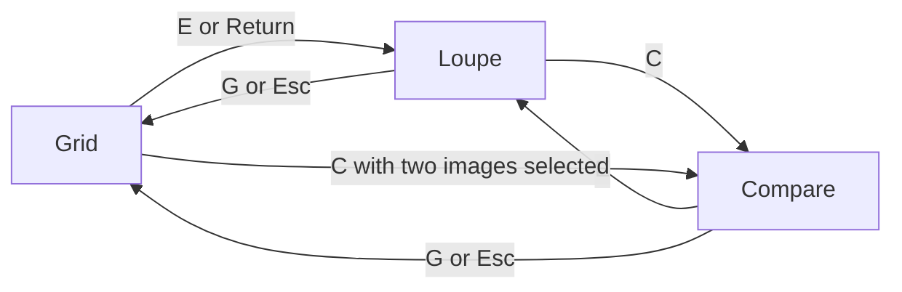

# macOS Culling App — PRD

Sep 30, 2026 · @Thanos

## Overview

A native macOS app for one job: deciding which photos to keep, faster than a general-purpose photo manager. It opens a folder of RAW and JPEG files directly, shows embedded previews instantly, decodes full RAW on demand for sharpness and exposure checks, and records ratings and color labels in XMP sidecars that Lightroom, RawTherapee and ART can read.

**Target user:** photographers who shoot hundreds to thousands of frames per session and cull before editing in Lightroom Classic, RawTherapee or ART. That includes travel photographers who curate a trip into a small set of keepers, where every frame is a one-off and a soft shot can't be reshot.

**Product principles**

1. **Keyboard first.** The shortcut map is the primary interface (see Keyboard shortcuts).
2. **Instant.** The next image is on screen before the next key repeat.
3. **Non-destructive and interoperable.** Originals are never touched; decisions live in standard XMP sidecars.
4. **Minimal.** One window, three modes (Grid, Loupe, Compare), no catalog and no import step.
5. **Native.** Swift, SwiftUI and AppKit, Metal, Apple HIG conventions, Apple silicon only.

## Goals and non-goals

v1 succeeds if a photographer can cull a shoot entirely from the keyboard and hand the keepers to their editor without any conversion step.

**Goals**

1. Keyboard-only culling: every cull-loop action is a single key (see Keyboard shortcuts).
2. Instant browsing from embedded JPEGs, with optional full RAW decode when sharpness or exposure must be trusted.
3. Objective checks: one-key 1:1 zoom, focus peaking, highlight and shadow clipping with user-set percentages, histogram, EXIF.
4. Decisions (stars 1–5, colors) stored in XMP sidecars that Lightroom Classic and RawTherapee read.
5. Clean hand-off: reveal the selection in Finder, open it in an external editor, or extract its embedded JPEGs.

**Non-goals for v1**

- No image editing or adjustments (RapidRAW covers that space; we are the step before it).
- No catalog, database or import step: the folder on disk is the source of truth.
- No AI auto-culling, face or blink detection (candidate for later, see suggested features).
- No cloud sync, no iOS or iPadOS app, no Intel Macs, no video, no tethered capture.
- No keywords, IPTC or caption editing.

## Core workflow

A session is five steps, and steps 2 to 4 repeat as many passes as the shoot needs. Keys shown are the proposed defaults.

1. **Open.** `⌘O` or drop a folder on the window. The Grid fills from embedded previews immediately; a RAW with a same-name JPEG shows as one frame (proposed).
2. **First pass.** Arrow through in Loupe. `X` rejects, `1`–`5` rates; hold `⇧` to apply and advance. When a frame is doubtful, `Z` zooms to 1:1 (developing the RAW if the preview is too small), `F` shows focus peaking, `H` and `S` show clipping, `I` shows EXIF and histogram.
3. **Settle doubts in Compare.** `C` on two similar frames, `Z` to check both at 1:1 together, `R` to develop the full RAW for a trustworthy sharpness check, `⇧X` to reject the loser and move on.
4. **Narrow.** `⌥⌘3` shows only frames with 3 stars or more, then a second pass raises the bar (`⌥⌘4`, `⌥⌘5`). Nothing is exported yet; every decision is already saved in the sidecar.
5. **Hand off.** `⌘A` selects everything in the filtered view. `⌘R` reveals those files in Finder, `⌘E` opens them in the external editor, `⇧⌘E` extracts their embedded JPEGs.

Quitting mid-session loses nothing, and reopening the folder restores the last position and filter (proposed).

## Keyboard shortcuts

Shortcuts are the product's primary interface: every action in the cull loop is one unmodified key, so a photographer never needs the mouse to review, rate, compare and export. The default map copies Lightroom Classic's Library keys (which FastRawViewer largely shares), so muscle memory carries over; analysis overlays get new mnemonic keys.

In the Note column, **LR** = same key in [Lightroom Classic](https://helpx.adobe.com/lightroom-classic/desktop/introduction-to-lightroom-classic/keyboard-shortcuts.html), **FRV** = same key in [FastRawViewer](https://updates.fastrawviewer.com/data/FastRawViewer%20Keyboard%20Shortcuts_macOS.pdf), **HIG** = standard macOS shortcut per Apple's [Keyboards guidelines](https://developer.apple.com/design/human-interface-guidelines/keyboards), **new** = proposed here.

### Principles

- **Hot loop = bare keys.** Navigate, rate, label, flag and toggle overlays without modifiers. Modifiers (⌘, ⌥) are for anything that leaves the loop: selection, filtering, editing, export.
- **Shift = do it and advance.** ⇧ plus any rating, label or flag key applies it and moves to the next image (verified in [Lightroom](https://helpx.adobe.com/lightroom-classic/desktop/organize-photos-in-lightroom-classic/flag-label-rate-photos.html)). A Settings toggle adds Photo Mechanic-style [auto-advance](https://home.camerabits.com/?p=3774) for people who want every rating to advance.
- **Tap toggles, hold is momentary.** Tap F, H, S or R to switch an overlay on and off; hold the key to see it only while pressed, which is the fastest way to flash focus peaking on and off during a comparison.
- **Don't hijack macOS.** Apple says not to repurpose standard shortcuts unless the action makes no sense in the app. We override one, a text-editing action this app has no use for: ⌘E (use selection for find) becomes Edit in external editor, as in Lightroom.
- **Physical key positions.** Bare-key shortcuts bind to key position, not character, so they still work when a non-Latin input source (Greek, Cyrillic, Japanese) is active. Acceptance test: full cull loop on at least one non-Latin layout.
- **No function keys in defaults.** Apple reserves ⌃F1–⌃F7 for system keyboard navigation, and Mac laptops need fn for F-keys by default. FastRawViewer's F2–F8 panel toggles are therefore replaced with letter keys.
- **Discoverable and remappable.** Every command sits in the menu bar with its key shown, is findable through Help-menu search (⌘?), and is listed in an in-app cheat sheet (?). Settings ⌘, has full remapping with conflict detection and presets: Default (Lightroom-style), FastRawViewer, Photo Mechanic.
- **Full Keyboard Access.** Every control is reachable without a pointer, as Apple recommends.
- **Safe.** Bare keys are ignored while a text field has focus; Esc returns focus to the image. ⌘Z undoes rating, label and flag changes, including the XMP write.

### Navigate and cull (the hot loop)

| Action | Key | Note |
| --- | --- | --- |
| Next / previous image | `→` / `←` | LR, FRV. Holding the key scrubs at the system repeat rate; see Performance |
| Row up / down in Grid | `↑` / `↓` |  |
| First / last image | `Home` / `End` | LR |
| Set 1–5 stars | `1` `2` `3` `4` `5` | LR, FRV |
| Clear rating | `0` | LR, FRV |
| Rating down / up one star | `[` / `]` | LR, FRV |
| Color label: red, yellow, green, blue | `6` `7` `8` `9` | LR, FRV. Purple has no default key in either app, so it is menu-only until remapped |
| Reject (press again to clear) | `X` | LR, FRV. Stored as rating -1. Pick and Unflag are not in v1 |
| Apply and go to next | `⇧` + rating, label or reject key | LR (⇧1–5, ⇧6–9, ⇧X) |
| Undo / redo last cull action | `⌘Z` / `⇧⌘Z` | HIG |
| Toggle auto-advance | `A` | new. Off by default |

### Zoom, 1:1 and RAW development

Checking sharpness is the reason this app exists, so zoom and RAW development are one keystroke each and they work together: zooming to 1:1 develops the RAW automatically when the embedded preview has fewer pixels than the screen needs. **1:1 means one image pixel per physical screen pixel**, not per point, so on a Retina display it shows the detail the sensor really recorded.

| Action | Key | Note |
| --- | --- | --- |
| Toggle fit / 1:1 | `Z` | LR, FRV. Tap toggles; hold shows 1:1 only while pressed. Zooms at the pointer if it is over the image, else at the camera's AF point when known, else the center |
| 1:1 / Fit, explicitly | `⌘1` / `⌘0` | FRV. Same result as Z but never toggles |
| Zoom in / out | `=` / `−` in Loupe and Compare; `⌘+` / `⌘−` everywhere | FRV and LR use the ⌘ forms. In Grid the bare keys change thumbnail size. Steps: Fit, 25, 50, 1:1, 200, 400%. Pinch and `⌥` + scroll also zoom |
| Pan when zoomed | Two-finger scroll or drag; `⌥` + arrows nudge; hold `Space` and drag | new. Bare arrows still change image, so pan never steals a cull key |
| Keep zoom and position on the next image | On by default while zoomed; `⌥Z` toggles | new. Checks the same spot across a burst without re-zooming |
| Develop the RAW for this image | `R` | new (FRV uses J). Toggles between embedded JPEG and developed RAW; the embedded image stays visible while decoding, and the badge reads "Developing" then "RAW" |
| Develop the RAW for every frame | `⇧R` | new. Session-wide Always mode; press again to return to On demand. Neighbors decode in the background |
| Automatic RAW at 1:1 | Setting, on by default (On demand mode) | Zooming to 1:1 develops the RAW when the preview is smaller than the screen needs |

### View and analysis

| Action | Key | Note |
| --- | --- | --- |
| Grid / Loupe / Compare | `G` / `E` / `C` | LR. Esc returns to Grid; Return or Space opens Loupe from Grid |
| Grid thumbnail size | `−` / `=` | LR. Grid only; in Loupe and Compare the same keys zoom |
| Focus peaking | `F` | new. Tap toggles, hold is momentary. FRV uses P; P is unassigned here |
| Peaking mode: edges / fine detail | `⇧F` | new. FRV offers both modes |
| Highlight clipping overlay | `H` | new. FRV: ⇧H |
| Shadow clipping overlay | `S` | new. FRV: U |
| Clipping thresholds (custom %) | `⌥H` | new. Popover with a highlight % and a shadow % field, fully keyboard-operable |
| Cycle info overlay | `I` | LR. Levels: off, filename + stars, + EXIF, + histogram |
| Histogram on / off | `⇧I` | new |
| Show / hide inspector (EXIF, histogram) | `⌥⌘I` | HIG |
| Lights out (dim, then black surround) | `L` | LR. Target v1.x |
| Hide / show all panels | `⇥` | FRV |
| Full screen | `⌃⌘F` | HIG. Bare F is taken by peaking |
| Shortcut cheat sheet | `?` | new. Shows keys for the current mode |

### Compare (2-up)

Model taken from Lightroom: a left "select" (the keeper) and a right "candidate". One side is active and gets every rating, label and flag key.

| Action | Key | Note |
| --- | --- | --- |
| Enter Compare | `C` | Two selected images compare those two; one selected compares it with the next |
| Step the active side | `←` / `→` |  |
| Switch active side | `⇥` | new. Overrides panel toggle while in Compare |
| Swap select and candidate | `↓` | LR |
| Advance both to the next pair | `↑` | LR |
| Zoom both sides to 1:1 at the same point | `Z` | new. Pan moves both sides |
| Link / unlink pan and zoom | `⇧Z` | new |
| Reject active side and advance | `⇧X` | LR pattern |

### Selection, filtering and output

| Action | Key | Note |
| --- | --- | --- |
| Select all / none | `⌘A` / `⇧⌘A` | HIG, LR |
| Deselect active image | `/` | LR |
| Select by rating, label or flag | `⌥⌘A` | LR selects flagged; FRV selects by rating or label |
| Invert selection | `⇧⌘I` | new. FRV uses ⌘I, which macOS reserves for Info |
| Show / hide filter bar | `\` key (backslash) | LR |
| Toggle filters on / off | `⌘L` | LR |
| Show images with at least N stars | `⌥⌘1`–`⌥⌘5`, `⌥⌘0` clears | new |
| Find by filename | `⌘F` | HIG |
| Reveal selection in Finder | `⌘R` | new. FRV uses ⌘F, which macOS reserves for Find |
| Edit in default external editor | `⌘E` | LR (Edit in Photoshop) |
| Edit in… (choose program) | `⌥⌘E` | new |
| Extract embedded JPEGs from selection | `⇧⌘E` | new |
| Open folder / Settings / Help | `⌘O` / `⌘,` / `⌘?` | HIG |

### Requirements

- Rating, label or flag key press shows on screen within one frame; the XMP write is asynchronous and never blocks the next key press. A write failure (read-only volume) shows a non-modal banner.
- Every command in this section exists as a menu item; menu and cheat sheet are generated from one command table, so they cannot drift.
- The keymap is data (a per-user file), so presets and remapping need no code changes.

The four key choices left open earlier are settled: Lightroom-style default preset, Purple menu-only until remapped, bare `F` for focus peaking, and `⇥` switching the active side in Compare. Pick and Unflag were dropped, so `X` is the only flag.

## Platform and technical constraints

The app is Swift-only, arm64-only, and leans on Apple's own image stack (ImageIO, Core Image, Metal) wherever it does the job, adding third-party code only where Apple's frameworks cannot: reading embedded JPEG bytes and covering cameras newer than the OS.

| Area | Proposed choice | Why and open points |
| --- | --- | --- |
| Build | Swift 6, Xcode, `ARCHS = arm64` (no x86\_64, no universal binary) | Requirement. Deployment target is macOS 27, so no compatibility code for older systems. Halves test matrix and binary size |
| UI | SwiftUI for windows, menus, settings, inspector; AppKit for Grid and image surfaces | Grid and Loupe need frame-exact control that SwiftUI lists don't guarantee. Full menu bar with shortcuts via a single command table |
| Embedded JPEG (browse) | Read the largest JPEG embedded in each RAW, decode with ImageIO | Fast path for the whole app. ImageIO alone cannot hand back the raw embedded bytes |
| Embedded JPEG (extract) | Own container parser (TIFF-based RAWs, CR3 boxes, RAF header) or LibRaw, copying the original JPEG bytes | Extraction must be lossless and keep its EXIF. Same parser feeds browsing |
| Full RAW decode | Core Image `CIRAWFilter` first; LibRaw as fallback for cameras the OS doesn't know yet | Native, GPU-assisted on Apple silicon. Spike needed: confirm sharpening and noise reduction can be switched off so sharpness checks are honest |
| Focus peaking | Metal compute shader: edge magnitude on luma, thresholded, drawn as a colored overlay | Runs at display resolution while browsing, at 1:1 when zoomed |
| Clipping overlays | Metal shader comparing per-pixel level to the user's thresholds | Overlay source (preview or RAW) is labeled on screen, since the two disagree |
| Histogram | Metal Performance Shaders or vImage over the displayed image | Computed from the embedded JPEG in preview mode and from the decoded image in RAW mode |
| Color | Color-managed to the display profile; embedded profile honored | Wide-gamut and HDR displays: SDR reference only in v1 |
| Caching | In-memory prefetch of a few frames each side of the cursor, plus a disk cache in Application Support keyed by path, size and modification date | Never write cache files into the photographer's folders |
| Metadata | XMP sidecars written by our own writer, EXIF read via ImageIO plus maker-note parsing for lens and AF data | See XMP section. Existing sidecar content we don't understand is preserved |
| Finder and editors | `NSWorkspace` to reveal multiple files at once and to open files in a chosen app | Reveal selects every file in one Finder window |
| Distribution | Open source: source code plus unsigned arm64 builds. No notarization, no Mac App Store | No sandbox, so sidecar writes and launching editors need no special entitlements. First launch of an unsigned build needs approval in Privacy & Security (see Risks) |

**Supported formats for v1:** Sony ARW, Canon CR2 and CR3, Nikon NEF, Fujifilm RAF, Adobe DNG, Olympus ORF, Panasonic RW2, Pentax PEF, plus JPEG, HEIC and TIFF files shot as-is (confirmed as the target set: popular modern camera RAWs).

**Minimum macOS:** macOS 27 or newer, Apple silicon only.

## Core features

Twelve features make up v1: the eleven from your list plus zoom and 1:1. Each has a requirement and a test for when it is done; numeric performance targets live in the Performance section.

| Feature | Requirement | Done when |
| --- | --- | --- |
| Embedded JPEG viewing | Show the largest JPEG embedded in each RAW; Grid thumbnails use the smallest adequate preview. A badge shows the preview's pixel size | A preview smaller than the sensor is flagged, so nobody mistakes it for a true 1:1 view |
| RAW decode option | Setting with three modes: Never (embedded only), On demand (default: `R` for one frame, or automatic when zooming to 1:1), Always (`⇧R`). Decoded with sharpening and noise reduction off | At 1:1 in RAW mode every pixel is a sensor pixel; the embedded preview stays visible while the RAW develops; neighbors decode in the background |
| Zoom and 1:1 | `Z` toggles fit and 1:1 (one image pixel per physical screen pixel) at the pointer, else the AF point, else the center; `=` and `−` step Fit, 25, 50, 1:1, 200, 400%; pinch and scroll work; zoom and position carry over to the next image | On a Retina display 1:1 shows exactly one image pixel per screen pixel; stepping through a burst at 1:1 stays on the same spot |
| Focus peaking | `F` overlays edges above a sensitivity threshold in a configurable color; second mode for fine detail | Works in Loupe, Compare and at 1:1; toggles within one frame |
| Compare two shots | Side by side with a shared cursor: linked pan and zoom, one active side that receives cull keys | Both sides can be inspected at the same relative point at 1:1 and rated separately |
| Highlight and shadow peaking | `H` and `S` overlays with user-set thresholds (default 98% and 2%, in 1% steps, editable in `⌥H` popover) and a readout of the % of the frame that is clipped | Thresholds persist; readout matches an independent pixel count on test images |
| Histogram | Luminance and RGB, with clip markers at both ends; in the info overlay and the inspector | Labeled with its source (preview or RAW); updates live while zooming or switching images |
| EXIF reader | Camera, lens, focal length, aperture, shutter, ISO, exposure compensation, white balance, metering, flash, capture time, dimensions, file size, GPS, AF data where the maker note allows | Values appear without decoding the image; any value copies with `⌘C` |
| Stars and colors | 1–5 stars, five color labels, reject; every change is saved to an XMP sidecar immediately | Lightroom Classic, RawTherapee and ART show the same values (see XMP section) |
| Edit in external program | Settings lists editors (Lightroom Classic, RawTherapee and ART preconfigured, others addable); `⌘E` opens the selection in the default one, `⌥⌘E` picks another | 100 files open in one call; missing apps disable their menu items |
| Reveal in Finder | Selection is first-class: filter by stars, label or reject, `⌘A`, then `⌘R` | Finder opens one window with exactly those files selected |
| Extract embedded JPEGs | `⇧⌘E` copies each selected file's largest embedded JPEG, byte for byte, to a chosen folder as `name.jpg` | Runs in the background with progress and cancel; files with no embedded JPEG are listed, not skipped silently |

## XMP sidecars

Stars are written as `xmp:Rating` and colors as `xmp:Label` in a `name.xmp` sidecar next to each RAW. Lightroom Classic reads these, RawTherapee 5.11 or newer reads them once a preference is switched on, and ART has equivalent support. Older RawTherapee versions and JPEG files in Lightroom cannot use sidecars, so the app must tell users this instead of failing quietly.

### What we write

| Decision | XMP property | Values |
| --- | --- | --- |
| Stars | `xmp:Rating` | 1–5; 0 means none |
| Color | `xmp:Label` | `Red`, `Yellow`, `Green`, `Blue`, `Purple`, the exact five names RawTherapee maps |
| Reject | `xmp:Rating` = -1 | Adobe Bridge convention. RawTherapee ignores -1; ART maps it to trash (see below) |

### Who reads it

| Reader | Stars | Colors | Reject | Condition |
| --- | --- | --- | --- | --- |
| RawTherapee 5.11 to 5.13 | Yes | Yes, the five names above | No: RawTherapee keeps trash in its own `.pp3` and ignores -1 | Off by default. Enable Preferences → File Browser → "Load/Save thumbnail rank and color from/to XMP sidecars", and set "XMP sidecar style" to match ours |
| RawTherapee 5.10 and older | No: embedded XMP only | No | No | Upgrade. Earlier forum answers saying sidecars are unsupported were correct before 5.11 |
| ART | Yes | Yes | Yes: the RawTherapee pull request notes say ART maps trash to rating -1 | Check ART's own metadata preferences. Behavior to be confirmed in testing |
| Lightroom Classic | Yes | Yes | To test | Photos must be copied to disk first, not imported straight from a card. For photos already in a catalog run Metadata → Read Metadata from Files. JPEGs ignore sidecars |

Sources: RawTherapee [pull request 6988](https://github.com/RawTherapee/RawTherapee/pull/6988) (merged 12 May 2024, shipped in 5.11 on 24 Aug 2024; latest release 5.13 on 26 Jul 2026), [issue 6084](https://github.com/RawTherapee/RawTherapee/issues/6084), and FastRawViewer's [XMP manual](https://www.fastrawviewer.com/usermanual15/xmp-metadata) for the Lightroom caveats.

### Sidecar naming

Default is `name.xmp` for `name.ext` (what Lightroom and FastRawViewer use). A setting switches to `name.ext.xmp`, the darktable-style naming that RawTherapee also supports. The setting must match RawTherapee's own "XMP sidecar style", and the app shows a one-line hint in Settings saying so.

### Write rules

- **Never destroy foreign data.** If a sidecar already holds Camera Raw or Lightroom develop settings, edit only our properties in place and keep everything else byte-for-byte where possible.
- **Atomic.** Write to a temporary file, then rename, so a crash never leaves a half-written sidecar.
- **Lazy.** A sidecar is created on the first decision for a photo; browsing alone creates nothing.
- **Refresh the metadata timestamp** (`xmp:MetadataDate`) so Lightroom sees the sidecar as newer than its catalog. To be confirmed in testing.
- **Watch for outside changes.** If Lightroom or another tool rewrites a sidecar while the folder is open, reload it before our next write; the merge is per property.
- **Never touch the RAW file, and never write RawTherapee `.pp3` files:** those hold a user's editing settings, and overwriting them would be worse than a missing star.
- **Read-only volumes** (locked card, network share): show a non-modal banner and keep decisions in memory until the user picks a place to save them.

### Test matrix

Lightroom Classic (current), the latest RawTherapee, the latest ART, and one RAW each from Sony, Canon, Nikon and Fujifilm. Each test: rate and label in our app, open the folder in the other tool, compare; then the reverse.

## Suggested additions

Seven small additions belong in v1 because the cull loop feels incomplete without them; the rest are ranked by value against the "minimal" principle. Inspiration is named where a reference app has it: [FastRawViewer](https://updates.fastrawviewer.com/data/FastRawViewer%20Keyboard%20Shortcuts_macOS.pdf) (FRV), [PhotoCuller](https://photoculler.com/docs), [RapidRAW](https://github.com/CyberTimon/RapidRAW), [Photo Mechanic](https://home.camerabits.com/?p=3774) (PM). The Photo Mechanic help index you linked shows only article titles, so PM items come from its preferences guide.

| Suggestion | Why it matters | Priority | Inspired by |
| --- | --- | --- | --- |
| Filter and sort bar (stars, label, flag, capture time, name) | Required for "select all the starred, then reveal in Finder"; also drives the second pass | v1 | PhotoCuller filter presets, Lightroom filter bar |
| Undo for every cull action | Culling by keyboard is fast enough to misfire; ⌘Z must also revert the sidecar | v1 | new |
| RAW+JPEG pairs as one frame | Otherwise every shot appears twice; rating applies to the pair | v1 | common practice |
| "Preview vs RAW" truth badge | Shows the preview's pixel size and whether a 1:1 view is real; the app's main honesty feature | v1 | FRV's RAW-first philosophy |
| Auto-advance option | Some people want every rating to advance without holding ⇧ | v1 | PM (Preferences → Preview) |
| Cheat sheet and remappable keys | Shortcuts are the primary interface | v1 | FRV, PM |
| Session resume | Reopening a folder returns to the last frame, filter and selection | v1 | new |
| Burst and similar-shot stacks | Groups by capture-time gap and sequence number (no AI needed); rate a stack once, expand to pick the best; brackets and panorama sequences group the same way | v1.x | PhotoCuller stacks and similar scenes |
| Focus-point overlay | Draw the camera's AF point from the maker note: shows whether focus landed on the subject, decisive for sports and wildlife | v1.x | new |
| Lights out (`L`) | Dims the surroundings so exposure judgments aren't skewed by the UI | v1.x | Lightroom |
| Survey view, 3–4 up | Compare more than two candidates at once | v1.x | Lightroom Survey, FRV 4-up |
| Progress and stats | "1,240 of 3,000 reviewed", counts per star and color; an Unreviewed filter | v1.x | PhotoCuller statistics |
| Move or copy rejects to a `_Rejected` folder | Optional cleanup after culling; nothing is deleted | v1.x | FRV |
| Save selection as a list file | Hand a shortlist to another tool or person without moving files | v1.x | FRV "Save Selection to file" |
| Hot folder | Watch a folder during a shoot and append new frames as they arrive | v1.x | FRV |
| Finder tags mirror | Optionally mirror colors as macOS Finder tags so decisions show in Finder and Spotlight | v1.x | new (macOS-native) |
| Group by day and place | A trip reads as chapters: Grid headers by capture day, then by GPS location where present. Matters most for travel curation | v1.x | new |
| Battery-friendly mode | Culling on a laptop away from power: smaller prefetch window and cheaper overlays while on battery | v1.x | new |
| Sharpness score badge | An objective per-image number (edge variance) to rank a burst; no machine learning | Later | new |
| RAW-level histogram and clipping stats | Per-channel, from sensor data before white balance: the truest exposure check | Later | FRV |
| Waveform, RGB parade, vectorscope | Extra scopes for color-critical work | Later | RapidRAW |
| Shadow boost preview | Lift shadows temporarily to judge noise | Later | FRV |
| Second-display Loupe | Grid on one screen, image on the other | Later | FRV multi-window |
| Card ingest with rename and verify | Copy from the card before culling | Later | PhotoCuller quick transfer |

**Deliberately not suggested:** AI auto-culling, face and blink detection, client-proofing links, tethered capture, cross-device sync (PhotoCuller and RapidRAW have some of these). Each would pull the app away from being small and fast; revisit after v1 if users ask.

## UX principles and screens

The interface is a quiet dark frame around the photograph; everything else is one key away and every command also lives in the menu bar. The principles below apply Apple's Human Interface Guidelines for [designing for macOS](https://developer.apple.com/design/human-interface-guidelines/designing-for-macos), [the menu bar](https://developer.apple.com/design/human-interface-guidelines/the-menu-bar), [toolbars](https://developer.apple.com/design/human-interface-guidelines/toolbars), [Dark Mode](https://developer.apple.com/design/human-interface-guidelines/dark-mode) and [keyboards](https://developer.apple.com/design/human-interface-guidelines/keyboards).

### Principles

- **Content first.** Apple advises fewer toolbar items, no heavy backgrounds or tinted controls that compete with content, and toolbars that can hide contextually with a reliable way back. Loupe hides toolbar and panels on `⇥`, and pressing it again, or moving the pointer to the top edge, restores them.
- **A complete, standard menu bar.** Standard order (app, File, Edit, View, custom menus, Window, Help). Items are disabled, never hidden, so the menu teaches what the app can do. Custom menus: Photo (rate, label, flag, reveal, edit in, extract) and Filter. Settings live at ⌘, in the app menu.
- **Neutral dark canvas.** The chrome follows the system appearance and there is no in-app appearance switch, as Apple recommends. The image canvas is always a neutral dark gray, a case Apple's Dark Mode guidance allows for media viewing, so the surround never biases exposure judgments. Text contrast is at least 4.5:1.
- **Windows the Mac way.** One resizable main window with full-screen support; the window title is the folder name and the subtitle reads "312 of 1,204 shown", never the app name.
- **Standard components.** Native toolbar (customizable, as Apple suggests for long-use apps), inspector sidebar, settings window, menus. No custom-drawn chrome where a system control exists.
- **Feedback without interruption.** A small on-canvas badge confirms each rating, label or flag. Errors are non-modal banners. No alert ever blocks the cull loop.
- **Never color alone.** Color labels also show a letter or shape, and VoiceOver reads state as one phrase ("3 stars, red label, rejected").
- **Instant means instant.** Image changes are cuts, not animations, so Reduce Motion needs no special handling in the loop.

### Screens

| Screen | Purpose | What is on it | Signature interactions |
| --- | --- | --- | --- |
| Grid | Overview, filtering, selection | Thumbnails with star, label and flag badges; filter bar on `\` key | `←↑→↓` move, `−`/`=` thumbnail size, Return or Space opens Loupe |
| Loupe | Judge one frame | Image at fit or 1:1, overlays (peaking, clipping), info strip with filename, stars, label and "Preview 1616 px" or "RAW" | `Z`, `F`, `H`, `S`, `I`, `R`; cull keys act on this frame |
| Compare | Choose between two frames | Two panes, a ring on the active side, linked zoom, differing EXIF values highlighted | `⇥` switches side, `↓` swaps, `Z` and `⇧Z` link zoom |
| Inspector | Facts about the current frame | Histogram, EXIF, sidecar state (what is saved, where) | `⌥⌘I` toggles; every field selectable and copyable |
| Settings | Rarely changed choices | General (RAW decode mode, auto-advance), Keys (remapping, presets), Analysis (peaking color and sensitivity, clipping %), Editors, Sidecars (naming, RawTherapee hint) | `⌘,` |
| Empty state | First launch | One line and a drop target: "Drop a folder or press ⌘O" | `⌘O` |

A diagram of how the three modes connect follows below.

In every mode: cull keys `0` to `9` and `X` (`⇧` adds advance), `Z` 1:1, `R` RAW, `⌘Z` undo, `⌘R` Reveal, `⌘E` Edit, `?` cheat sheet.

Grid, Loupe and Compare each reach the other two with a single key, and the cull keys work in all three, so a decision never needs a mode switch.

## Performance targets

Speed is the feature: with the fastest system key repeat (roughly 30 steps a second), the image on screen must always be the newest one, never a stale frame. All numbers below are proposals to be validated in an early spike on the slowest supported Mac, which is an open question.

| Metric | Target (proposed) | How it is measured |
| --- | --- | --- |
| Launch to empty window | Under 1 s cold | Instruments launch template |
| Folder open to first image | First embedded preview on screen in under 300 ms; visible Grid cells fill first | Test folder of 1,000 RAWs on internal SSD |
| Folder scan | 5,000 files listed with capture times in under 3 s | Same, larger folder |
| Next image, embedded JPEG | Under 50 ms at the 95th percentile when prefetched, under 100 ms cold; sustains key repeat with no stale frames | Signposts from key event to displayed frame |
| Cull key to feedback | Badge visible within one display frame (16 ms at 60 Hz) | Signposts |
| Overlay toggles (F, H, S, I) | Within one display frame at 24 MP | Metal frame capture |
| Full RAW decode to sharp 1:1 | Under 1 s for 24 MP, under 2 s for 45–61 MP; the embedded preview shows meanwhile and sharpens in place | Spike per camera family |
| Zoom to 1:1 | Within one display frame from any image; the embedded preview scales at once and the RAW sharpens in when ready | Signposts |
| Grid scrolling | 60 fps with 10,000 files, thumbnails from disk cache | Instruments |
| Sidecar write | Never blocks input; 1,000 decisions in a minute write without a dropped key | Stress script |
| Extraction | Within 20% of a plain Finder copy of the same bytes | Timed on 500 files |
| Memory | Prefetch cache capped (default 2 GB, adjustable); at most 5 full-resolution RAW decodes held | Allocations instrument |
| Idle | 0% CPU when nothing is changing | Activity Monitor |

**How the pipeline meets them:** read the embedded preview with memory-mapped I/O; prefetch a window of frames each side of the cursor in the direction of travel; give every request a token and cancel stale ones so the newest target always wins; decode on background queues and hand finished textures to Metal without copies (unified memory on Apple silicon).

**Test set:** 1,000-file folders from a 24 MP camera and a 45–61 MP camera, each on internal SSD, a UHS-II SD card and a network share, since cards and shares are where previews stall.

## Success metrics

The app works if a photographer culls a benchmark shoot faster than in their current tool, without touching the mouse, and nothing they decided is ever lost or corrupted. Targets are proposals; the app is assumed to collect no telemetry, so every metric is measured in scripted tests or observed sessions.

| Metric | Target (proposed) | How |
| --- | --- | --- |
| Benchmark cull speed | At least as fast as the user's current tool on the same 1,000-frame set (open, first pass, narrow to 3 stars or more) | Timed sessions, alternating tools |
| Keyboard-only completion | 100% of cull-loop and hand-off tasks doable without the mouse | Scripted walkthrough with Full Keyboard Access on |
| Performance targets | All met on the test set and slowest supported Mac | Signposts and Instruments, run before each release |
| Sidecar interoperability | 100% pass on the Lightroom Classic and RawTherapee test matrix | Manual matrix plus automated sidecar diff tests |
| Data safety | Zero corrupted or foreign-data-losing sidecars across a 10,000-write stress test | Automated, including sidecars with existing Camera Raw settings |
| Learnability | 5 of 5 new users cull a folder unaided within 10 minutes and use keys for at least 90% of actions | Observed sessions; cheat sheet allowed |
| Trust in checks | Peaking, clipping and histogram values match a reference tool within agreed tolerance on 20 test images | Side-by-side against FastRawViewer or RawTherapee |

## Phasing

The MVP proves the two riskiest promises first, keyboard speed and sidecar interoperability, before any analysis tooling is built. Each phase ends at a gate.

| Phase | Scope | Gate to leave the phase |
| --- | --- | --- |
| MVP | Open folder; Grid and Loupe from embedded JPEGs with one-key 1:1 zoom; full keyboard cull (stars, colors, reject, ⇧ apply-and-advance); XMP sidecar writing; filter bar; undo; EXIF and histogram; select all then Reveal in Finder; menu bar and shortcut cheat sheet | Performance targets met on the test set; Lightroom Classic and RawTherapee matrix passes |
| v1.0 | RAW decode on R and automatic at 1:1; focus peaking; highlight and shadow overlays with custom %; Compare; Edit in external program; Extract embedded JPEGs; RAW+JPEG pairs; truth badge; key remapping and presets; session resume; auto-advance | Every "Done when" in Core features holds; success metrics met |
| v1.x | Stacks, AF-point overlay, Survey view, Lights out, progress and stats, `_Rejected` folder, save selection as list, hot folder, Finder tags mirror | Chosen by user feedback after v1.0 |
| Later | RAW-level histogram and clipping stats, waveform and parade, shadow boost, second-display Loupe, card ingest | Only if they keep the app small and fast |

## Risks and unknowns

The two largest risks are sidecar behavior across tools and whether Apple's RAW decoder gives honest sharpness at 1:1. Both get an early spike.

| Risk | Why it matters | Mitigation |
| --- | --- | --- |
| RawTherapee reads sidecars only from 5.11, and only with an off-by-default preference | Users on older versions or default settings see no stars or colors and blame the app | Say so in Settings and first-run help; document the exact preference; test the latest release, since 5.11 is the first that reads sidecars |
| Reject maps differently in each editor | RawTherapee ignores rating -1 and keeps trash in `.pp3`; ART reportedly maps it to trash; Lightroom is untested | Test all three; document the behavior; never write `.pp3` |
| ART behavior is unverified | Our ART statements rest on RawTherapee's pull request notes, not on ART's own documentation | Test the current ART release and read its metadata settings before v1.0 |
| Existing sidecars hold Camera Raw settings | Rewriting the file could wipe a user's edits | Patch our two properties in place; automated diff tests on real Lightroom sidecars |
| Lightroom label and JPEG behavior | Color shows only if the label text matches the active label set; JPEGs ignore sidecars | Spike with a default and a custom label set; offer opt-in embedding of XMP into JPEGs, off by default |
| `CIRAWFilter` output isn't a clean 1:1 | Built-in sharpening or noise reduction would hide soft focus | Spike per camera family; fall back to LibRaw if the OS decoder can't be neutral |
| Newest cameras lag behind OS support | RAW decode fails for a new body until an OS update | LibRaw fallback; embedded-JPEG browsing still works |
| Embedded previews vary | Some are small or low quality; a few formats have none | Truth badge, automatic RAW at 1:1, clear message when no preview exists |
| Opening files in Lightroom Classic | It may only launch or start an Import dialog instead of opening the files like Photoshop does | Spike; if so, label the command "Open with" and explain |
| Library licenses | The app will be open source, so its license limits which libraries it can use: Exiv2 is GPL and only fits a GPL-compatible app license; LibRaw is LGPL or CDDL and RapidRAW's rawler is LGPL (licenses from memory, not yet verified) | License is deferred (see Decisions), so avoid GPL-only dependencies until it is chosen; verify each dependency |
| Unsigned distribution | Without notarization, macOS 15 and later block the first launch and the user must go to System Settings → Privacy & Security → Open Anyway ([Tietze](https://christiantietze.de/posts/2024/11/running-unsigned-applications-macos-sequoia/)). Homebrew's main cask repository disables casks that fail Gatekeeper from 1 Sep 2026, though third-party taps are unaffected ([Homebrew discussion](https://github.com/orgs/Homebrew/discussions/6334)) | Install notes with screenshots, the ad-hoc signature Xcode adds to builds, build-from-source instructions, and a project-owned Homebrew tap |
| Non-Latin keyboard layouts | Bare-key shortcuts can fail when the input source isn't Latin | Bind by key position; test on at least one non-Latin layout |
| Slow media | SD cards and network shares stall preview reads | Larger prefetch window, read-ahead, clear busy indicator |
| HDR and wide-gamut displays | Clipping overlays can disagree with what an EDR display shows | SDR reference in v1; revisit later |

## Decisions and open questions

Your answers are recorded below, and anything you didn't answer keeps my default. Only one item is deferred: the license, to be decided once implementation starts.

### Decided

| Topic | Decision |
| --- | --- |
| Default keymap | Lightroom-style; FastRawViewer and Photo Mechanic presets ship too |
| Purple label | Menu-only until remapped |
| Focus peaking key | Bare `F`; `P` is unassigned |
| `⇥` in Compare | Switches the active side there; hides panels elsewhere |
| Flags | Pick and Unflag dropped; `X` rejects, stored as rating -1 |
| Custom % for clipping | Both: brightness thresholds and a clipped-area readout |
| RAW decode default | On demand: `R` per frame, automatic at 1:1, `⇧R` for every frame |
| Cameras | Popular modern camera RAWs: Sony ARW, Canon CR2 and CR3, Nikon NEF, Fujifilm RAF, DNG, Olympus ORF, Panasonic RW2, Pentax PEF, plus JPEG, HEIC and TIFF |
| Editors | Lightroom Classic, RawTherapee and ART preconfigured |
| Sidecar naming | `name.xmp`; `name.ext.xmp` available as a setting |
| JPEG-only files | Sidecar only; embedding XMP into the JPEG is opt-in and off by default |
| Distribution | Open source, unsigned arm64 builds, no notarization, no Mac App Store, no sandbox |
| Minimum macOS | macOS 27 or newer |
| Target user | Also travel photographers who curate a trip into a keeper set |
| RawTherapee and ART versions | Always the latest release; the test matrix follows them |
| Sticky zoom | On: zoom and position stay when stepping to the next frame while zoomed; ⌥Z switches it off |
| Meaning of 1:1 | One image pixel per physical screen pixel |
| Travel features | Group by day and place, and battery-friendly mode, stay in v1.x |

### Deferred

**License.** Decided when implementation starts. The options are GPL-3.0 (keeps GPL libraries such as Exiv2 usable), AGPL-3.0 (RapidRAW's choice) and a permissive license such as MIT or Apache-2.0 (narrows library choices). Until then, avoid adding GPL-only dependencies and prefer our own parser plus LibRaw, so no option is closed off.
