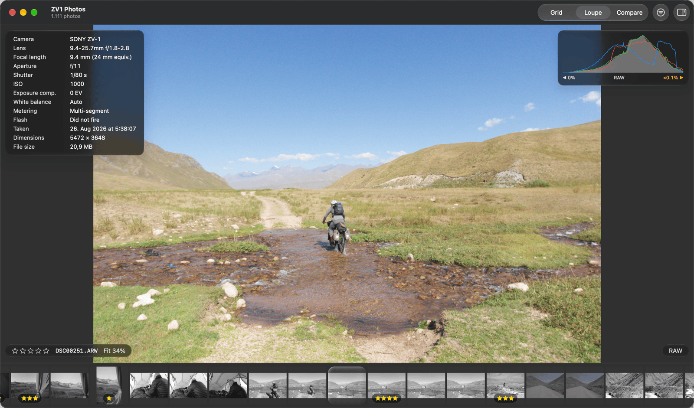
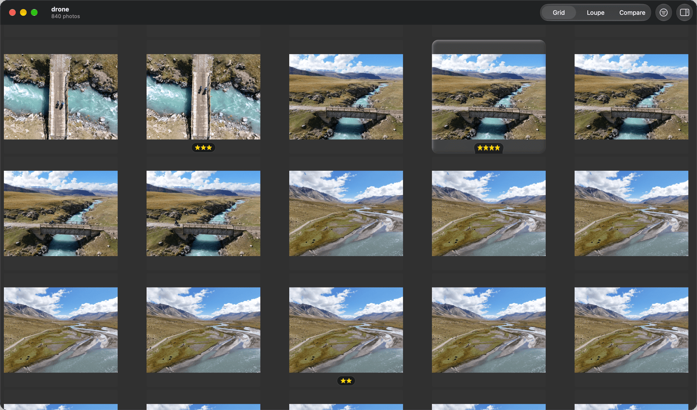
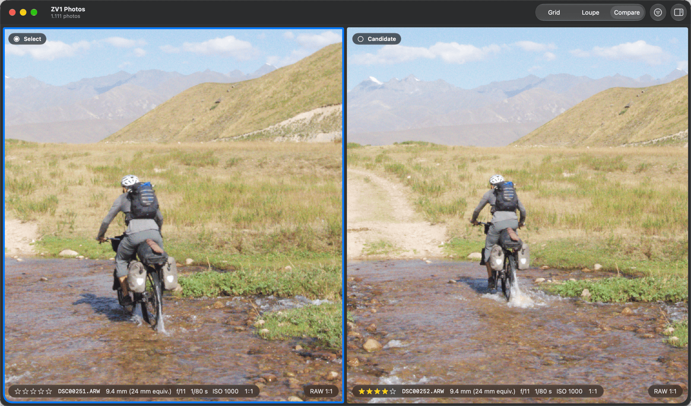

# Oxys

A keyboard-first RAW culler for macOS. Instant embedded previews, full keyboard culling, and ratings and labels saved in XMP sidecars that Lightroom Classic, RawTherapee and ART can read.

Status: version 1.0.0 is released. See the [changelog](CHANGELOG.md) for what changed, [PRD.md](PRD.md) for the product and [STORIES.md](STORIES.md) for the build plan.



## What it does

- Loupe and Grid views with instant embedded previews, and a film strip in Loupe.
- Full keyboard culling: ratings, labels and reject. You can change every key, or use the Photo Mechanic key set.
- [Compare](docs/guide/compare.md) shows two photos side by side.
- Focus mode hides every panel but the RAW badge and the decision.
- Checks for sharpness and exposure: focus peaking, clipping and a histogram.
- Optional lens correction for the developed RAW, off by default.
- Export of developed files. An opt-in switch removes location and serial numbers.
- Decisions are saved in XMP sidecars. Oxys never writes into your photo folders except these sidecars.





## Using Oxys

The [user guide](docs/guide/README.md) explains each feature and key: [get started](docs/guide/getting-started.md), [cull photos](docs/guide/culling.md), [check sharpness and exposure](docs/guide/inspecting.md), [Compare](docs/guide/compare.md), [sidecars and other apps](docs/guide/sidecars.md), and all [keyboard shortcuts](docs/guide/shortcuts.md).

## Requirements

- Apple silicon Mac running macOS 27 or newer
- Xcode 27 (Swift 6.4)

## Install

Download `Oxys.zip` from [Releases](https://github.com/Taaanos/oxys/releases). The build has no Apple Developer ID, so Apple does not check it. Check the signature first ([how](docs/guide/install.md#check-the-download)). Then move the app to `/Applications` and run this, because macOS blocks it the first time:

```sh
xattr -dr com.apple.quarantine /Applications/Oxys.app
```

See [Install Oxys](docs/guide/install.md) for the System Settings way and for other ways.

### Install with Homebrew

```sh
brew install --cask taaanos/tap/oxys
```

The tap is a separate repository, [Taaanos/homebrew-tap](https://github.com/Taaanos/homebrew-tap). The cask checks the SHA-256 of the download. It does not check the release signature: for that, use the steps in [Check the download](docs/guide/install.md#check-the-download).

### Release key fingerprint

Each release zip is signed with the Taaanos release key, which signs all Taaanos apps. The fingerprint of its public key is:

```
SHA256:LwCXsIldlnJTEIbwsXmy8q/6twNbhYRjW9FjZ/nLyC0
```

Compare it with the same line on [github.com/Taaanos](https://github.com/Taaanos) and on [thanosam.com/about](https://www.thanosam.com/about). Trust the key only if all three match. The public key file is [docs/release-signers](docs/release-signers).

## Build from source

```sh
git clone https://github.com/Taaanos/oxys.git && cd oxys
make build        # Release build into ./build
make check-arch   # prints the app's architectures; must be just "arm64"
```

The app is signed ad hoc ("Sign to Run Locally"), so no Apple developer account is needed. You can also open `App/Oxys.xcodeproj` in Xcode and press Run.

## Tests

```sh
make test         # runs the unit tests of every package under Packages/
```

## Layout

| Path | What |
| --- | --- |
| `App/` | Xcode project and the SwiftUI app target |
| `Packages/` | One local Swift package per module: Commands, Library, Containers, Imaging, Canvas, Sidecar, Metadata, Diagnostics |
| `scripts/` | Developer scripts |
| `docs/` | The [user guide](docs/guide/README.md), spike write-ups, performance and design reports, and the security, license and release-signing notes |

## License

Oxys is free software under the [GNU General Public License, version 3 or any later version](LICENSE). You can use, change and share it. If you share a changed version, you must share its source under the same license. [docs/license-audit.md](docs/license-audit.md) lists what the app contains: it has no third-party code.

The name "Oxys" and the app icon are not licensed for reuse. A changed version that you distribute, on the Mac App Store or anywhere else, must use another name and another icon.

Copyright (C) 2026 Athanasios Amoutzias.
