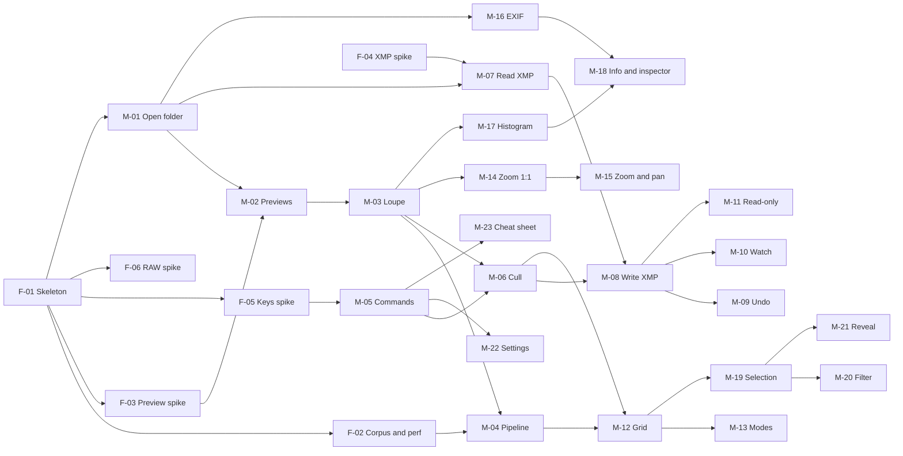

# Oxys: implementation stories

Derived from [PRD.md](PRD.md) (Sep 30, 2026). "Oxys" is a working name taken from the repo folder (see G-1).

## How to use this document

- Stories are listed in the suggested build order. Each one is a thin increment you can run and check before moving on.
- IDs: `F-` foundation and spikes, `M-` MVP, `V-` v1.0, `P-` performance (Phase 2b, before the v1.0 gate), `D-` design (Phase 2c, Liquid Glass), `B-` / `L-` backlog (v1.x / Later).
- Open questions are numbered per story, so we can refer to them as `M-08/Q1`. Every question has a *Proposed* default, so an unanswered question never blocks work: we build the default and revisit later. When one is settled, change *Proposed* to **Decided** where it stands.
- Questions that touch many stories live in [Cross-cutting open questions](#cross-cutting-open-questions); stories link to them as `G-n`.
- Status lives in the [Story index](#story-index): `todo`, `in progress`, `done`, `parked`.

### How we work through a story

1. Pick the next story in index order (or agree to jump).
2. Read its open questions. Answer the ones that change the design; accept the proposals for the rest.
3. Build it, check every acceptance criterion, record decisions in the story, and update its status.

### Definition of done (applies to every story)

- Builds in Swift 6 language mode with strict concurrency and no warnings; arm64 only.
- Logic that lives in a package has unit tests. UI behavior has the manual or UI-test check its acceptance criteria list.
- New commands are in the command table (so they appear in the menu bar and the cheat sheet), with the PRD's default key.
- Code on a performance-sensitive path emits signposts (F-02).
- Reachable by keyboard. Anything that shows state has a VoiceOver label.
- Nothing is written into the photographer's folders except sidecars (and their temporary files during an atomic write, see G-9). Originals are never written.

## Proposed architecture

For orientation only. F-01 creates it; stories refine it.

| Module | Responsibility | First story |
| --- | --- | --- |
| `App` | SwiftUI app, the window, settings, menus built from the command table | F-01 |
| `Commands` | Command table, keymap files, key routing (physical keys, tap vs hold) | F-05, M-05 |
| `Library` | Folder scan, `Photo` model, decisions, selection, filter and sort, session state | M-01 |
| `Containers` | RAW and JPEG container parsing: embedded preview locations, maker notes | F-03 |
| `Imaging` | Decoding (ImageIO, CIRAWFilter, LibRaw), request tokens, prefetch, memory and disk caches | M-02, M-04 |
| `Canvas` | Metal image surface: fit, zoom, pan, overlays (peaking, clipping), histogram | M-03 |
| `Sidecar` | XMP reading, in-place patching, atomic write queue, file watching | M-07 |
| `Metadata` | EXIF via ImageIO, value formatting, maker-note fields | M-16 |
| `Diagnostics` | Signpost intervals, latency statistics, trace report tool | F-02 |

Every module except `App` is a local Swift package, so it can be tested without launching the app.

## Story index

| ID | Story | Depends on | Status |
| --- | --- | --- | --- |
| **Phase 0** | **Foundations and spikes** | | |
| F-01 | Project skeleton | none | done |
| F-02 | Test corpus and performance harness | F-01 | done (real-shoot and SD/SMB measurements pending) |
| F-03 | Spike: locating embedded previews | F-01 | done (ORF, real RW2 and Nikon maker-note previews open) |
| F-04 | Spike: XMP interoperability | none | done (ART tested; RawTherapee, `name.ext.xmp` and the preference wording still open; Lightroom deferred to M-25) |
| F-05 | Spike: keyboard routing | F-01 | done (router and layouts tested; live input-source and menu double-fire check pending, see `docs/spikes/keyboard-routing.md`) |
| F-06 | Spike: honest RAW decode | F-01 | done |
| **Phase 1** | **MVP** | | |
| M-01 | Open a folder | F-01 | done (5,000-file timing measured warm on APFS clones; cold SSD, SD and a live UI click-through pending) |
| M-02 | Embedded preview reader | F-03, M-01 | done (orientation checked by eye on the two rotated corpus files; no Preview.app color comparison, no Adobe RGB sample, no CR3/ORF file in the corpus) |
| M-03 | Loupe canvas | M-02 | built, needs visual check |
| M-04 | Image pipeline: prefetch, cancellation, caches | M-03, F-02 | done |
| M-05 | Command table, keymap and menu bar | F-05 | done (menu bar and live key checks pending, see the story) |
| M-06 | Cull decisions and feedback | M-03, M-05 | done (badge timing as a number and the text-field menu-equivalent check pending) |
| M-07 | Read existing sidecars | M-01, F-04 | done (ART and hand-written fixtures; no Lightroom or RawTherapee fixtures until M-25; live UI check pending) |
| M-08 | Write sidecars safely | M-06, M-07 | done (Lightroom and RawTherapee walking-skeleton check pending) |
| M-09 | Undo and redo | M-08 | done (live ⌘Z click-through pending) |
| M-10 | React to outside sidecar changes | M-08 | done |
| M-11 | Write failures and read-only folders | M-08 | done (live locked-card and eject checks pending) |
| M-12 | Grid view | M-04, M-06 | done (60 fps scroll in Instruments, badge-in-one-frame as a number pending) |
| M-13 | Modes and window chrome | M-12 | built (keys, toolbar and `⇥` not checked in the running app) |
| M-14 | Zoom: Fit and 1:1 | M-03, F-05 | built, needs visual check |
| M-15 | Zoom steps, panning and sticky zoom | M-14 | done |
| M-16 | EXIF | M-01 | done (reference comparison passes on the corpus; live panel, ⌘C and the one-frame timing not checked in the running app) |
| M-17 | Histogram | M-03 | done |
| M-18 | Info overlay and inspector | M-16, M-17 | built, not checked in the live app |
| M-19 | Selection | M-12 | built, not checked in the live app |
| M-20 | Filter and sort bar | M-19 | built, not checked in the live app |
| M-21 | Reveal in Finder | M-19 | built (live Finder check pending) |
| M-22 | Settings window | M-05 | done (keyboard walk-through and live naming switch not checked in the running app) |
| M-23 | Cheat sheet and menu audit | M-05 and all MVP commands | done |
| M-24 | Keyboard-only and accessibility pass | all MVP UI | built; Full Keyboard Access not checked; VoiceOver skipped by decision |
| M-25 | MVP gate: interoperability and data safety | M-07 to M-11 | in progress (automated parts done; the Lightroom Classic, RawTherapee and ART matrix waits for you: `docs/m25-interop-matrix.md`) |
| M-26 | MVP gate: performance | all MVP | done (gate not met: 6 misses) |
| **Phase 2** | **v1.0** | | |
| V-01 | Maker notes: lens and AF point | M-16, F-03 | built (Sony, Canon CR2 and DNG, Fujifilm match the reference on the corpus; Nikon and CR3 only on built files; the live `Z` check is pending) |
| V-02 | Develop the RAW on demand | F-06, M-04, M-14 | done |
| V-03 | RAW modes and automatic RAW at 1:1 | V-02 | done |
| V-04 | LibRaw fallback | F-06, V-02, G-2 | parked (closed: not needed for v1.0) |
| V-05 | Truth badge | V-02 | done |
| V-06 | Focus peaking | M-15 | done |
| V-07 | Highlight and shadow clipping | M-17 | done |
| V-08 | Compare: layout and culling | M-13, M-19 | done |
| V-09 | Compare: linked zoom and EXIF differences | V-08, M-15, M-16 | done (screen not looked at, pointer drags unchecked) |
| V-10 | RAW+JPEG pairs | M-08, M-21 | built, needs visual check (pairs shown in a live window, Lightroom reading the rating) |
| V-11 | Auto-advance | M-06 | done |
| V-12 | External editors | M-19, M-22 | built, needs a live check (ART first; RawTherapee and Lightroom Classic untested) |
| V-13 | Extract embedded JPEGs | M-02, M-19 | built, needs a live check (the ⇧⌘E panel and plate not clicked through; cold-cache time over the limit) |
| V-14 | Key remapping and presets | M-22, M-23 | moved to v1.x (B-19): built when users ask for it |
| V-15 | Session resume | M-20 | built (checked in the live app on a read-only disk image; filter and selection restore not clicked through) |
| V-16 | Interop guidance | M-22, F-04 | done (documentation only, no in-app guidance; ART preference wording and the Lightroom and RawTherapee results stay open with F-04 and M-25) |
| V-17 | Distribution | G-2 | in progress (license, audit, bundle ID, changelog and cask script done; waiting for you: release key, tap repository, screenshots, clean-Mac test, next release) |
| V-19 | Optional lens correction for RAW | V-02, M-22 | todo (spike done: `docs/spikes/lens-correction.md`) |
| V-20 | Film strip in Loupe | M-12, M-13, M-04 | todo |
| V-21 | Export developed JPEG and HEIC | V-13, V-02 | done (checked on six brands and 20 drone files with the bench tool; live panel used by you on 4 Oct 2026) |
| V-22 | Remove location and serial numbers on export | V-13, V-21 | todo (design open; from audit S-7) |
| V-23 | Clear the thumbnail cache | M-22, P-02 | done (unit test and build pass; live click-through pending) |
| V-18 | v1.0 gate | all v1.0, P-11 | todo |
| **Phase 2b** | **Performance** (build before V-18) | | |
| P-01 | Performance gate tool and a real shoot | M-26 | done (criterion 1 not met: the M-26 table does not reproduce; cold rows run warm, no `purge`) |
| P-02 | Decode once, into GPU memory | P-01 | done (criterion 2 met against the P-01 baseline, not against the stale 3.4 GB; see the story) |
| P-03 | Screen-size frame first (cold next image) | P-02 | done (criteria 1 and 3 met; criterion 2: prefetched p95 is 62 ms, not under 50, unchanged by this story; see the story) |
| P-04 | One memory budget | P-02 | done (develop-always and the 61 MP scrub meet the limit; the 24 MP scrub peak does not, accepted on 4 Oct 2026: see the story) |
| P-05 | Keys within one display frame while frames load | P-01 | todo |
| P-06 | Overlay toggles without new allocations | P-01 | todo |
| P-07 | Capture times in under 3 s | P-01 | todo |
| P-08 | Grid first pass without dropped frames | P-01 | todo |
| P-09 | Zero idle CPU in Loupe | P-01 | done (criterion met in Grid, 0.006%; in Loupe 0.014% against 0.01%: the rest is AppKit's own wake-ups; see the story) |
| P-10 | RAW develop and extraction on real files | P-01 | todo |
| P-11 | Performance gate | P-02 to P-10 | todo |
| **Phase 2c** | **Design (Liquid Glass)** (see G-14) | | |
| D-01 | Contrast probe for labels on the photo | M-18, V-05, P-01 | done (measured in dark appearance only; the Reduce Transparency, Increase Contrast and light runs are open) |
| D-02 | Glass for the badges on the photo | D-01 | in progress (built; contrast passes in the dark appearance; the perf gate and the accessibility-setting runs are open) |
| D-03 | Glass for the floating panels | D-02 | built, checks open |
| D-04 | The write banner as a floating glass notice | D-03 | built, not checked on screen |
| D-05 | The toolbar on macOS 27 | M-13 | built, not checked on screen |
| D-06 | The filter bar under the toolbar | D-05, M-20 | built, partly checked |
| D-07 | Glass for the EXIF panel and the histogram | D-02 | built, not measured (D-01 gives no valid numbers in this session; see the story) |
| D-08 | Corners concentric with the window | D-02, V-08 | built, partly checked (window and inspector checked by eye; full screen and the glass labels see the story) |
| D-09 | The app icon in every appearance | none | built, partly checked (build and sheets done; your eye on 16 px and on the Dock, Finder and Spotlight is open; see the story) |
| D-10 | Symbols in the menus | M-05, M-23 | done |
| D-11 | Spike: the info strip as a floating glass bar | D-01, D-02 | done (glass kept; `⇧I` toggle 9 ms slower, full `make contrast`, the morph and the 20-frame comparison not done) |
| D-12 | Spike: a glass HUD for commands with no visible result | D-02 | built; gate open (nothing run or seen on screen yet: contrast, Reduce Motion, idle CPU, one-session decision) |

### Dependency map (foundations and MVP)

M-24 to M-26 close the MVP and depend on everything above. F-04 needs no code, so it can start on day one, alongside F-01.

## Cross-cutting open questions

These are questions, plus gaps I found in the PRD while splitting it, that affect more than one story.

| ID | Question | Proposed default | Affects |
| --- | --- | --- | --- |
| G-1 | Is "Oxys" the product name? It sets the bundle ID, the Application Support folder and the Homebrew cask name. | **Decided:** product name Oxys. Bundle ID `com.thanosam.Oxys`, from the owner's own domain (decided in V-17, 2026-10-04; it replaced the placeholder `dev.oxys.Oxys` that 0.1.0 shipped with, so 0.1.0 users start with default settings once). Do not change it again: it resets users' settings and cache. | F-01, V-17 |
| G-2 | License (deferred in the PRD). It decides whether LibRaw or GPL code is usable, and it has to be settled before the first third-party code lands. F-06 found LibRaw is not needed for v1.0. | **Decided (V-17, 2026-10-04): GPL-3.0-or-later.** Free for anyone to use and change; a changed version must stay open under the GPL, which also stops a closed copy on the Mac App Store. The name and icon are not licensed for reuse. The owner keeps the right to sell on the App Store later, so: no GPL-only, AGPL or LGPL dependency without the owner's decision, and a Contributor License Agreement (not only a DCO) before the first outside contribution is merged. Audit: `docs/license-audit.md` (no third-party code). | F-03, V-04, V-17 |
| G-3 | What is the slowest supported Mac? Every performance target is measured on it. | **Decided:** the reference Mac is the development Mac (Apple M4, 24 GB, internal SSD). No other Mac is available, so every target is measured on it. The PRD's "slowest supported Mac" stays unmeasured, and the v1.0 gate (V-18, P-11) says so. | F-02, M-04, M-26, P-01, P-11 |
| G-4 | Scan subfolders? Cards use `DCIM/100XXXXX/`. | Not recursive in the MVP; show a hint when the folder holds no photos but its subfolders do. | M-01 |
| G-5 | In Grid with several photos selected, do cull keys apply to all of them or only to the active one? | All selected in Grid (as in Lightroom's Grid), only the active photo in Loupe and Compare. One undo step for the group. | M-06, M-09, M-19 |
| G-6 | When a decision makes the current photo leave the active filter (you press `2` while showing ≥3 stars), does it disappear at once? | It stays until you move away, so the view never jumps under your fingers. | M-06, M-20 |
| G-7 | The PRD puts the disk cache in Application Support; the macOS convention for data that can be regenerated is `~/Library/Caches` (Time Machine skips it and the system can purge it). | `~/Library/Caches/<bundle id>/`. | M-04 |
| G-8 | Lightroom Classic writes metadata inside DNG, JPEG and TIFF files rather than in sidecars, so it will likely ignore our sidecars for DNG and TIFF too, not only JPEG as the PRD says. DNG is in the supported set. | Verify in F-04; read embedded ratings as a fallback (M-07/Q3); explain it in the app (V-16). | F-04, M-07, V-16 |
| G-9 | An atomic rename needs the temporary file on the same volume, so for a moment it sits in the photo folder under a hidden name. That is the one exception to "nothing but sidecars in the photographer's folders". | Accept it; clean up leftover temp files from a crash when the folder is next opened. | M-08 |
| G-10 | Who runs the manual interoperability tests, and on which machine with a Lightroom Classic license? | **Decided:** you run the GUI steps from a checklist I write; I analyze the files they produce. No Lightroom license is available during the spikes (only RawTherapee and ART), so Lightroom Classic is tested later with users, against the real app, in M-25. | F-04, M-25 |
| G-11 | Do the performance targets apply on SD cards and network shares too? | **Decided:** the targets apply on the internal SSD only. No SD card or SMB share is available. The request tokens that prevent stale frames are the only protection on slow media; P-01 checks them with a delay injected into the loader, not on real media. | M-26, P-01 |
| G-12 | Auto-repeat on cull keys: holding `⇧3` would rate and advance through many frames. | Cull keys and overlay toggles ignore auto-repeat; only navigation, zoom and pan repeat. | F-05, M-06 |
| G-13 | `Esc` means both "return focus to the image" (from a text field) and "go to Grid". | First `Esc` leaves the text field or closes the popover or cheat sheet; the next `Esc` goes to Grid. | M-05, M-13 |
| G-14 | Does v1.0 (V-18) wait for the design phase (Phase 2c)? | D-01 to D-10 come before V-18, because the Apple Design Award entry is the v1.0 app. The spikes D-11 and D-12 do not block v1.0: if one is not done, it moves to v1.x. | D-01 to D-12, V-18 |

---

## Phase 0: Foundations and spikes

Spikes answer a question and produce a short write-up in `docs/spikes/`. Their code is throwaway unless it turns out good enough to keep.

### F-01 · Project skeleton

**Depends on:** none

> As the developer, I want an arm64-only Swift 6 project with testable modules and an empty window, so that every later story has somewhere to land.

**Scope**
- Git repository, `.gitignore`, README with build-from-source steps.
- Xcode project: app target with `ARCHS = arm64`, deployment target macOS 27, Swift 6 language mode, App Sandbox off, ad-hoc signing ("Sign to Run Locally").
- Local Swift packages for the modules in [Proposed architecture](#proposed-architecture), each with a test target.
- A single SwiftUI `Window` scene hosting an AppKit content view, with the empty state "Drop a folder or press ⌘O" (it does nothing until M-01).
- A Settings scene stub at `⌘,`.

**Acceptance criteria**
- [x] `lipo -archs` on the built app prints only `arm64` (`make check-arch`).
- [x] One command runs every package's tests from the terminal (`make test`).
- [x] Cold launch to the empty window takes under 1 s (first measurement; the formal check is in M-26).

**Implementation notes**
- Use a `Window` scene, not `WindowGroup`: the PRD asks for exactly one window.
- Keep AppKit behind `NSViewRepresentable`: SwiftUI owns the layout, AppKit owns the pixels.

**Open questions**
1. Product name and bundle ID: see G-1 (**Decided**).
2. CI: GitHub-hosted runners may not have Xcode with the macOS 27 SDK yet. **Decided:** a local `make test` script first; add CI once such a runner exists.
3. Xcode project or SwiftPM-only (with a thin app wrapper)? **Decided:** an Xcode project plus local packages; no project generator. The bare project came from Xcode's template; build settings and package links were edited afterwards.

**Result notes**
- The Xcode project lives in `App/` (`App/Oxys.xcodeproj`, sources in `App/Oxys/`); the packages are in `Packages/`.
- Checked by hand: one window with the empty-state text, `⌘,` opens the Settings stub, `⌘N` opens no second window.
- Package manifests use `swift-tools-version: 6.4`, because `.macOS(.v27)` only exists from that version.
- Launch to first drawn frame, measured with `make launch-time` (Release, 5 runs): 392 ms for the first launch, then 161–170 ms. Formal check is M-26.

### F-02 · Test corpus and performance harness

**Depends on:** F-01

> As the developer, I want repeatable test folders and a way to measure key-to-pixel latency, so that "instant" is a number we check rather than a feeling.

**Scope**
- A script that downloads sample files for every supported format (for example from raw.pixls.us, mostly CC0; check each file's license) into a git-ignored `TestData/`. Camera files are never committed.
- A script that builds benchmark folders: 1,000 files from a 24 MP camera, 1,000 from a 45–61 MP camera, 5,000 files for scan tests, 10,000 files for Grid scrolling.
- Signpost intervals defined once in a shared helper: key event → frame on screen, preview read, decode, texture upload, sidecar write.
- A script that records an Instruments trace (`xctrace`) and prints p50 and p95 for each interval.
- The same folder copied to the internal SSD, a UHS-II SD card and a network share.

**Acceptance criteria**
- [x] One command recreates the corpus on a clean machine (`make corpus`).
- [x] One command prints the latency table for a run (`scripts/perf-record.sh <Oxys.app> [seconds]`, or `make perf-report TRACE=...`).
- [x] A manifest lists each file's camera, format, pixel size and embedded preview sizes (`make manifest` → `TestData/manifest.json`).

**Implementation notes**
- Duplicated files are fine for scan and Grid tests, but not for next-image timings: the OS file cache makes repeated bytes look faster than real. Use real shoots there.

**Open questions**
1. Slowest supported Mac: see G-3.
2. Can you provide real 1,000-frame shoots from a 24 MP and a 45–61 MP camera? Which cameras do you have access to? **Decided:** the 14 files already in `TestData/` are enough for format coverage and for the synthetic folders; no more downloads for now. Real shoots for next-image timings are still needed before M-26 (open).
3. What kind of network share? *Proposed:* SMB from a NAS.

**Result notes**
- New package `Packages/Diagnostics` (added to the module table): `PerfInterval` names the five intervals (`key-to-frame`, `preview-read`, `decode`, `texture-upload`, `sidecar-write`), `Perf.begin/end/measure` emit them through one `OSSignposter` (subsystem `dev.oxys.Oxys`, category `Performance`). `LatencyStats` gives nearest-rank p50/p95. Its `PerfTool` executable runs `xctrace export` on the `OSSignpostIntervals` table and prints the table; `PerfTool selftest` emits synthetic intervals, so `make perf-selftest` checks the whole record-and-report path (it reports key-to-frame at about 6 ms for a 4 ms sleep: `usleep` overshoots by 1–2 ms, so those numbers only prove the pipeline, not the harness's accuracy).
- No app code emits the signposts yet; each later story that touches a performance path (M-02, M-03, M-04, M-08) adds its calls.
- `scripts/corpus.tsv` lists the 9 raw.pixls.us files in `TestData/` (id, sha256, camera; all CC0 1.0). `make corpus` fetches any that are missing or wrong, verifies the checksum, and rebuilds the manifest. Checked by deleting one file and refetching it (byte-identical). The other 5 files in `TestData/` are the developer's own and are not fetched.
- The manifest tool is `CorpusManifest` in the Containers package. Pixel size comes from ImageIO and is approximate: for the R6 Mark III CR3 it reports the 4320×2880 preview, and for the K10D PEF nothing.
- `make bench-folders` builds `TestData/bench/{24mp-1000,hires-1000,scan-5000,grid-10000}` as APFS clones (no extra disk). Their sources are chosen by the manifest's megapixels: 18–36 MP, 40+ MP, and everything. The corpus has only one 40+ MP file (the DJI 48.8 MP DNG), so `hires-1000` is 1,000 clones of it. Clones share bytes, so these folders suit scan and Grid tests only.
- `scripts/copy-to-volume.sh <folder> <volume>` copies a folder to an SD card or share with rsync and checks the file count.
- **Still open for this story's scope:** measuring on a UHS-II card and an SMB share needs the hardware; the scripts are ready. A cold-cache pass needs `sudo purge`, which this session cannot run.

### F-03 · Spike: locating embedded previews

**Depends on:** F-01

> As the developer, I want to know for every supported format where its embedded JPEGs are and how fast we can read them, so that the choice between our own parser and LibRaw rests on evidence.

**Scope**
- Prototype locators that return `(offset, length, width, height)` for every embedded JPEG:
  - TIFF-based formats (ARW, CR2, NEF, DNG, ORF, RW2, PEF): the IFD chain, SubIFDs, EXIF and the vendor-specific maker-note preview IFDs.
  - CR3: ISO base media file boxes (the THMB and PRVW boxes, and the full-size JPEG track).
  - RAF: the JPEG offset and length in the fixed header.
- Compare with ImageIO's own thumbnail path (`CGImageSourceCreateThumbnailAtIndex`), which decodes previews but cannot hand back their bytes.
- Time read plus decode per format, memory-mapped, on SSD and SD card.

**Acceptance criteria**
- [x] For every corpus file, the extracted bytes are identical to what an independent reference extractor produces for the embedded JPEG (a test oracle only, never a dependency). *14 files (ARW, CR2, CR3, RAF, PEF, NEF and seven DNGs); all 25 located JPEGs match. The CR3 `PRVW` matches up to two zero bytes of padding that the oracle appends. ORF has no file; RW2 is verified only on a tiny test stub.*
- [x] `docs/spikes/previews.md` has a table: format, camera, available preview sizes, read and decode time. *Warm SSD only; cold SSD and SD card are not measured.*
- [x] The decision is recorded: our own parser, LibRaw, or ImageIO for browsing plus our parser for extraction. *Own parser for browsing and extraction; ImageIO only decodes the bytes.*

**Decisions (recorded after the spike)**
- Own locator (`Packages/Containers`) for browsing and extraction. ImageIO's file thumbnail path is not used: it hides which preview it picked, never picks the A7C II's 7008×4672 JPEG, and is 2–4× slower than locate + read + decode on the same small preview. Open question 1: no.
- A JPEG-compressed IFD is not necessarily a preview. DNG raws can be lossless-JPEG tiles, and Apple DNGs add JPEG semantic masks. Classify by photometric interpretation (exclude CFA, Linear Raw, semantic mask), tiling and subfile type.
- DNG reduced-resolution previews carry no orientation tag; fall back to IFD0's.
- No third-party code is needed for previews, so F-03 does not force G-2.
- Input for M-04: a full decode of the 33 MP preview takes about 60 ms on an M4 (target: 50 ms p95). Decode at reduced size or show the smaller preview first.
- Lossless JPEG (SOF3 and variants) is raw data, never a preview (CR2's IFD3 is a 21 MB one). CR3 JPEGs live in `THMB`, `PRVW` and a `trak` sample in `mdat`; make, model and orientation come from `CMT1`.
- Grid should decode at cell size from the extracted bytes, since some bodies (EOS 7D) offer only a thumbnail and the full-size JPEG. Detect formats by sniffing, not by extension.
- Open question 2 (bodies beyond the corpus): the corpus now covers ARW, CR2, CR3, RAF, PEF and DNG from several makers. ORF, a real RW2 (the Panasonic tag 0x002E path is checked on a stub only) and Nikon maker-note JPEG previews remain open.

**Implementation notes**
- Read only the headers and the preview bytes. Reading a whole 60 MB RAW would miss the 50 ms target on an SD card.
- Many previews carry no ICC profile. Some Adobe RGB previews signal their color space only through EXIF (`InteroperabilityIndex = R03`). Record which cameras do this, since M-02 must honor it.
- Record which previews lack an orientation tag.

**Open questions**
1. If ImageIO's thumbnail path is fast enough for browsing, may we use it for display and keep our parser only for extraction? *Proposed:* yes, if it meets the targets; fewer code paths to trust.
2. Which camera bodies must work beyond the corpus (for example older CR2 bodies, Sony's compressed and lossless ARW variants)? *Proposed:* what raw.pixls.us has for the nine formats from the last eight years or so.

### F-04 · Spike: XMP interoperability

**Depends on:** none (manual testing)

> As a photographer, I want the stars and colors this app writes to show up in Lightroom Classic, RawTherapee and ART, so that I never rate a shoot twice.

**Scope**
- Hand-write sidecars with `xmp:Rating` (-1 to 5), `xmp:Label` (the five names) and `xmp:MetadataDate`, in both naming styles (`name.xmp` and `name.ext.xmp`).
- Open them in Lightroom Classic (current), RawTherapee (latest) and ART (latest), with one RAW each from Sony, Canon, Nikon and Fujifilm, plus one DNG.
- The reverse direction: rate and label in each tool, save metadata, and keep the files they write as test fixtures.
- Fill in the PRD's "To test" and "to be confirmed" cells: reject in Lightroom and ART, whether `MetadataDate` is needed, custom Lightroom label sets, DNG and JPEG behavior.

**Acceptance criteria**
- [~] `docs/spikes/xmp-interop.md` holds the reader table and the exact preference steps for each tool. ART read and write results are in; RawTherapee, ART's preference wording and Lightroom are open (the last is deferred to M-25).
- [~] Fixture sidecars from each tool are committed under `Packages/Sidecar/Tests/Fixtures/xmp/` (moved there: the Sidecar package owns the tests). ART 1.26.7 is in. No RawTherapee or Lightroom fixtures yet. ART's sidecars hold no develop settings (they go to `.arp`), so the foreign-data fixture comes from Lightroom at M-25 or is hand-written `crs:` content.
- [x] Decided (provisionally, on ART alone): "no rating" writes `xmp:Rating="0"`; "no label" removes `xmp:Label` (ART writes an empty `Label=""` and reads both as no label, but removing is the safer form for readers we haven't tested). Revisit after RawTherapee and at M-25.

**Implementation notes**
- Tools write properties either as attributes of `rdf:Description` or as child elements, and older Adobe files use the `xap:` prefix for the same namespace. Collect an example of each for M-07.
- See G-8 on Lightroom and DNG.

**Open questions**
1. Who runs the tests: see G-10. **Decided:** RawTherapee and ART now; Lightroom Classic deferred to M-25. The Lightroom cells in the reader table stay "untested" and the PRD's Lightroom claims stay unverified until then.
2. If Lightroom ignores rating -1, do we still write -1 for reject? **Decided:** yes. ART writes `-1` itself for trash and reads it back, so it is the one convention we can confirm; Lightroom's behavior is documented at M-25.

**Findings that shape later stories** (details in `docs/spikes/xmp-interop.md`)
- ART reads `xmp:Rating` and `xmp:Label` as attributes, child elements, with the `xap:` prefix, and mixed: M-07 parses all four.
- Labels match exactly and case-sensitively (`Red` works, `red` does not): M-07 keeps the string as is, M-08 writes only the five names.
- ART edits an existing sidecar in place and leaves `xmp:MetadataDate` alone; it creates `<stem>.xmp` when none exists.
- ART keeps develop settings in `<name>.<ext>.arp`: M-01 and M-07 ignore `.arp` files, and nothing in Oxys writes them.

### F-05 · Spike: keyboard routing

**Depends on:** F-01

> As a photographer, I want every bare key to act instantly and keep working with a Greek, Russian or Japanese input source active, so that the shortcut map is something I can rely on.

**Scope** (prototype in a throwaway window)
- Dispatch by physical key (`NSEvent.keyCode`), not by the character typed.
- Key labels for menus and the cheat sheet come from the current layout, or from the ASCII-capable fallback layout when the input source is non-Latin.
- Menu items show their key equivalents without firing twice alongside our dispatcher.
- Tap vs hold: a tap toggles, a hold is momentary and reverts on key-up.
- Auto-repeat for `←` / `→` arrives at the system repeat rate; see G-12 for keys that should ignore it.
- Bare keys are ignored while a text field is first responder, and `Esc` returns focus to the canvas.

**Acceptance criteria** (`[~]` = passes in router and layout tests; live check in the spike window still to run)
- [~] With a Greek or Russian layout active, `X`, `1`–`5`, `[`, `]`, `\`, `=`, `−` and `?` trigger the right commands.
- [~] `⌘` shortcuts (`⌘A`, `⌘R`, `⌘Z`) work on the same layouts.
- [~] Holding `Z` for half a second and releasing returns to the previous state; tapping toggles.
- [~] Typing in a search field never triggers a cull command.
- [x] A short write-up of the chosen routing design and its limits.

**Implementation notes**
- A likely design: a local key-down/key-up event monitor looks up `(keyCode, modifiers, mode)` in the keymap and swallows the events it handles. Menu items carry the same shortcut for display and mouse use; `NSMenuItem.allowsAutomaticKeyEquivalentLocalization` covers the `⌘` shortcuts.
- The hold threshold can be the first auto-repeat event or a fixed time; try both.

**Findings that shape later stories** (details in `docs/spikes/keyboard-routing.md`)
- The router lives in `Packages/Commands` (`KeyRouter`, `Keymap`, `KeyLayout`): M-05 builds the command table and keymap file on top of it, with bindings as `.position` or `.character` and a behavior (`once`, `repeating`, `toggleOrHold`) per key.
- The monitor must return `nil` for consumed events; menu items show shortcuts for display and mouse use only.
- Hold means "toggle again on release", so a command bound `toggleOrHold` has to handle both `perform` and `releaseHold`.
- Layout lookups (`TIS…`) are main-thread only.

**Open questions**
1. Punctuation keys (`[`, `]`, `\`, `=`, `?`) sit in different places on ISO, JIS and non-US layouts. Do we bind by US key position or by the character the user's Latin layout produces? **Decided:** position for letters and digits (works everywhere), the character on the Latin layout for punctuation; the cheat sheet always shows what to press on the current keyboard.
2. Hold threshold. **Decided:** 250 ms, tunable through the hidden default `keyHoldThresholdSeconds`; measured on event timestamps at key-up, no timers.

### F-06 · Spike: honest RAW decode

**Depends on:** F-01

> As a photographer, I want a developed RAW at 1:1 to show what the sensor recorded, with no added sharpening or noise reduction, so that a soft frame looks soft.

**Scope**
- Decode corpus RAWs with `CIRAWFilter`, with sharpening, luminance and color noise reduction, detail, local tone mapping and moiré reduction at 0 where supported; record the `is…Supported` flags per camera.
- Compare with LibRaw (no sharpening) at 1:1: a visual diff plus a numeric sharpness measure (for example variance of the Laplacian) on the same crop.
- Time decoding to a GPU texture at 24 MP and at 45–61 MP.
- Check the corpus against `CIRAWFilter.supportedCameraModels`.

**Acceptance criteria**
- [x] `docs/spikes/raw-decode.md`: per camera, whether decoding can be neutral, decode time, whether it is supported.
- [x] Decided: CIRAWFilter alone, or a LibRaw fallback in v1.0 (this feeds V-04 and G-2). **CIRAWFilter alone.**

**Implementation notes**
- Not on the MVP critical path. Run it early anyway, because it can force the license choice.
- Record the RAW output's geometry (crop, dimensions) against the embedded preview's; V-02 maps zoom positions between the two.

**Open questions**
1. Which tone rendering for RAW mode: the camera-like default, or something flatter? It changes what the clipping overlay (V-07) reports. **Decided:** CIRAWFilter's default tone and as-shot white balance, with only detail processing switched off. V-07's overlay reports the rendered pixels, not the sensor data.

**Findings that shape later stories** (details in `docs/spikes/raw-decode.md`)
- Every decodable corpus RAW can be made neutral (sharpness, both noise reductions, detail and moiré at 0; local tone map is unsupported and defaults to 0 except on ProRAW). Decode to a texture took 37–288 ms, the 48.8 MP DNG 109 ms. 61 MP is not measured; the corpus has none.
- Neutral output is never sharper than LibRaw's no-sharpening decode (crude single-crop metric plus two visual checks). So no LibRaw in v1.0: V-04 is parked.
- `CIRAWFilter.supportedCameraModels` lists marketing names and is not a gate; DNG cameras decode regardless. Success means an image with the expected `nativeSize`.
- CIRAWFilter trusts the file extension: raw.pixls.us `.tiff` files returned only the thumbnail until copied under their real extension. V-02 must sniff the container (`identifierHint` untried).
- `nativeSize` equals the embedded preview's pixel size (no crop), but `outputImage` is already rotated by the orientation tag while the preview JPEG is not. Lens correction is on by default for some bodies; whether to disable it in RAW mode is open for V-02.
- A Nikon Coolscan "NEF" is not a RAW; CIRAWFilter gives nothing, so it stays preview-only.

---

## Phase 1: MVP

**Gate to leave the phase (PRD):** performance targets met on the test set; the Lightroom Classic and RawTherapee matrix passes.

**Walking skeleton.** M-01 to M-08 together open a folder, step through previews in Loupe, rate them, and show the stars in Lightroom. They prove the PRD's two riskiest promises, keyboard speed and sidecar interoperability, so we build them first. Every later MVP story widens that path.

### M-01 · Open a folder

**Depends on:** F-01

> As a photographer, I want to press ⌘O or drop a folder on the window and see my shoot listed at once, so that there is no import step.

**Scope**
- `⌘O` folder picker, dropping a folder on the window, and the empty state as a drop target.
- Scan: supported extensions (any case); skip hidden files, AppleDouble `._*` files (common on exFAT cards) and `.xmp` files.
- `Photo` model: URL, format, file size, modification date, capture time (filled in asynchronously), decision (M-06), preview info (M-02).
- Capture time from EXIF (`DateTimeOriginal` plus sub-seconds and offset) without decoding the image. Default sort: capture time, then filename.
- Window title is the folder name; the subtitle reads "1,204 photos" (it becomes "312 of 1,204 shown" in M-20).
- Opening another folder replaces the current one.
- Until Grid exists (M-12), opening a folder lands in Loupe on the first photo.

**Acceptance criteria**
- [x] 5,000 files listed with capture times in under 3 s on the internal SSD (signpost).
- [x] The list appears before the capture times finish loading.
- [x] Unsupported, hidden and `._*` files never appear.
- [ ] An empty folder, or one without photos, shows a clear one-line message.
- [x] Nothing is written into the folder.

**Implementation notes**
- Read files concurrently with a bound. On SD cards, sequential reads may be faster; measure both.
- Capture-time reading shares code with EXIF (M-16).

**Open questions**
1. Subfolders: see G-4. **Decided** as proposed: not recursive; the empty-folder message changes when a subfolder up to 3 levels down holds photos.
2. File → Open Recent? **Decided:** yes, via `NSDocumentController`'s recent list, shown in a hand-built File menu item.
3. Frames with no capture time (screenshots, exported JPEGs)? **Decided:** fall back to the file's modification date (`Photo.sortDate`; `captureTime` stays nil).

**Built (decisions and results)**
- `Metadata.CaptureTime` reads `DateTimeOriginal`, sub-seconds and `OffsetTimeOriginal` through ImageIO without decoding; no offset means the Mac's current time zone. `Library` has `Photo`, `PhotoFormat`, `FolderScanner` (list, then capture times with 8 reads in flight) and `FolderModel` (publishes the list first, re-sorts once when the times arrive; a newer `open` supersedes an older one).
- Extensions decide the format here. Detection by sniffing (the raw.pixls `.tiff` files hold DNG, PEF and NEF) is left to M-02 and V-02, which open the files anyway.
- `Photo` has no `decision` or `preview` fields yet; M-06 and M-02 add them with their first use.
- Signposts: `folder-scan` and `capture-times` in `PerfInterval`. `ScanBench <folder> [widths]` in `Packages/Library` times both.
- Measured on an M4 with a release build, warm, on the APFS-clone bench folders: `scan-5000` lists in 0.10 s and reads all 5,000 capture times in 2.2 s at width 8 (9.7 s at width 1, 2.1 s at 16), so 2.3 s total against the 3 s budget. That margin is thin for the G-3 baseline (M1); the next lever is reading the EXIF IFD with `Containers`' parser instead of ImageIO. Cold-SSD and SD-card numbers are not measured.
- Until M-03 the window shows a stand-in naming the first photo. `OXYS_OPEN=<folder>` opens a folder at launch for scripted checks.
- Not yet checked by hand: the ⌘O panel, drag-and-drop, Open Recent and the window title/subtitle. Automating them needs Accessibility permission, which this session lacks; the model behind them is unit-tested and the app launches with `OXYS_OPEN` set.

### M-02 · Embedded preview reader

**Depends on:** F-03, M-01

> As a photographer, I want each RAW's embedded JPEG shown instantly with the right orientation and color, so that browsing feels like flipping through prints.

**Scope**
- The production version of F-03's locators (or the library chosen there) behind one `PreviewSource` API: list the embedded images, pick the largest for Loupe and the smallest adequate one for Grid.
- Memory-mapped reads; ImageIO decodes to the requested maximum size.
- Orientation from the RAW's EXIF when the preview lacks it.
- Color: an embedded ICC profile is honored; EXIF-signalled Adobe RGB is assigned; untagged images are treated as sRGB.
- JPEG, HEIC and TIFF originals are their own preview (using their embedded thumbnail for Grid when there is one).
- The preview's pixel size is stored on the `Photo` (the info strip uses it now, the truth badge in V-05).
- Files with no embedded preview get a clear placeholder and message.

**Acceptance criteria**
- [~] Every corpus file shows with the correct orientation, and colors match Preview.app (spot-check sRGB and Adobe RGB samples). *Orientation: `PreviewCheck` renders all 13 corpus photos; the two rotated ones (A7C II ARW, iPhone DNG) come out upright. Colors: not compared with Preview.app, and the corpus has no Adobe RGB sample (see below).*
- [x] Unit tests cover each container type against fixtures. *Locators per container were already tested in F-03 (TIFF, CR3, RAF, synthetic); M-02 adds reader tests on synthetic TIFF containers and standalone JPEGs.*
- [x] A truncated or corrupt file shows an error tile and never crashes the app. *A test cuts a container at 40 points and decodes each; the stand-in view shows the tile. The tile was not seen live.*

**Open questions**
1. "Smallest adequate" for Grid: adequate for the current cell size, or one fixed size? *Proposed:* the smallest embedded image at least as large as the biggest Grid cell in pixels; otherwise downscale the next larger one and keep it in the disk cache (M-04).

**Built (decisions and results)**
- `Imaging.PreviewSource`: `open(url, isRaw:)` maps the file and runs `Containers`' locator (headers only); `decodeLoupe(maxPixelSize:)` and `decodeGrid(longEdge:)` return a `DecodedPreview` (pixels plus the EXIF orientation still to apply, so Metal can do the rotation in M-03). Nothing is cached here; M-04 owns that. Errors are `PreviewError`: `unreadable`, `noPreview`, `corrupt`.
- Open question 1 **decided** as proposed. Grid takes the smallest embedded image whose long edge reaches the requested size and ImageIO scales it down to exactly that edge; never upscaled. Writing the downscaled result to the disk cache is M-04's.
- Orientation: the preview JPEG's own Exif, else its container tag, else IFD0's (DNG reduced previews). Color: an embedded ICC profile is left to ImageIO; without one, Exif `InteroperabilityIndex` `R03` assigns Adobe RGB and everything else sRGB, using the interop value from the JPEG's own Exif (new `JPEGHeader.exifInteropIndex`) or the container's. The `R03` path is covered by unit tests only, since no corpus camera writes it.
- Sniffing, as left open in M-01: a file whose extension says JPEG, HEIC or TIFF is still treated as a RAW when its container holds a JPEG with a long edge of 512 px or more (the raw.pixls `.tiff` DNG, PEF and NEF files). `Photo.format` still follows the extension. The Coolscan NEF, whose only image is uncompressed RGB, shows as a plain TIFF original (320×218).
- JPEG, HEIC and TIFF originals are their own Loupe preview. For Grid, ImageIO's embedded thumbnail is used when it is large enough, else the full image is scaled.
- `Library.PreviewInfo` (upright pixel size) is stored on `Photo.preview` through `FolderModel.setPreview`. The window's stand-in (`PreviewStandIn`) loads the first photo's preview off the main thread, shows it or an error tile, and fills `Photo.preview`. M-03 replaces the view.
- Signposts: `preview-read` around open and `decode` around each decode. Not yet measured in the app.
- `PreviewCheck <out-dir> <files...>` in `Packages/Imaging` writes upright Loupe and Grid PNGs and prints what was found, for checking by eye.
- Known limit: files are memory-mapped, so a file truncated by another process (a card pulled mid-read) can fault the process (SIGBUS). A truncated file already on disk is handled. Decision (B-3): tried reading whole files instead of mapping on removable, remote and unknown volumes (`FileBytes.load`, commit 9b867c7), then reverted it. It read about 5 to 15 times more bytes per file (the whole RAW, not the preview) and slowed Grid and Loupe on cards and shares, so we accept the known limit. A later fix must keep reads lazy: read the header and then only the preview byte range with `pread`, which needs locators and decoders that work on a windowed reader, not on a whole `Data`.

### M-03 · Loupe canvas

**Depends on:** M-02

> As a photographer, I want one frame at a time on a neutral dark canvas, stepping with ← and →, so that I can judge each photo without distraction.

**Scope**
- An AppKit view on a `CAMetalLayer`, using Metal from the start so the v1.0 overlays slot in. It draws only when something changes.
- Fit-to-window with high-quality downsampling.
- Color management: the layer is tagged with the image's color space so the system matches it to the display profile; SDR only.
- `←` / `→` for next and previous, `Home` / `End` for first and last. Image changes are cuts, never animations.
- A minimal info strip: filename and "Preview 1616 px" (stars and label arrive in M-06).
- The canvas is neutral dark gray whatever the system appearance.

**Acceptance criteria**
- [ ] 0% CPU while idle (Activity Monitor).
- [ ] Moving the window between a Retina and a non-Retina display re-renders sharply.
- [ ] A photo looks the same as in Preview.app on the same display.

**Implementation notes**
- Downsampling quality at Fit matters: a poor filter makes sharp frames look soft or jagged. Use mipmaps or a good pre-filter, and test on a frame with fine detail.

**Open questions**
1. Which gray exactly? *Proposed:* about `#303030`, identical in light and dark appearance; tune by eye.

**Built (decisions and results)**
- Open question 1 **decided** as proposed: `#303030` (`LoupeView.canvasGray`), drawn by Metal's clear color and the layer background, so the system appearance never touches it. Not yet tuned by eye.
- `Canvas.LoupeView` is a `CAMetalLayer`-backed `NSView` that renders only on a new image, layout, or backing-scale change (no display link, no timer). `LoupeGPU` (shared device, queue, pipeline; shader compiled from source at first use) prepares a `PreparedImage` off the main thread: the CGImage is drawn into BGRA8 in its own color space (values untouched), uploaded with a full mip chain, and sampled trilinear with 16x anisotropy for the Fit downsample. The layer's `colorspace` is set to the image's, so the system does the display match. Untagged or non-RGB images are treated as sRGB.
- Orientation is applied on the GPU through `OrientationMap` (corner texture coordinates per EXIF value); a test checks all eight against `CIImage.oriented`. `FitGeometry` centers the image and snaps its rect to device pixels. Fit fills the window, upscaling small images; 1:1 is M-14.
- Live resize presents with a transaction so the frame matches the layout.
- Navigation: `FolderModel.currentURL` (tracked by URL so the capture-time re-sort cannot change the frame), `move(.next/.previous/.first/.last)`, stopping at the ends. Keys `←` `→` (repeating) and `Home` `End` go through `KeyRouter` with a four-entry keymap in `LoupeController`, plus a Go menu for display and the mouse. M-05 replaces both with the command table. `PhysicalKey` gained `home` and `end`.
- The previous frame stays up until the next one is decoded; the info strip (name, "Preview N px" on the long edge) changes together with the frame, so it never describes another photo. Loading is a stopgap (decode up to 8192 px per navigation, no cache); M-04 replaces it.
- `key-to-frame` begins at the key or menu action and ends in the layer's presented handler; `texture-upload` wraps the upload.
- Files that cannot be previewed show the error tile and an empty canvas.
- Checked: idle CPU read 0.0% in `ps` with a folder open. Unit tests: orientation (8 cases), fit geometry, mip chain, navigation.
- **Not checked:** the three acceptance criteria that need eyes (sharp on moving between Retina and non-Retina, match with Preview.app, Activity Monitor), and fine-detail downsample quality. This session cannot capture the app's window. Keys and the Go menu were not exercised live.

### M-04 · Image pipeline: prefetch, cancellation, caches

**Depends on:** M-03, F-02

> As a photographer, I want the next frame on screen before my next key repeat, even while I hold →, so that I never look at a stale image.

**Scope**
- Every request carries a token. Newer requests cancel stale ones before the read, before the decode and before the upload, so the newest target always wins.
- A prefetch window of a few frames on each side, weighted toward the direction of travel, with bounded concurrency.
- An in-memory cache with a byte budget (default 2 GB, adjustable in Settings) and least-recently-used eviction.
- While scrubbing fast, show the best image of the target that is already available (its Grid thumbnail) at once, and swap in the full preview when ready. The frame on screen is always the newest one.
- A disk thumbnail cache keyed by path, size and modification date, with a size cap and eviction.
- Textures created without copies (shared storage on unified memory).

**Acceptance criteria**
- [ ] Next image p95 under 50 ms when prefetched and under 100 ms cold (signposts, SSD, 24 MP set).
- [ ] Holding `→` at the fastest key repeat, a per-frame log of (cursor, displayed photo) never shows a photo the cursor has already left.
- [ ] Memory stays within the budget while scrubbing 1,000 frames.
- [ ] No cache file ever appears in the photo folder.

**Open questions**
1. Disk cache location: see G-7.
2. Disk cache size cap. *Proposed:* 2 GB, least recently used first out.
3. Prefetch window. *Proposed:* 4 ahead and 2 behind in the direction of travel, widened automatically when reads are slow (SD cards, shares).

**Built (decisions and results)**
- Open question 1 (G-7) **decided** as proposed: `~/Library/Caches/<bundle id>/thumbnails/`. Question 2 **decided**: 2 GB cap, least recently used out (file modification date is touched on every hit; trimmed every 64 writes). Question 3 **decided**: 4 ahead, 2 behind in the direction of travel (two ahead for each one behind, nearest first), doubled while the smoothed frame load time is over 150 ms.
- Memory budget: 2 GB, or a quarter of the RAM when that is less (G-3: 2 GB on an 8 GB M1 is too much). The `prefetchBudgetMB` default overrides it and applies live; Settings has a stepper for it until M-22 builds the real pane.
- `Imaging`: `FramePipeline<Frame>` (actor; the loader closure knows nothing about Metal), `ByteBudgetCache` (LRU by byte cost), `PrefetchPlan`, `DiskThumbnailCache`, `FrameKey` (path, size, modification date). A request that is neither the target nor in the new prefetch window is cancelled when a newer one arrives; the loader checks cancellation before the read, before the decode and before the upload. A cancelled request never fills the cache. Prefetch runs at utility priority, two at a time.
- The app side: `FrameLoader` (open, decode up to 8192 px, upload) and `LoupeController.load`. A frame reaches the canvas only if the task is not cancelled and the cursor is still on that photo, checked with no suspension before `show`. On a cache miss the 512 px disk thumbnail is shown at once if it exists, and the full preview replaces it; `key-to-frame` still ends at the full frame, so it measures what the story's targets measure. The thumbnail is written the first time a file is loaded (background priority).
- Textures: Core Graphics now draws straight into a shared `MTLBuffer` and the GPU copies it into the mipmapped texture, which drops the CPU staging copy. A fully copy-free texture is not possible with a mip chain (buffer-backed textures cannot have mips).
- New signpost `frame-load` (read, decode and upload of one frame). `OXYS_FRAME_LOG=<file>` logs `cursor / displayed / kind` per frame for the held-key audit.
- Unit tests: LRU and budget, prefetch plan, repeats served from cache, stale cancellation, budget under 200 frames, changed file misses, failures not cached, disk round trip and key, LRU trim, nothing written into the photo folder.
- Also fixed (M-03 bug found by you): exiting fullscreen left the image stretched; see the M-03 fix commit. Not verified live here.
- **Checked live** (24 MP bench set, a held `→`, Release build): the `OXYS_FRAME_LOG` audit over 526 frames shows no line where the displayed photo differs from the cursor, and frames were skipped as intended (about every fifth) while the key was held. Resident memory read about 270 MB. Navigation felt fast to the user. Note for measuring: launch the binary directly and attach `xctrace` to it (`--attach`); `xctrace --launch` starts the app without key focus, so the keys do nothing.
- **Deferred (by the user):** the p95 numbers (under 50 ms prefetched, under 100 ms cold), memory over a 1,000-frame scrub against the budget, and the fullscreen-exit fix are not measured. `perf-record.sh --report` on the attached trace did not return, so the trace needs another look when this is picked up (M-26 is the natural place for the full performance pass).

### M-05 · Command table, keymap and menu bar

**Depends on:** F-05

> As a photographer, I want every action in the menu bar with its key shown, and the keys to behave the same everywhere, so that I can learn the app from its menus.

**Scope**
- One command table. Each entry has an ID, a title, a menu placement, the modes it is available in, an enablement rule, a kind (action, toggle, or toggle with momentary hold) and a handler.
- The keymap is data: a bundled Default (Lightroom-style) preset plus a per-user file that overrides it. Rebinding needs no code change.
- The F-05 router dispatches by physical key and mode.
- The menu bar is generated from the table in the standard order: app, File, Edit, View, Photo, Filter, Window, Help. Items are disabled, never hidden.
- Help-menu search finds every command (real menu items give us this for free).
- Register the commands that exist so far (open, navigation); later stories add their own.

**Acceptance criteria**
- [ ] Adding a command to the table is all it takes to get a menu item and a key.
- [ ] Editing the per-user keymap file and relaunching changes the binding.
- [ ] Menu items show the key as printed on the current keyboard layout.
- [ ] Bare keys do nothing while a text field has focus (G-13 for `Esc`).

**Open questions**
1. Keymap file location and format. *Proposed:* `~/Library/Application Support/<app>/Keymap.json`, storing only the overrides, with a schema version.
2. Show bare-key shortcuts in menus ("Reject   X")? *Proposed:* yes; AppKit displays key equivalents without modifiers.

**Built (decisions and results)**
- Question 1 **decided** as proposed, with the folder named `Oxys` (not the bundle ID, which is still a placeholder): `~/Library/Application Support/Oxys/Keymap.json`, `{"version": 1, "bindings": {"<command>": [{"position": "rightArrow"} | {"character": "[", "modifiers": [...]}]}}`. A command listed there loses its default keys and gets exactly the listed ones (`[]` unbinds); a key claimed there is taken from another command's default; two user claims on one key keep the first by command name. Bad entries are skipped and logged (`os.Logger`, category `commands`); a file that does not parse or has another version leaves the defaults. There is no UI for these problems yet. Question 2 **decided** as proposed.
- `Commands`: `Command` (id, title, `MenuPlacement`, modes, `Requirements`, kind, `repeats`, default keys), `CommandTable` (`standard` holds the entries; `groups(in:)` gives a menu's divider-separated groups), `Keymap.resolve(table:userFile:)`, `PhysicalKey.name`. The Default preset is the table's own default keys, so adding a command is one table entry: it gets a menu item and a key, and the app registers its handler. A command's modes and behavior (`once` / `repeating` / `toggleOrHold`) apply to all its keys, including the user's.
- App: `CommandCenter` owns the keymap, router, the single key monitor and the handlers, and answers enabled / checked / shortcut for the menu bar. `TableCommands` generates the menus; Edit, View, Window and Help items are added to the system's menus, Photo and Filter appear once they have items, and the old Go menu is gone (navigation lives in Photo). Items are disabled, never hidden (no handler, wrong mode, or no photos). Menu shortcuts are the command's first key, printed from the current layout and refreshed on an input-source change.
- Registered now: `file.open` (⌘O), `nav.next`, `nav.previous`, `nav.first`, `nav.last`. `LoupeController` lost its own keymap and monitor. The monitor now runs for the whole app, so ⌘O works with no folder open; it ignores events for panels (Open, alerts) and when the window is not key. Held keys revert when the window or app resigns.
- Numeric keypad digits were not aliased to the digit row; M-06 added the aliases for the rating and label keys.
- Checked: package tests (table, menu groups, enablement, repeat policy, override, unbind, steal, character keys, bad entries, conflicts, unreadable and newer files, key names; 34 in `Commands`), Release build with no warnings.
- **Not checked live** (this session cannot read the menu bar or send keys): the menu bar contents and shortcut display, a relaunch with an edited `Keymap.json`, and bare keys with a text field focused (there is no text field in the app yet; M-13 adds the first). Risk to look at then: AppKit may fire a bare-key menu equivalent before a field editor sees the key.

### M-06 · Cull decisions and feedback

**Depends on:** M-03, M-05

> As a photographer, I want 1–5, 0, [, ], 6–9 and X to rate, label and reject the current frame with instant confirmation, and ⇧ to apply and advance, so that the first pass has a rhythm.

**Scope**
- Decision model: rating -1 (reject) or 0 to 5; label none, Red, Yellow, Green, Blue or Purple.
- Keys: `1`–`5` set stars, `0` clears, `[` / `]` step down and up, `6`–`9` set Red, Yellow, Green, Blue; Purple is menu-only; `X` rejects and clears the reject when pressed again.
- `⇧` plus any of these keys applies it and moves to the next frame.
- A small on-canvas badge confirms each change; the info strip shows stars, label and reject state.
- Photo menu entries for all of the above.
- Decisions live in memory in this story; M-08 saves them.
- VoiceOver announces the new state as one phrase ("3 stars, red label").

**Acceptance criteria**
- [ ] The badge appears within one display frame of the key press (signpost; 16 ms at 60 Hz).
- [ ] `⇧3` rates the current frame and shows the next one.
- [ ] The label badge carries a letter or shape, not color alone.

**Open questions**
1. `X` on a 3-star photo, then `X` again: back to 0 or back to 3 stars? *Proposed:* back to 0. The file holds a single rating value, and restoring 3 would need hidden state.
2. Pressing the current label's key again: clear the label? *Proposed:* yes, so `6`–`9` both set and clear.
3. Pressing the current star count again: no change or clear? *Proposed:* no change; `0` clears.
4. `[` / `]` on a rejected photo? *Proposed:* they work within 0 to 5; `]` on a reject gives 1 star, `[` does nothing.
5. Several photos selected in Grid: see G-5. Filter side effects: see G-6. Auto-repeat: see G-12.

**Built (decisions and results)**
- Questions 1 to 4 **decided** as proposed. `Library.CullAction.applied(to:)` is the one place they live (tested): `X` on a reject goes to 0; a label key sets or clears; the current star count again changes nothing and `0` clears; `]` on a reject gives 1 star, `[` does nothing, and both stay in 0 to 5. A star key on a reject un-rejects. A reject keeps its label. Question 5: Loupe acts on the active photo only; Grid joins in M-12 (the cull commands list `loupe` and `compare` as their modes). G-6 has nothing to do yet (no filter); G-12 holds because the cull commands do not repeat.
- `Library.Decision` (rating -1...5, `ColorLabel?`, `summary` such as "3 stars, red label") lives on `Photo.decision`; `FolderModel.apply(_:to:)` changes it. In memory only; M-08 saves it. Fixed on the way: the capture-time re-sort rebuilt the list from a snapshot and would have dropped decisions (and previews) made while times were being read; it now merges into the live list.
- Commands `cull.rate.0` to `.5`, `cull.rate.down` and `.up` (`[` `]`), `cull.reject` (`X`), `cull.label.red` to `.blue` (`6`–`9`) and `cull.label.purple` (menu only) sit in the Photo menu in four groups. The numeric keypad digits are now aliased to the digit row (the open note from M-05).
- `⇧`: a command with `shiftAdvances` gets a twin binding for every key, which routes as the new `RoutedAction.performAdvancing` and reaches the handler as `CommandPhase.performAdvancing`; the app then navigates to the next frame (same `key-to-frame` path as `→`). The menu shows only the bare key. A character key cannot carry `⇧`, so the twin of `[` is the character `{` and of `]` is `}` (US shifted characters); a user binding of another character key gets no `⇧` twin. Decision: acceptable until a layout shows otherwise.
- Feedback: an on-canvas badge (stars, or a reject mark, plus a label chip with its letter inside a rounded square; "No rating" after `0`; with `⇧` it also names the photo it is about) that times out after 1.2 s, and the info strip shows the same glyphs. VoiceOver gets one phrase through an announcement ("3 stars, red label"; with `⇧`, prefixed by the file name) and the strip's accessibility label carries the decision.
- New signpost `cull-feedback`: begins at the key handler and ends on the first display-link tick after the badge state is set. This is the next display frame, not a measured present, so treat it as a lower bound.
- Checked: unit tests for every rule above, the `⇧` twins, keypad, auto-repeat, Grid exclusion, and decisions surviving the re-sort (`Library` 26, `Commands` 37); Release build with no warnings.
- **Checked live (by the user):** the badge appears at once, `⇧3` rates and shows the next frame, the label reads by its letter, the menu items show their keys, and `⇧X` rejects once and advances (no double fire from the bare-key menu equivalent, because the key monitor consumes the event first).
- **Not checked:** VoiceOver speech; the badge timing as a number (the signpost ends at the next display tick, a lower bound); the bare-key menu equivalent with a text field focused (M-13 adds the first field; AppKit tries menu equivalents before the field editor, so `3` or `X` typed there could rate or reject the photo underneath). (VoiceOver: not checked, by decision 4 Oct 2026)
- **Changed later (rating cue):** the plate in the middle of the photo is gone. A cull key now bounces the rating glyphs where they are already drawn: the filled stars one after another, 30 ms apart (a new star morphs from outline to filled with Magic Replace, and flashes; only the last filled star bounces, once, so `1`→`5` is one wave and one bounce, not five; stars that did not change and a plain change of photo stay still), the reject mark with `bounce`, the label chip with a short swell (the plain fade when Reduce Motion is on). Loupe and Compare pulse the info strip. With the strip off (`I`), `⌥I` ("Always Show Rating", `info.rating`, saved) keeps a small rating capsule (Liquid Glass, tinted dark for contrast) at the bottom-left; with it off too there is no visual cue, for slideshow use, and VoiceOver still hears the phrase. After `⇧`+rating the strip already shows the next frame, so its glyphs bounce for the frame just left. Grid shows no extra cue: its cells already update. `cull-feedback` still ends at the next display tick.

### M-07 · Read existing sidecars

**Depends on:** M-01, F-04

> As a photographer, I want stars and labels set earlier, in this app or in Lightroom, to appear when I open the folder, so that decisions travel both ways.

**Scope**
- For each photo, look for a sidecar in the configured naming style, then in the other style.
- A namespace-aware parse (by namespace URI, not prefix): `xmp:Rating` and `xmp:Label` as attributes or as elements, across any number of `rdf:Description` blocks, with or without the `<?xpacket?>` wrapper.
- Sidecars are read after the list appears, off the main thread; ratings fill in progressively.
- Remember which file each photo's sidecar is (M-08 and the inspector need it).

**Acceptance criteria**
- [ ] Every F-04 fixture (Lightroom, RawTherapee, ART, hand-written) parses to the expected values.
- [ ] A malformed sidecar leaves the photo without a decision, shows the problem in the inspector, and flags the file so M-08 won't overwrite it blindly.
- [ ] Reading 5,000 sidecars doesn't delay the first image.

**Open questions**
1. Both `name.xmp` and `name.ext.xmp` exist: which wins? *Proposed:* the configured style; the inspector mentions the other file.
2. A label we don't know, such as a custom Lightroom label "Select"? *Proposed:* show "Other: Select" and leave it untouched unless the user sets a new label.
3. Read ratings embedded in JPEG, DNG, TIFF and HEIC files, where Lightroom writes them? *Proposed:* yes, read-only, as a fallback when no sidecar exists. It's cheap with ImageIO and makes the Lightroom-to-app direction work for those formats (G-8).

**Status:** done (live UI check pending)

**Decisions**
- All three proposals accepted. Q1: the configured style wins (`FolderModel.sidecarNaming`, default `name.xmp`; the Settings control arrives with its story) and `SidecarInfo.alsoPresent` names the other file. Q2: an unknown label leaves `Decision.label` empty, is kept in `SidecarInfo.unknownLabel` and shown as "Other label: Select". Q3: JPEG, HEIC, TIFF and DNG fall back to embedded `xmp:Rating`/`xmp:Label` through ImageIO when no sidecar exists (`SidecarInfo.isEmbedded`).
- `XMPReader` parses with `XMLParser` and resolves namespaces itself: Foundation's namespace mode reports attributes by qualified name and never calls `didStartMappingPrefix`, so attribute namespaces could not be checked. It matches the XMP namespace URI (so `xap:` and any prefix work), attributes and child elements, any number of `rdf:Description` blocks, with or without the xpacket wrapper. A file with no `rdf:RDF` or broken XML is malformed. A rating outside -1 to 5 is clamped; a non-integer rating is ignored. A missing rating reads as 0 stars.
- Sidecars are found with one directory listing per folder (`SidecarIndex`, case-insensitive lookup), not a `stat` per photo. `.arp` and other files are never matched.
- A malformed sidecar gives no decision, sets `SidecarInfo.problem` and keeps `file`, so M-08 can refuse to overwrite it. A sidecar over 8 MB counts as malformed.
- Reads run in chunks of 64 with 4 in flight, off the main thread, beside the capture-time pass, and apply chunk by chunk. A decision made before the read finishes is kept (a photo with no decision is the only one filled in; resetting a photo to 0 stars within that window is indistinguishable and would be filled in).
- Until the inspector exists, the info strip shows the first note (problem, other label, embedded source, second file) with all of them in its tooltip and VoiceOver label.
- New signpost `sidecar-read`.

**Checked**
- Unit tests (`Sidecar` 8, `Library` 30): every F-04 fixture (ART 1.26.7 four files) plus hand-written ones for attribute, child-element, `xap:`, multi-`Description`, xpacket-wrapped, reject, custom label, foreign namespace and truncated forms; both naming styles and the both-exist case; malformed handling; a decision surviving the read; 5,000 sidecars read serially in 0.21 s (so far off the first-image path).
- Release build with no warnings.
- **Not checked:** the info strip note by eye; embedded-rating fallback against a real Lightroom-written JPEG/DNG (no such file in the corpus); Lightroom and RawTherapee fixtures (M-25).

### M-08 · Write sidecars safely

**Depends on:** M-06, M-07

> As a photographer, I want every decision saved immediately to a standard XMP sidecar without ever damaging what is already in it, so that quitting mid-session loses nothing.

**Scope**
- A write queue off the main thread with per-photo coalescing (only the latest state is written). It never blocks input.
- Always read, then modify, then write: read the file just before writing, patch only `xmp:Rating`, `xmp:Label` and `xmp:MetadataDate`, and keep every other byte.
- A new sidecar is created from a minimal template on the photo's first decision.
- Atomic: write a temporary file in the same folder, then rename it over the original, keeping its permissions.
- Pending writes are flushed on quit.
- Uses the naming setting (default `name.xmp`); its Settings UI arrives in M-22.

**Acceptance criteria**
- [ ] Golden-file tests: for each fixture, the output differs from the input only inside our three properties.
- [ ] Killing the app mid-write leaves either the old or the new sidecar, never a partial one (automated test).
- [ ] 1,000 decisions in one minute: no dropped key, every sidecar correct (stress script).
- [ ] Walking-skeleton check: rate 20 frames, open the folder in Lightroom Classic and RawTherapee, and the values match.

**Implementation notes**
- A full XMP toolkit (Adobe's XMP Toolkit SDK is BSD-licensed) re-serializes the whole packet, which breaks "keep everything else byte-for-byte". Proposal: a small tokenizer that records byte offsets, and a patcher that edits spans (an attribute value or element text), or inserts an attribute on the `rdf:Description` that declares the XMP namespace, declaring the namespace if needed.
- Because every write re-reads the file first, the PRD's rule "reload before our next write" holds by construction. M-10 covers the UI side.
- Temporary files: see G-9.

**Open questions**
1. Rating 0: write `xmp:Rating="0"` or remove the property? No label: remove the property or write it empty? *Proposed:* follow F-04's findings; until then, write `0` and remove `xmp:Label`.
2. Also update `xmp:ModifyDate` or add `xmp:CreatorTool`? *Proposed:* no; touch as little as possible.
3. The existing sidecar is malformed (M-07)? *Proposed:* don't write; keep the decision in memory and say so in a banner and in the inspector.

**Status:** done (walking-skeleton check in Lightroom Classic and RawTherapee pending)

**Decisions**
- Q1 to Q3 accepted. Rating is always written (`0` included); no label removes `xmp:Label`; `xmp:MetadataDate` is written (local time with offset) and nothing else is touched (no `ModifyDate`, no `CreatorTool`). A malformed sidecar is never written: `FolderModel` skips it, and the writer re-parses just before writing and refuses too (`SidecarWriteOutcome.refused`, which sets `sidecar.problem` and `lastWriteFailure`). The banner and inspector wording arrive with M-11 and the inspector.
- `XMPPatcher` scans the bytes once (start tags, attribute and element-text ranges, namespace scopes by URI) and edits spans: replaces attribute values and element text, removes an attribute or element with its indentation, and inserts missing attributes on the first `rdf:Description` that has the XMP namespace in scope (declaring it, with a free prefix, when none has; adding a `rdf:Description` when the packet has none). Every duplicate occurrence is patched (the reader is last-wins). UTF-16, a DOCTYPE and unbalanced markup are refused, not guessed at. New sidecars come from `XMPPatcher.template` through the same path.
- `SidecarWriter`: read, patch, write a hidden `.name.xmp.oxys-tmp-xxxxxxxx` in the same folder, `F_FULLFSYNC`, restore the original's permissions, `rename`. Nothing is written when the patched bytes equal the file. Leftover temp files older than a minute are deleted when a folder is read (G-9).
- `SidecarWriteQueue`: one serial utility queue, per-sidecar coalescing (a dictionary keyed by target), `submit` never waits on disk, `flush()` runs from `willTerminate`. Signpost `sidecar-write` wraps each write.
- A decision made before the sidecar read reaches its photo carries a fallback target (the other naming style), so an existing `name.ARW.xmp` is patched instead of a second file created. An unknown label (`Select`) is kept (`LabelChange.keep`) until the user changes the label.
- Tools: `SidecarStress crashloop` (the child the kill test SIGKILLs) and `SidecarStress stress`; `make sidecar-stress` runs the latter.

**Checked**
- Unit tests (`Sidecar` 25, `Library` 36): golden-style check over every fixture (output equals input once our three properties are cut out), foreign `crs:` data and untouched bytes, element form, namespace declaration, new description, refusals, permissions kept, read-just-before-write, fallback, stale temps, 1,000 queued decisions, `submit` under 50 ms for 200 calls, and `FolderModel` end to end (create, patch, malformed, custom label, full-name sidecar).
- Kill test: 25 rounds of SIGKILL against a child writing in a loop; the file is always one whole state and no temp file stays visible after cleanup.
- `make sidecar-stress`: 1,000 decisions in 60 s across 40 sidecars, 0 wrong, 0 temp files left.
- Release build with no warnings from our code.
- **Not checked:** rating 20 frames and reading them in Lightroom Classic and RawTherapee (needs you, G-10); quit while a write is pending, by hand.

### M-09 · Undo and redo

**Depends on:** M-08

> As a photographer, I want ⌘Z to take back a mistyped rating, sidecar included, so that speed never costs me a decision.

**Scope**
- Each cull action registers its inverse (the previous decision of each photo it touched) with the window's undo manager. A multi-photo action is one undo step.
- Undo and redo queue a sidecar write of the restored state.
- The Edit menu names the action ("Undo Set Rating", "Undo Reject").
- Undo brings the affected photo on screen if it isn't there.

**Acceptance criteria**
- [x] `⇧3`, then `⌘Z`: the previous rating is back in the UI and in the sidecar; `⇧⌘Z` applies it again.
- [x] Unit tests cover undo stacks mixing all action types.

**Open questions**
1. Undoing the decision that created a sidecar: delete the file, or keep it with rating 0? *Proposed:* delete it only if its content is still exactly what we created; otherwise patch it.
2. Undo after an apply-and-advance: also move back? *Proposed:* yes, undo navigates to the photo it changes.
3. Undo history lifetime? *Proposed:* per folder, cleared when another folder opens.

**Status:** done (live check pending: ⌘Z by hand with the Edit menu open)

**Decisions**
- Q1 to Q3 accepted. `SidecarWriteQueue` remembers the exact bytes of each sidecar it created; an undo that returns a photo to "nothing decided" submits with `removeIfCreatedByUs`, and the file is deleted only while its bytes still match. Any other file (an existing one, or ours after another program touched it) is patched. The check runs on the write queue, so it is ordered with the writes around it; a do-then-undo that has not been written yet leaves no file at all. `.removed(url)` is a new `SidecarWriteOutcome`.
- The history is `UndoStack` in `Library` (pure values, 10,000 steps), owned by `FolderModel` and cleared in `open`. It is not an `NSUndoManager`: the stack is unit-tested without AppKit and the Edit menu titles come from it. Revisit if text fields (rename, search) need the system manager.
- One step is a list of per-photo changes (before, after, and the unknown label a color change drops), so `apply(_:toAll:)` is already the one-step group of G-5 for Grid. A key that changes nothing records nothing. A new action empties the redo history.
- Undo and redo move to the first photo they change, so the undo of `⇧3` also goes back one frame (Q2), and show the badge and announce "Undid Set Rating. IMG_0001, 2 stars".
- Edit menu: `edit.undo` (`⌘Z`) and `edit.redo` (`⇧⌘Z`) in the command table replace the system Undo and Redo items; titles carry the action name; the items are disabled when there is nothing to undo.

**Checked**
- Unit tests (`Library` 49): rating and sidecar round trip, delete-on-undo and re-create on redo, a changed file patched instead of deleted, a pre-existing file never deleted, group is one step, a mixed history of seven actions across two photos undone and redone step by step against snapshots, redo ends on a new action, history cleared on open, menu names.
- Release build with no warnings from our code.
- **Not checked:** the shortcut and menu in the running app by eye.

### M-10 · React to outside sidecar changes

**Depends on:** M-08

> As a photographer, I want the app to notice when Lightroom or another tool rewrites a sidecar while the folder is open, so that I always see and keep the latest values.

**Scope**
- A file-level FSEvents stream on the open folder.
- Our own writes are ignored (matched by the modification date and inode we produced).
- On an outside change: re-read the sidecar and update the photo's decision on screen.
- The merge is per property: our next write patches only our properties on top of the fresh file (M-08).

**Acceptance criteria**
- [ ] Editing a sidecar in a text editor while the folder is open updates the UI within 1 s.
- [ ] Automated test: an outside writer adds Camera Raw settings between two of our writes, and both sets of changes survive.

**Open questions**
1. Photos added to or removed from the folder while it's open (not a hot folder, which is v1.x)? *Proposed:* removed photos leave the view; added ones are ignored until reopened, with a small "3 new files, reload" banner.
2. An outside tool changes the rating while our own change to it is still queued: who wins? *Proposed:* ours, since it is the user's latest intent here; the inspector records the overwrite.

**Status:** done (live check pending: edit a sidecar in a text editor with the app open)

**Decisions**
- Q1 and Q2 accepted. Removed photos leave the list (the current photo moves to its neighbour; an emptied folder shows the empty state). Added photo files are only counted: the window subtitle reads "N new files, reload with ⌥⌘R" and `file.reload` ("Reload Folder", ⌥⌘R, File menu) reopens the folder. A banner view can replace the subtitle later.
- `FolderWatcher` (`Sidecar`) is a file-level FSEvents stream (200 ms latency, direct children only) that hands over file names. `FolderModel` maps them to photos by sidecar name (both naming styles, case-insensitive) and re-reads just those photos off the main thread with a fresh `SidecarIndex`. A JPEG, DNG, TIFF or HEIC with no sidecar is re-read when the image file itself changes (Lightroom writes there, G-8).
- Own writes are recognised by `FileSignature` (inode, modification time in ns, size) that `SidecarWriteQueue` records after each write or removal; an event for a file that still has it is ignored. Hidden temp files are ignored by name.
- Q2: when our change to that photo is still queued or being written (`hasPendingWrite`), the decision on screen stays ours, and the sidecar info gets `overwrittenOutsideChange` ("Replaced a change made outside Oxys (…)") for the inspector. Our write then patches our properties onto the fresh file, so other changes survive (M-08).
- An outside edit that leaves the file unparseable keeps the decision on screen, sets `sidecar.problem`, and so stops our writes until the file parses again. A deleted sidecar clears the decision.
- The undo history is not rewritten for outside changes: undoing a step restores its recorded "before" value.

**Checked**
- Unit tests (`Library` 56, `Sidecar` 25): a real FSEvents round trip updates the decision in under 1 s, own-write signature versus outside edit, Camera Raw settings added by an outside writer between two writes survive with both rating changes, malformed rewrite, removed and new photos, own-write echo not read back.
- Release build with no warnings from our code.
- **Not checked:** the text-editor check in the running app by eye; the pending-write overwrite note (no deterministic test).

### M-11 · Write failures and read-only folders

**Depends on:** M-08

> As a photographer culling from a locked card or a read-only share, I want my decisions kept and a clear notice that doesn't block me, so that nothing is lost and nothing interrupts me.

**Scope**
- Detect read-only volumes and folders on open and show a non-modal banner.
- Any failed write (permissions, full disk, card removed): banner, decision kept in memory, retry queue.
- A "Save decisions to…" action in the banner: pick a folder and write the sidecars there.
- The inspector shows which decisions are unsaved.
- Quitting with unsaved decisions asks once. This is the only modal, and it sits outside the cull loop.

**Acceptance criteria**
- [ ] On a locked SD card, culling continues uninterrupted, the banner appears once, and sidecars land in the chosen folder.
- [ ] Ejecting the card mid-session never crashes the app or loses decisions held in memory.

**Open questions**
1. What should "pick a place to save them" produce: sidecars only in another folder (the user moves them next to the RAWs later), or copies of the RAWs as well? *Proposed:* sidecars only, with the same names, and the banner explains how to reunite them.
2. Keep unsaved decisions across a relaunch? *Proposed:* yes, once session state exists (V-15); in the MVP, the quit warning covers it.

**Status:** done (live locked-card and eject checks pending)

**Decisions**
- Q1 and Q2 accepted. "Save Decisions To…" (⇧⌘S, enabled while something is unsaved, also in the banner) writes sidecars only, with the configured names, through the same patcher, so an existing sidecar in that folder is patched. Once copied, those photos count as saved and their failed writes are forgotten (a folder that becomes writable later is not written to). The banner then says where they went and that the files must be moved next to the photos.
- Read-only is found on open (`volumeIsReadOnly` or not writable) and again on Retry. Writes are still attempted, so there is one failure path: `SidecarWriteQueue` keeps each `.failed` job (`retryFailed`, `unsavedCount`, `forgetFailure`); a newer decision for the same sidecar replaces it and a retry never overwrites a newer one. Refusals count as unsaved but are not retried.
- `FolderModel` tracks `SidecarInfo.unsaved` per photo (`unsavedCount`, `banner`, `isBannerDismissed`); the info strip shows "Not saved yet" until the inspector exists. The banner appears once per opened folder (Dismiss hides it), is non-modal, never takes focus, and is announced to VoiceOver. Retry runs from the banner and whenever the app becomes active.
- Quit: `AppDelegate.applicationShouldTerminate` retries and flushes, and only if something is still unsaved shows the one alert (Save Decisions To…, Cancel, Quit; V-15 renamed the last button).

**Checked**
- Unit tests (`Sidecar` 26, `Library` 63): read-only banner on open, decisions kept and marked unsaved, retry after unlocking, newer decision not overwritten, save to another folder with same names, folder vanishing mid-session.
- Not yet done by hand: a real locked SD card and ejecting a card mid-session.

### M-12 · Grid view

**Depends on:** M-04, M-06

> As a photographer, I want a thumbnail grid of the whole folder with star, label and reject badges, so that I can see the shoot at a glance and jump anywhere.

**Scope**
- An AppKit collection view with a flow layout. Thumbnails come from the disk cache; visible cells fill first, then the rows ahead in the scroll direction.
- Badges: stars, label (color plus a letter), reject mark.
- Keys: `←↑→↓` move, `Home` / `End`, `−` / `=` change thumbnail size, `Return` or `Space` opens Loupe.
- Mouse: click makes a photo active, double-click opens Loupe (selection arrives in M-19).
- Opening a folder now lands in Grid.

**Acceptance criteria**
- [ ] 60 fps scrolling through 10,000 files with a warm disk cache (Instruments).
- [ ] The first visible thumbnails appear within 300 ms of opening the 1,000-file folder.
- [ ] Rating in Grid updates the badge within one frame.

**Open questions**
1. Filenames under thumbnails? *Proposed:* off by default; the `I` info levels could apply to Grid as well.
2. Thumbnail size range. *Proposed:* five steps from about 120 to 480 points.

**Decisions and notes**
- Questions 1 and 2 **decided** as proposed. No filenames under thumbnails (they are in each cell's VoiceOver label; the `I` levels come later). Sizes 120, 160, 240, 320, 480 pt, default 240, remembered in `gridThumbnailStep`.
- Pure logic is in `Library.GridGeometry` (columns, visible range, arrow moves, prefetch order, tested). `Imaging.CGImage.upright(_:)` applies EXIF orientation (all eight tested), because Grid draws plain layers. `GridThumbnailLoader` keeps a 256 MB memory cache, four loads at once, the newest wish list wins and cancels the rest; Loupe and Grid share one disk cache (512 px, or 1024 px when a cell is wider than 512 device pixels).
- The folder model stays the source of truth: `GridController` observes `photos` and `currentURL` and redraws only cells whose decision changed. The active photo is `currentURL` (a ring); selection is M-19. New commands: `nav.up`/`nav.down` (Grid), `view.loupe` (`Return`, `Space`), `view.grid` (`G`), `grid.smaller`/`grid.larger` (`−`/`=`). `G` is only the way back until M-13 adds `E`, `Esc` and the mode picker. Cull keys now work in Grid on the active photo; G-5's whole-selection rule waits for M-19.
- Opening a folder (⌘O, drop, `OXYS_OPEN`) lands in Grid. New signposts: `grid-thumbnail`, `grid-first-screen` (open to every first-screen thumbnail drawn).

**Checked**
- Unit tests: `Library` 70, `Imaging` 28, `Commands` 38.
- 1,000-file folder, Release, via xctrace: `grid-first-screen` 116 ms with a cold disk cache and 122 ms warm (scan included); `grid-thumbnail` p50 5 ms cold, 1 ms warm. Thumbnails render upright with the active ring on the sample corpus.
- Not yet done: 60 fps scrolling through 10,000 files in Instruments, keys and clicks in the running app, badge timing as a number, VoiceOver. (VoiceOver: not checked, by decision 4 Oct 2026)

### M-13 · Modes and window chrome

**Depends on:** M-12

> As a photographer, I want G, E and Esc to move between Grid and Loupe, and a window that stays out of the way, so that the photo is always the focus.

**Scope**
- A mode state machine following the PRD's diagram (Compare joins in V-08): `G`, `E`, `Esc` to Grid, `Return` / `Space` to Loupe.
- Keys that depend on the mode: `−` / `=` resize thumbnails in Grid and zoom in Loupe (M-15).
- A native, customizable toolbar with few items.
- `⇥` hides and shows the toolbar and panels; moving the pointer to the top edge brings them back.
- Full screen with `⌃⌘F` (the standard View menu item).
- Title is the folder name; the subtitle shows the count.

**Acceptance criteria**
- [ ] Every transition in the PRD's mode diagram, Compare aside, works by key.
- [ ] The toolbar can be customized and hidden; the chrome follows the system appearance while the canvas stays neutral gray.

**Open questions**
1. Default toolbar items. *Proposed:* a mode picker (Grid, Loupe, Compare), a filter-bar toggle and an inspector toggle; nothing else.
2. Tapping `Space` in Loupe (holding it and dragging pans, M-15)? *Proposed:* does nothing.
3. `Esc` in a zoomed Loupe: back to Fit, or to Grid as the PRD says? *Proposed:* to Grid, as the PRD says; `Z` returns to Fit.

**Decisions and notes**
- Questions 1 to 3 **decided** as proposed. Toolbar: a Grid/Loupe picker plus Filter and Inspector toggles that are disabled until M-20 and M-18 (items are disabled, never hidden); Compare becomes a third segment in V-08. Tapping `Space` in Loupe does nothing; `Esc` in Loupe goes to Grid whatever the zoom.
- Keys: `view.loupe` is `E`, `Return`, `Space` (Grid, and Compare once it exists); `view.grid` is `G`, `Esc` (Loupe, Compare). `Esc` and `G` in Grid do nothing. G-13 was already in the router: in a text field the first `Esc` returns focus to the canvas, the next goes to Grid. `view.chrome` (`⇥`, title "Hide Toolbar" / "Show Toolbar") works in every mode.
- Chrome: SwiftUI `toolbar(id:)` makes the toolbar customizable; `⇥` flips `toolbarVisibility`. The first build also showed it again when the pointer came within 6 pt of the content top. That is removed: the inspector shares the flag, so a pointer that drifted to the top edge brought back the inspector and shifted the canvas. Only `⇥` and `⌥⌘T` show the chrome again. There are no panels yet; M-18 and M-20 hang off the same `chromeHidden` flag. Full screen and the title/subtitle (folder name, photo count) were already standard.
- Loupe's screen is kept alive behind Grid (hidden, not rebuilt) and only loads while it is in front. Rebuilding its Metal canvas on every Grid-to-Loupe entry sometimes left the canvas blank; eight enter/leave cycles in a script now end with the photo showing, 4 runs of 4. Leaving Loupe blanks the canvas so the next entry never flashes the old photo.
- `−` / `=` stay Grid-only until M-15 gives them a Loupe meaning (done: they step the zoom in Loupe).

**Checked**
- Unit tests: `Commands` 40 (new: every mode-diagram transition except Compare's entries, `⇥` in every mode). Release build clean, arm64.
- Not checked in the running app (this session cannot send keys or see the window): the picker, toolbar customization, `⇥` hide/show, pointer-at-top reveal, full screen, and that `Esc` reaches the key monitor before the menu. Risk: the pointer reveal depends on `contentLayoutRect` while the toolbar is hidden.

### M-14 · Zoom: Fit and 1:1

**Depends on:** M-03, F-05

> As a photographer, I want Z to show one image pixel per physical screen pixel at the spot I'm pointing at, so that I can check focus with one key.

**Scope**
- `Z` toggles between Fit and 1:1; holding `Z` shows 1:1 only while held. `⌘1` / `⌘0` set 1:1 and Fit explicitly.
- 1:1 is computed from physical panel pixels, taking the backing scale and scaled display modes into account.
- Anchor: the pointer if it's over the image, otherwise the center (the AF point joins in V-01).
- Instant: the current preview is scaled right away.
- The info strip shows the zoom level and flags when the preview has fewer pixels than 1:1 needs (the full truth badge is V-05).

**Acceptance criteria**
- [ ] On a Retina display at its default scaling, a test chart with 1-pixel lines shows exactly one image pixel per screen pixel.
- [ ] Zoom completes within one display frame from any image (signpost).
- [ ] The point under the pointer stays under the pointer.

**Implementation notes**
- In scaled display modes ("More Space"), macOS renders at twice the point size and then resamples to the panel, so one backing pixel is not one physical pixel. The true factor comes from the display's native pixel width against the current mode's width in points (`CGDisplayCopyDisplayMode`). Verify this on hardware.

**Open questions**
1. At 200% and 400%, nearest-neighbor (see the actual pixels) or smooth? *Proposed:* nearest-neighbor; honesty over prettiness.
2. In a scaled display mode, an exact pixel-for-pixel view is impossible because the system resamples the whole screen. Is the closest match, with a note in the inspector, acceptable? *Proposed:* yes.

**Built (decisions and results)**
- Both open questions **decided** as proposed. Nearest-neighbor is used whenever the view is at 1:1 or larger (`LoupeGPU.nearestSampler`); Fit keeps the trilinear mip sampler, including when it upscales a small image. In a scaled mode the 1:1 scale is the closest match (below); the inspector note waits for M-18.
- `ZoomGeometry` (Canvas, pure, tested): `oneToOneScale` = the mode's framebuffer pixel width over the panel's native pixel width (the display mode flagged `kDisplayModeNativeFlag`), so it is 1 at the default scaling; `rect` places the image from a center point (0...1 in the image), centers an axis smaller than the view, never shows a gap at an edge, and uses whole-pixel origins so 1:1 lands one image pixel on one drawable pixel; `center(keeping:under:)` keeps the image point under the pointer.
- `Z` is `toggleOrHold` (tap toggles, held past the threshold shows 1:1 only while held); `⌘1` is 1:1 and `⌘0` is Fit, all Loupe-only, in the View menu. Plain digits still rate.
- Anchor: the pointer when it is over the image, otherwise the middle of the view. Near an image edge the clamp (no gap) wins over the pointer. Back to Fit always recenters. The zoom state is the image point at the view's middle, so M-15 pans by changing it.
- A different photo opens at Fit (sticky zoom is M-15); the thumbnail stand-in giving way to the preview of the same photo keeps the zoom and spot, because the state is normalized to the image. A zoom command acts on the frame on screen at once, no reload.
- `zoom` signpost: from the command to the presented frame. Info strip: "Fit 31%" or "1:1" (percent of physical pixels), and for a RAW at 1:1 an orange "Preview pixels, fewer than the sensor". The sensor size is not known yet (M-16), so every RAW at 1:1 is flagged, including a camera whose embedded preview is full size. V-05 replaces it.

**Checked**
- Unit tests: `Canvas` 12 (new: 1:1 scale at default and scaled modes, whole-pixel placement, pointer stays put, no gap, small image centered, center round trip), `Commands` 42 (new: `Z` tap and hold, `⌘1`/`⌘0` against plain digits). Release build clean, arm64.
- **Not checked** (this session cannot send keys or see the window): the three acceptance criteria (1-pixel chart on a Retina display, the `zoom` interval under one frame in the signpost report, pointer pinning), the scaled-mode factor on hardware, and that `Z` hold releases correctly in the live app.

### M-15 · Zoom steps, panning and sticky zoom

**Depends on:** M-14

> As a photographer, I want to step through zoom levels, move around a zoomed photo, and keep the same spot while stepping through a burst, so that I can inspect any part of any frame without the mouse.

**Scope**
- In Loupe, `=` / `−` step through Fit, 25, 50, 100 (1:1), 200 and 400%; `⌘+` / `⌘−` work everywhere.
- Pinch and `⌥`-scroll zoom around the pointer.
- Pan with two-finger scroll, drag, `⌥`-arrows, or by holding `Space` and dragging; panning stops at the image edges.
- Bare arrows still change the image while zoomed.
- Sticky zoom: on by default, zoom and position (in normalized image coordinates) carry over to the next frame; `⌥Z` switches it off.

**Acceptance criteria**
- [ ] Every zoom and pan input works in Loupe, and none of them changes a decision or the current image.
- [ ] `⌥`-arrows can reach every edge of the image.
- [ ] Stepping through a burst at 1:1 stays on the same spot.

**Implementation notes**
- The PRD's phasing lists only "one-key 1:1 zoom" for the MVP, but the core workflow's first pass relies on sticky zoom and it's cheap once zoom exists, so it's here.

**Open questions**
1. Pinch: snap to the steps, or continuous? *Proposed:* continuous; `Z`, `=` and `−` snap.
2. How far does `⌥`-arrow move? *Proposed:* a quarter of the view; `⌥⇧`-arrow moves a full view.
3. The next frame has a different orientation (portrait after landscape): keep the normalized center? *Proposed:* yes.

**Built (decisions and results)**
- All three open questions **decided** as proposed: pinch and `⌥`-scroll are continuous (clamped between Fit and 400%, at or under Fit it is Fit), `=`/`−`/`Z` snap; `⌥`-arrow pans a quarter of the view and `⌥⇧`-arrow a whole view; the normalized center carries over to a frame of another orientation.
- `ZoomMode` became `ZoomLevel` (`.fit` or `.scale(s)`, physical pixels per image pixel). `ZoomSteps.next` (pure, tested): the stops are Fit and every step of 25, 50, 100, 200, 400% above Fit's own scale (so no 25% on a photo whose Fit is 31%, and a small image that Fit upscales gets only the steps above that). Between stops (after a pinch) a step goes to the nearest stop that way. `ZoomGeometry.panned` (pure, tested) moves the content by a delta from the rect actually on screen, so pushing against an edge does not wind up.
- Commands (Loupe only, View menu): `zoom.in` (`=`, `⌘=`, `⌘⇧=`, i.e. `⌘+`), `zoom.out` (`−`, `⌘−`), `zoom.sticky` (`⌥Z`, a checked toggle), `pan.*` (`⌥`-arrows, repeating) and `pan.page*` (`⌥⇧`-arrows). In Grid `⌘+`/`⌘−` resize thumbnails like the bare keys, so the shortcut means "bigger/smaller" in both modes. Bare arrows still navigate.
- Mouse and trackpad: two-finger scroll pans, `⌥`-scroll and pinch zoom about the pointer, a drag pans once zoomed in (open hand cursor, closed while dragging). Holding Space shows the hand cursor; since a drag always pans, Space adds nothing else. No input here touches a decision or the current photo.
- `Z` out of a zoom that was not 1:1 remembers it: the next `Z` (or the end of a hold) returns to that zoom, not 1:1.
- Sticky zoom is on by default, persisted (`stickyZoom` default), and keeps the level and spot across photos, across an unreadable photo, and across Grid and back. Off, a different photo opens at Fit. A new folder resets to Fit.
- A thumbnail stand-in is smaller than its preview, so at a sticky 1:1 it would flash tiny. The view scales the stand-in's zoom geometry to the last preview's long side (`zoomSizeFactor`), so it covers the same area, and the preview replaces it at the same spot.
- Info strip: Fit shows "Fit n%", 1:1 shows "1:1", anything else "n%". The RAW preview warning shows at any zoom past Fit.

**Checked**
- Unit tests: `Canvas` 19 (new: step order and ends, between-stop steps, small-image steps, pan reaches all four edges, no wind-up, pan by delta, an axis that fits stays put, normalized center in another orientation), `Commands` 43 (new: the zoom, pan and sticky keys in Loupe and Grid; `−` in Loupe now zooms out). Release build clean, arm64.
- **Not checked** (this session cannot send keys, gestures or see the window): that each input works in the live app, that `⌥`-arrows reach every edge on a real photo, and that stepping a burst at 1:1 keeps the spot.

### M-16 · EXIF

**Depends on:** M-01

> As a photographer, I want camera, lens and exposure facts for the current frame without waiting for a decode, so that I can explain what I see.

**Scope**
- ImageIO properties, read without decoding pixels: camera, lens, focal length, aperture, shutter, ISO, exposure compensation, white balance, metering, flash, capture time, dimensions, file size, GPS.
- Human-readable formatting (1/250 s, f/2.8, +⅓ EV, 35 mm).
- Loaded lazily per photo and cached; shares its reader with M-01's capture times.
- `⌘C` copies the focused value.
- Lens names from maker notes and AF data arrive in V-01.

**Acceptance criteria**
- [x] For every corpus file, values match an independent reference tool for the same fields.
- [ ] Values appear within one frame of changing to a prefetched image.

**Open questions**
1. GPS: coordinates only, or also a place name (which needs a network lookup)? **Decided:** coordinates plus a "Show in Maps" action.

**Built (decisions and results)**
- Q1 **decided** as proposed: coordinates (`48.8584° N, 2.2945° E`) plus **Show in Maps** (View menu, enabled only when the frame has GPS), which opens an Apple Maps URL. Oxys itself makes no lookup.
- `Metadata`: `ExifReader` (ImageIO properties, no pixels decoded), `ExifFormat` (1/250 s, f/2.8, +⅓ EV, 35 mm with the 35 mm equivalent when it differs, ISO, metering, white balance, flash, camera name without a repeated make, coordinates), `ExifInfo` (formatted fields in a fixed order; missing ones are left out) and `ExifCache` (lazy, bounded to 2,000 entries, remembers files with no EXIF). `CaptureTime.read` now uses the same properties call as `ExifReader`, and `ExifReader.parse` parses the same date, so M-01's scan and the panel agree.
- Loupe: `I` shows or hides a panel at the top left (remembered across launches; M-18's cycle takes the key over). `↑`/`↓` move between values, a click also focuses one, `⌘C` copies the focused value or, with none focused, every value as "Label: value" lines. Each row has a VoiceOver label and the move announces itself. `↑`/`↓` do nothing in Loupe otherwise, so they are free.
- Within one frame: `load` reads the current photo's EXIF and its prefetch neighbors' on a utility task; when a photo is shown, a cache hit is applied in the same state change as the frame. A miss reads on a background task and is dropped if the photo has changed.
- Dimensions are what ImageIO reports for the file's main image (the sensor size for most RAWs, a preview for some, see the M-14 note); this is the number V-05 needs. The "Preview pixels, fewer than the sensor" flag in the info strip is unchanged until V-05.
- Not in this story: lens names from maker notes (V-01), the histogram and the inspector (M-17, M-18).

**Checked**
- Unit tests: `Metadata` 19 (formatting, parsing a property dictionary with every field and GPS signs, field order, cache bounds), `Commands` 44 (new: `I`, `↑`, `⌘C` in Loupe only; Loupe's `↓` is now an EXIF key). Release build clean, arm64.
- `ExifCheck` (new tool in `Packages/Metadata`): with `PREVIEW_ORACLE=<path to a reference extractor>` it compares 10 fields per file after running the oracle's numbers through the same formatters. The 13 camera files in `TestData/` that ImageIO reads: 106 values compared, 0 differ (metering is compared against the EXIF tag; a Canon maker note carries a second, differently numbered code).
- **Known gap:** ImageIO returns no EXIF for the Pentax K10D file (a PEF), although the reference tool reads exposure, aperture, ISO and capture time from it. That frame shows no values, and its capture time is missing in M-01's sort too. Fixing it needs our own TIFF/EXIF walker in `Containers` (F-03 already parses the container); parked until a story picks it up (likely V-01).
- **Not checked** (this session cannot send keys or see the window): the panel's look over bright photos, `I`, `↑`/`↓`, click and `⌘C` in the live app (including whether the menu's `⌘C` item and the standard Copy item coexist), VoiceOver, and the one-frame criterion for a prefetched image (no signpost for it yet). (VoiceOver: not checked, by decision 4 Oct 2026)

### M-17 · Histogram

**Depends on:** M-03

> As a photographer, I want a luminance and RGB histogram with clip markers for the frame I'm looking at, labeled with its source, so that I can judge exposure at a glance.

**Scope**
- Computed with Metal Performance Shaders or vImage from the displayed source image (the embedded preview in the MVP, the RAW from V-02), off the main thread.
- Luminance plus R, G and B, with markers at both ends showing the clipped percentages.
- Labeled "Preview" or "RAW".
- Updates on every image change.
- One reusable view for the info overlay and the inspector (M-18).

**Acceptance criteria**
- [ ] Synthetic test images with known distributions produce the expected bins.
- [ ] Switching images at key-repeat speed never delays the image; the histogram may lag it by one frame at most.

**Open questions**
1. The whole image, or only the visible part when zoomed? The PRD says it "updates live while zooming". *Proposed:* the whole image by default (stable), with a visible-region mode later.
2. Which luminance and which color space: Rec. 709 weights on the image's encoded values (as most viewers do), or on linear values? *Proposed:* encoded values in the image's own color space; check against FastRawViewer or RawTherapee on the "trust in checks" images.

**Built (decisions and results)**
- Q1 **decided** as proposed: the whole image. A visible-region mode is not built; the histogram does not change while zooming.
- Q2 **decided** as proposed: Rec. 709 weights (fixed point, rounded) on the encoded 8-bit values in the image's own RGB color space (a non-RGB image is drawn as sRGB). Comparison against a reference tool on the "trust in checks" images is **not done**.
- `Imaging`: `Histogram` (256 bins each for R, G, B and luminance, the source label `Preview`/`RAW`, and the clipped shares). The image is first drawn down to at most 1,024 px on its long side, so the cost does not depend on the preview size, and then binned in one loop; this deviates from "MPS or vImage" because a single pass over about a million pixels needs neither. The clipped share at each end is the largest of the three channels' shares in their lowest or highest bin, not a count of pixels with any channel clipped. Scaling leaves flat (clipped) areas alone but blends edges, so the shares can read slightly low.
- The histogram is computed inside `FrameLoader.load` (new `histogram` signpost), off the main thread, and stored in the cached frame, so a prefetched photo has its histogram ready when it is shown and the histogram never trails the image. While a thumbnail stand-in is up there is no histogram (not a stale one).
- Loupe: `⇧I` (View menu, `info.histogram`) shows or hides it at the top right; remembered across launches. `HistogramView` is the reusable view (luminance filled, R, G, B as lines on a square-root scale, `◀ n%` and `n% ▶` clip markers, source label); VoiceOver reads the source and both clipped shares. M-18 folds it into the `I` cycle and the inspector.

**Checked**
- Unit tests: `Imaging` (new: flat gray, separate channels and luminance weights, both ends clipped, per-channel maximum, a ramp with one pixel per bin, scaling keeps flat areas). `Commands` (new: `⇧I`). Release build clean, arm64.
- **Not checked** (this session cannot send keys or see the window): the panel's look, `⇧I` in the live app, the histogram's cost on a 24 MP preview (read it from the `histogram` signpost with `scripts/perf-record.sh`), key-repeat switching never delaying the image, and agreement with a reference tool.

### M-18 · Info overlay and inspector

**Depends on:** M-16, M-17

> As a photographer, I want I to cycle how much information sits on the image, and ⌥⌘I to open a full inspector, so that facts are one key away but never in the way.

**Scope**
- `I` cycles: off → filename and stars → plus EXIF → plus histogram. `⇧I` toggles the histogram.
- An inspector sidebar (`⌥⌘I`) with Histogram, EXIF and Sidecar sections. The Sidecar section shows the file path, whether it exists, the saved values, the last write, errors, and unsaved decisions (M-11).
- Every field can be selected and copied.

**Acceptance criteria**
- [ ] Every level is readable on both bright and dark photos (a backing plate keeps text contrast at 4.5:1 or better).
- [ ] The inspector is fully usable with Full Keyboard Access.

**Open questions**
1. Is `⇧I` an independent histogram switch, or a jump to the histogram level? *Proposed:* independent.
2. Remember the `I` level across launches? *Proposed:* yes.

**Built (decisions and results)**
- Both questions **decided** as proposed: `⇧I` is independent of the `I` level, and the level is remembered across launches (default: filename and stars, as before).
- `I` (`info.cycle`, replaces `info.exif`) cycles Off → filename and stars → plus EXIF → plus histogram → Off, announcing the new level. The last level turns the histogram on and leaving it turns it off; `⇧I` toggles it alone at any level, and turning it on while info is Off brings the strip back to the first level. Off hides the strip too, including its sidecar notes (the inspector and the write banner still carry those).
- Inspector (`⌥⌘I`, `info.inspector`, toolbar button, View menu): a SwiftUI `.inspector` sidebar in Grid and Loupe, hidden with the toolbar by `⇥`, remembered across launches. Sections: Histogram (only for the photo open in Loupe), EXIF (the Loupe cache), Sidecar (path it reads or will write, exists, rating and label, saved or kept in memory, last write time from the file, the problem, the last write error, outside changes, the other naming style's file, unsaved count for the folder).
- Keyboard: `⇥` stays the toolbar key, so "Move Focus to Inspector" (`⌃⌘I`) or a click on a row activates the inspector. While it is active `⇥`/`⇧⇥` (wrapping) and `↑`/`↓` move between rows, `⌘C` copies the focused row, `Esc` returns to the image, and other keys route as usual. While the inspector is open `⌥↑`/`⌥↓` also walk the rows (activating it, no wrap), like message navigation in chat apps; they replace Loupe's `⌥`-arrow pan up and down then (`⌥⇧` still pans a view, `⌥←`/`⌥→` are unchanged). The first version used SwiftUI focus; in the live app it did not take the keyboard from the image view and `⇥` never moved, so focus is now ours (`AppModel.inspectorKey`, offered each bare key first by `CommandCenter.route`). Opening the inspector does not take the keyboard, so Grid and Loupe arrows keep working. Rows are one VoiceOver element each, and the move announces itself.
- Contrast: all text on the image sits on a plate of black at 70% (`InfoPlate.swift`) with secondary text at 85% white, which computes to about 6.7:1 over a pure white photo; the strip used 45% before, which would have been about 3.4:1.
- New `FolderModel.sidecarTarget(for:)`.

**Checked**
- Unit tests: `Commands` (new: `⌥⌘I` and `⌃⌘I` in Grid and Loupe; `I` now cycles). All packages pass. Release build clean, arm64.
- **Not checked** (this session cannot send keys or see the window): the cycle and the inspector in the live app, `⇥` and `Esc` between the inspector and the image, `⌘C` from an inspector row, Full Keyboard Access and VoiceOver, and the contrast on real bright and dark photos (computed, not measured). (VoiceOver: not checked, by decision 4 Oct 2026)

### M-19 · Selection

**Depends on:** M-12

> As a photographer, I want to select photos from the keyboard, including by rating or label, so that I can act on a whole set at once.

**Scope**
- A selection separate from the active photo, kept across mode changes.
- `⌘A` selects all visible (filtered) photos, `⇧⌘A` selects none, `/` deselects the active photo, `⌥⌘A` selects by rating, label or reject (a small popover you can operate by keyboard), `⇧⌘I` inverts.
- Mouse in Grid: click, `⇧`-click for a range, `⌘`-click to toggle; `⇧`-arrows extend the selection.
- The selection count is visible.

**Acceptance criteria**
- [ ] With a ≥3-star filter, `⌘A` selects exactly the visible photos.
- [ ] Every selection command is in the menu and works in Grid and Loupe.

**Open questions**
1. When a filter hides selected photos, do they stay selected? *Proposed:* no, they're deselected, so hand-off acts on exactly what is visible.
2. Cull keys with several photos selected: see G-5.

**Built (decisions and results)**
- Q1 **decided** as proposed: only photos in `FolderModel.photos` can be selected, and `Selection.retain` drops the rest when photos leave the list. There is no filter yet (M-20), so "visible" is the whole folder today; M-20 must call `selection.retain` with the filtered list. Opening another folder clears the selection.
- Q2 follows **G-5**: in Grid, cull keys act on the selection when there is one (one undo step), otherwise on the active photo; Loupe and Compare act on the active photo only. A plain click in Grid clears the selection, so a key never reaches photos that no longer look chosen; plain arrows move the active photo and leave the selection alone.
- `Selection` and `SelectionCriteria` (new, `Library`) are pure and tested; `FolderModel` holds the selection (by URL, so a re-sort cannot change it) and adds `selectAll`, `selectNone`, `invertSelection`, `deselectCurrent`, `select(matching:)`, `click(_:mode:)` and `extendSelection(toIndex:)`.
- Commands (Edit menu, every mode): `select.all` `⌘A`, `select.none` `⇧⌘A`, `select.invert` `⇧⌘I`, `select.deselectActive` `/`, `select.by` `⌥⌘A`. Grid only: `select.extendNext/Previous/Up/Down` on `⇧`-arrows (the range runs from the anchor, which a click sets, or from the active photo).
- `⌥⌘A` opens a popover styled like a filter strip: a row of ✕ and five stars, a row of label circles (gray means no label). Choosing selects at once, so the subtitle count is the preview. A star click selects that rating exactly, `⇧`-click that many or fewer, `⌥`-click that many or more (rejects are never in a star range); a second click clears the row. The rating and label rows combine. Keys inside it: `1`–`5` (`⇧` fewer, `⌥` more), `0` unrated, `X` rejected, `6`–`9` the colors, `-` no label, `Return` or `Esc` closes. The first version used segmented pickers and a Select button; it was replaced after review.
- Mouse in Grid: click, `⇧`-click for a range, `⌘`-click to toggle. A selected cell has an accent tint and a checkmark (so it never relies on color alone), and the active photo keeps its ring; VoiceOver reads a selected cell as selected and announces the count.
- The count is in the window subtitle ("1,204 photos · 38 selected"), visible in Grid and Loupe.

**Checked**
- Unit tests: `Library` (select all and none, invert, click modes, `⇧`-arrow extension, deselect active, select by rating and label including "3 stars or more" with a reject, cull targets, one undo step for a group, cleared on reopen), `Commands` (keys, menu, modes). All packages pass. Release build clean, arm64.
- **Not checked** (this session cannot send keys or see the window): the acceptance criterion with a ≥3-star filter (the filter arrives in M-20; the logic is tested against `select(matching:)` and `selectAll`), the popover and `⇧`-arrows in the live app, the cell tint and checkmark, VoiceOver, and Loupe's `⌘A` and friends by hand. Cull with a group in Grid shows no badge (no canvas), only the announcement.

### M-20 · Filter and sort bar

**Depends on:** M-19

> As a photographer, I want to show only frames with at least N stars, certain labels, or no rejects, and sort by time or name, so that each pass raises the bar.

**Scope**
- The bar toggles with `\`; `⌘L` turns filtering on and off without losing the settings.
- Minimum stars (`⌥⌘1`–`⌥⌘5`, `⌥⌘0` clears), labels (any of the chosen ones), rejects (show all, hide rejected, only rejected).
- Sort by capture time or filename, ascending or descending.
- `⌘F` finds by filename: it focuses the search field, and `Esc` returns to the image.
- Subtitle "312 of 1,204 shown".
- A Filter menu with all of the above.

**Acceptance criteria**
- [ ] Filter changes apply within one frame on 5,000 photos.
- [ ] Step 4 of the PRD's core workflow ("Narrow") can be done by keyboard alone.

**Open questions**
1. A decision that takes the current photo out of the filter: see G-6.
2. A default filter on open: none, or hide rejects? *Proposed:* none.
3. Filters by camera, lens or file type? *Proposed:* not in v1.

**Built (decisions and results)**
- Q1 follows **G-6** as proposed: `FolderModel.visible` is the filtered, sorted list (Grid, Loupe's neighbours, the arrows, selection and cull targets all use it); `photos` stays the full list in capture order, where decisions and sidecars live. While a filter is narrowing, the current photo is kept in `visible` even after a decision stops it matching, and drops out once you move away. Changing the filter itself does move a hidden current photo to the next shown one (else the previous) and trims the selection to what is shown (M-19/Q1).
- Q2 **decided** as proposed: no filter on open. The filter and sort settings are not reset when another folder opens (session persistence is V-15).
- Q3 **decided** as proposed: no camera, lens or file-type filters in v1.
- `PhotoFilter` (new, `Library`, pure and tested): on/off (`⌘L`), minimum stars (rejects never pass a minimum), any-of labels, rejects (show, hide, only), filename search (case and diacritic insensitive substring), sort key (capture time or filename, Finder-style numeric) and direction. `⌘L` keeps the settings; the search is part of the filter and goes off with it.
- Commands (Filter menu): `filter.bar` `\`, `filter.enabled` `⌘L`, `filter.find` `⌘F`, `filter.clear`, `filter.stars.0`–`5` on `⌥⌘0`–`⌥⌘5`, `filter.label.red/yellow/green/blue` on `⌥⌘6`–`⌥⌘9` (purple and "any" menu-only), `filter.rejects.showAll/hide/only` plus `filter.rejects.cycle` on `⌥⌘X`, `filter.sort.time/name/reverse` (menu only). Any filter command turns filtering on and announces "312 of 1,204 shown, 3 stars or more".
- Stars: the filter holds a set of ratings (`PhotoFilter.stars`, rejects never match a non-empty set). In the bar a click selects exactly that star (like the select-by popover); `⌘`-click adds or removes one (1 and 3); `⇧`-click makes a range from the last star clicked (2 then `⇧`5 is 2 to 5); `⌥`-click is that many or more; a second click on the only lit star clears. The `⌥⌘0`–`⌥⌘5` keys are "N or more" (0 clears).
- The bar (`FilterBar`) has the on/off switch, five stars, label circles, a rejects menu, sort key and direction, and the search field; `⌘F` shows the bar if hidden and focuses the field, and `Esc` (or Return) hands the keyboard back to the image. Hiding the bar keeps the filter. The toolbar's Filter item is live and filled while a filter narrows.
- The subtitle reads "312 of 1,204 shown" while narrowing.
- **No stars and no label** (added after use): the filter could not show only the unrated or only the unlabeled photos. `PhotoFilter.stars` may now hold `0` (no stars; a reject is not "no stars"), and `PhotoFilter.noLabel` passes photos without a label. Both combine with the rest as "any of": no label plus blue shows blue and unlabeled photos. The bar has a `star.slash` button before the stars and a gray circle after the colors (gray is "no label", as in the select-by popover). `⌘`-click adds "no stars" to other ratings. Commands: `filter.stars.unrated` on `⌥⌘U`, `filter.label.none` on `⌥⌘-`; "Any Label" and Clear also reset `noLabel`. Sessions saved before `noLabel` still load (`decodeIfPresent`). Tested in `PhotoFilterTests`; the bar and shortcuts are not checked in the live app.

**Checked**
- Unit tests: `PhotoFilterTests` (each criterion, combinations, off keeps settings, numeric name sort, descending, keep-current) and `FilterModelTests` (navigation walks the visible list, G-6 stickiness, hidden current moves and selection is trimmed, sort leaves the catalog alone). All packages pass; Release build clean.
- **Not checked** (this session cannot send keys or see the window): the one-frame criterion on 5,000 photos (the filter is one linear pass over the array, cached until the photos, filter or, while narrowing, the current photo change; Grid reloads when the list changes), the "Narrow" workflow by keyboard in the live app, the bar layout and VoiceOver.

### M-21 · Reveal in Finder

**Depends on:** M-19

> As a photographer, I want ⌘R to open one Finder window with exactly my selected files highlighted, so that I can hand my keepers to any tool.

**Scope**
- `⌘R` reveals the selected photos, or the active photo when nothing is selected, using `NSWorkspace.activateFileViewerSelecting`.
- A Photo menu item.

**Acceptance criteria**
- [ ] With 500 files selected, one Finder window opens with exactly those files selected.
- [ ] Works from Grid and Loupe.

**Open questions**
1. Reveal the sidecars too? **Decided** as proposed: no. RAW+JPEG pairs reveal both images (V-10).

**Built (decisions and results)**
- `file.reveal` (`⌘R`, Photo menu, every mode) passes `folder.cullTargets` (the selection in screen order, or the active photo when nothing is selected) to one `NSWorkspace.activateFileViewerSelecting` call, so a single Finder window opens. Disabled with no photos; announces "Revealed N files in Finder".
- The command and key already existed in the key-routing spike's keymap, so the router sends `⌘R` here unchanged.

**Checked**
- All packages pass; Release build clean.
- **Not checked** (this session cannot drive the window): 500 files selected opening one Finder window with exactly those files highlighted, and Grid and Loupe in the live app.

### M-22 · Settings window

**Depends on:** M-05

> As a photographer, I want a standard Settings window for the few choices that rarely change, so that the main window stays clean.

**Scope**
- A Settings scene (`⌘,`) with panes added as features arrive: General, Keys, Analysis, Editors, Sidecars.
- MVP content: Sidecars (naming style plus the one-line RawTherapee hint) and General (memory budget for prefetch).
- Settings persist in user defaults; the keymap keeps its own file (M-05).

**Acceptance criteria**
- [ ] Every control is reachable by keyboard, and changes apply without a relaunch.

**Open questions**
1. Switching naming style when sidecars already exist in the old one: rename them? **Decided** as proposed: no renaming. New writes use the new style, reads fall back to the old one (M-07), and the inspector shows which file is in use.

**Built (decisions and results)**
- `SettingsView.swift` replaces the stub: a `TabView` with General (an Automatic toggle, plus a frame-cache slider and a number field that edit the same value in MB, clamped from 256 MB to the RAM size; 0 stays "automatic" in the defaults) and Sidecars (radio group `name.xmp` / `name.ext.xmp`, the RawTherapee "XMP sidecar style" hint, and a note that nothing is renamed). Keys, Analysis and Editors panes arrive with their stories.
- Values are `@AppStorage`: `prefetchBudgetMB` (already applied live by the loupe controller) and `sidecarNaming`. `AppModel` sets `folder.sidecarNaming` at launch and on every defaults change, so a switch applies to the next write and read without a relaunch. The inspector already shows the sidecar file in use.
- The `Settings` scene gives `⌘,` and the app-menu item; controls are standard, so Full Keyboard Access reaches them.
- Later layout change: panes fit their content (no scrolling). Analysis is split into Peaking and Clipping, and General is split into General, RAW and Memory. Each cache limit is an Automatic/Custom picker (0 stays "automatic" in the defaults). "Extract exact bytes" has no switch; the `extractExactBytes` default still works through `defaults write`.

**Checked**
- Release build clean. No package logic changed.
- **Not checked** (this session cannot drive the window): tabbing through every control, and flipping the naming style with a folder open.

### M-23 · Cheat sheet and menu audit

**Depends on:** M-05 and every MVP command

> As a new user, I want ? to show the keys that work in the current mode, so that I learn the shortcuts in minutes.

**Scope**
- A `?` overlay listing the current mode's commands, grouped as in the PRD, with key labels for the current keyboard, generated from the command table.
- `?` or `Esc` dismisses it; it scrolls by keyboard.
- Audit: every MVP command is in a menu and in the cheat sheet, and Help search finds them.

**Acceptance criteria**
- [x] A unit test fails if any command lacks a menu placement or a cheat-sheet group.

**Built (decisions and results)**
- `CheatSheet.swift` (Commands): `CheatGroup` (Rate, Label and Reject; Move and Switch View; Zoom and Pan; Info; Select; Filter and Sort; Files; Help). A command's group comes from its ID prefix, so new commands need no extra entry and an unmapped prefix fails the test. `CheatSheet.sections(table:keymap:mode:)` returns the current mode's commands with the keys of the live keymap (so user remaps show), commands without a key included.
- `help.cheatsheet` ("Keyboard Shortcuts", `?`, every mode) is in the Help menu. `CheatSheetView` is an in-window overlay on a dimmed backdrop: keys print as the menus print them; a click outside, `?` or `Esc` closes it; arrows, Page, Home, End and Space scroll it (the command center gives it every key but `⌘` chords while it is up, so nothing leaks to the grid). Each row is one VoiceOver element ("Reject", value "X").
- Help search: the system Help menu search indexes menu items, and every command has one (tested).

**Checked**
- Unit tests: every command has a menu placement and a group; per-mode listing; `?` routes to the command. Release build clean.
- **Not checked** (this session cannot drive the window): scrolling by keyboard, `?`/`Esc` dismissal, Help search in the running app.

### M-24 · Keyboard-only and accessibility pass

**Depends on:** all MVP UI

> As a photographer who never wants to touch the mouse, or can't, I want every task reachable by keyboard and readable by VoiceOver, so that the app is both fast and inclusive.

**Scope**
- With Full Keyboard Access on, every control is reachable and shows focus.
- VoiceOver reads the image as one phrase ("IMG_0412.ARW, 3 stars, red label" or "…, rejected") and announces changes.
- No state shown by color alone; text contrast at least 4.5:1.
- A full cull loop on a non-Latin keyboard layout.
- A scripted UI test that walks through the core workflow without pointer events.

**Acceptance criteria**
- [x] Core workflow steps 1, 2, 4 and 5 (Reveal only; Edit and Extract come in v1.0) complete by keyboard alone. (Every command has a key and a menu item. `scripts/ui-walk.sh` passes on the real app: open, first pass with ratings and a reject, narrow, select all. Reveal is not in the walk, because it opens Finder.)
- [x] The full cull loop passes on at least one non-Latin layout. (Greek and Russian, by test.)

**Built (decisions and results)**
- Audit result: VoiceOver phrases for the Loupe, the Grid cells, the cull confirmation and the banner were already in place (M-06, M-12, M-18, M-23). The gaps were contrast and Full Keyboard Access.
- Contrast: white on the red and green label chips was 3.5:1 and 2.2:1, and red or orange text on the plate was below 4.5:1. Chips now use black letters (5:1 or better on all five colors). The "Rejected" and warning labels keep a colored icon and use white text (`PlateLabel`). The Grid's badge strip uses the Loupe plate opacity (70%) and a darker red under the white ✕. State is never color alone: stars are filled or hollow, labels carry a letter or a filled circle, a reject carries a word and an ✕, a selection carries a check.
- Full Keyboard Access: `⇥` went to "Hide Toolbar" in every state, so Tab could not reach the filter bar, the toolbar or the banner buttons. With Full Keyboard Access on, `⇥` and `⇧⇥` now go to the system. "Hide Toolbar" gains `⌥⌘T` (the system's own key) so it stays reachable. A focused control (button, picker) now owns its keys, so Space presses a button; `Esc` returns to the image.
- Non-Latin layouts: `NonLatinCullLoopTests` builds real key events under the Greek and Russian layouts and routes them through the standard keymap. Every positional default key gives the same actions as on the ABC layout, and a first-pass loop (next, rate and advance, reject, label, back, reveal, select all) gives the expected commands. Punctuation keys already use the ASCII-capable layout (M-05).
- `scripts/ui-walk.sh` (`make ui-walk`): opens a copy of three corpus files, then walks open, first pass, narrow and select all with System Events key codes only, then checks the sidecars. A real XCUITest target was not added: it needs a project edit and the same permission. The walk starts with `Home`: the capture-time re-sort can move the photo that open selected (the current photo follows its file, G-6), so a fixed key count from the open position is not reliable.

**Checked**
- Unit tests pass (Commands: 50). Release build clean.
- `make ui-walk` passed on the user's machine (ratings 3, -1 and 5 in three sidecars).
- **Not checked**: Tab movement with Full Keyboard Access on; a VoiceOver pass; the focused-control rule on SwiftUI buttons (it assumes a hosted button is an `NSControl`); the contrast numbers are computed, not measured on screen. (VoiceOver: not checked, by decision 4 Oct 2026)

### M-25 · MVP gate: interoperability and data safety

**Depends on:** M-07 to M-11

> As a photographer, I want proof that my decisions survive every tool and every crash, so that I can trust the app with a real shoot.

**Scope**
- The PRD's test matrix with the real app (Lightroom Classic is first tested here, with users, since F-04 had no license; this includes the `MetadataDate` and custom label set checks from `docs/spikes/xmp-interop.md`): Lightroom Classic, RawTherapee and ART with Sony, Canon, Nikon and Fujifilm files, in both directions.
- Automated sidecar diff tests on real Lightroom sidecars that contain Camera Raw settings.
- A 10,000-write stress test that includes simulated outside writers and crashes.

**Acceptance criteria**
- [ ] The matrix passes for Lightroom Classic and RawTherapee; ART results are documented. **Waiting for you:** the steps are in `docs/m25-interop-matrix.md`. I cannot run them (G-10: no license, and the steps need the GUI of each tool).
- [x] Zero corrupted sidecars, and zero sidecars that lost foreign data, across 10,000 writes.

**Built**
- `lightroom-style-crs-3star-red.xmp` (hand-written, Lightroom layout: `xpacket` padding, many `crs:` attributes, tone curve, masks, history). It is a stand-in until a real Lightroom sidecar arrives (Part C of the checklist). The diff tests (`PatcherTests`) now include it, and `lightroomStyleSidecarKeepsEveryCameraRawLine` compares every line except our three properties.
- `make sidecar-gate` (`SidecarStress gate`): 10,000 decisions on 40 sidecars that start from the Lightroom-style file. Each decision is flushed alone, so each one is a real file write (the queue merges pending edits for one file; the older `stress` mode relies on that). Every 500 decisions, an outside program changes the Camera Raw exposure on 8 sidecars (and the rating and label on some), by atomic replace. Then one decision goes to every sidecar, so each write must start from the outside file. Then a writer process is killed with SIGKILL in the middle of its writes. After each step, every sidecar must parse, keep its foreign data (compared as text with our three properties cut out), and hold the expected rating and label.
- Result: 10,040 decisions, 10,040 file writes, 152 outside edits, 19 killed writers; 0 unparsable, 0 with changed foreign data, 0 wrong decisions, 0 temp files left (after `removeStaleTemps`). About 77 s.

**Decisions**
- Outside edits happen between flushes, not at the same moment as a write. A real race exists: an outside program can replace the file after we read it and before we rename. The write path has no lock for it (no program can lock a file that another program replaces by rename). The gate does not test this race, and I did not find a way to close it. It stays a known limit.
- A killed writer can leave a hidden temp file. The gate calls `removeStaleTemps` after each kill, as the app does at open.

**Checked**
- `swift test` passes in Sidecar (27 tests). `make sidecar-gate` passes.
- **Not checked**: everything in the matrix (real Lightroom Classic, RawTherapee and ART with Sony, Canon, Nikon and Fujifilm files).

### M-26 · MVP gate: performance

**Depends on:** all MVP

> As a photographer, I want the speed promises measured on the slowest supported Mac, so that "instant" holds on real hardware and real media.

**Scope**
- Measure every MVP-relevant PRD target on the test set (SSD, SD card, network share): launch, folder open, scan, next image, cull feedback, zoom to 1:1 on the preview, Grid scrolling, sidecar writes, memory cap, idle CPU.

**Acceptance criteria**
- [ ] `docs/perf/mvp.md` lists each target with its measured value, pass or fail, and the fix for each miss.

**Open questions**
1. Slow media: see G-11. **Decided** as proposed, but not measured: no SD card or share was at hand. The numbers are reported for the SSD only.

**Built**
- `docs/perf/mvp.md`: every target with its measured value, pass or fail, and the fix for each miss.
- `OXYS_PERF_LOG` (`Perf.record`, `PerfTool log`) and an in-app driver (`PerfBench`, `OXYS_BENCH=<scenario>`, `scripts/perf-bench.sh`, `make perf-bench`) that runs a scenario through the key commands and prints p50 and p95 per interval. It replaces Instruments for the gate.
- Two fixes found by the gate: `FramePipeline(transientFactor:)` counts the working memory of loads in flight against the budget (peak 4.6 GB to 3.4 GB), and the histogram runs beside the texture upload (cold frame load p50 184 ms to 137 ms).

**Result:** passes: launch, folder open, scan list, next image prefetched, no stale frame, Grid 60 fps, sidecar writes, idle CPU. **Misses (not fixed here):** next image cold (p95 232 ms on the 24 MP set), capture times for 5,000 files (3.7 s), cull feedback, overlay toggles and zoom (p95 above one frame), and memory (3.4 GB footprint against a 2 GB budget). Each has a fix proposal in the document and a backlog item: B-13 (cold frames), B-14 (memory), B-15 (main-thread frame work), B-16 (capture times), B-17 (slowest Mac and slow media), B-18 (Loupe idle CPU).

**Checked**
- Unit tests pass (Imaging 35, Diagnostics 11). Release build clean. `make sidecar-stress` passes.
- **Not checked**: the slowest supported Mac (base M1, 8 GB), SD card, network share, real 1,000-frame shoots (the bench sets are clones of 14 files, so the OS cache is warmer than in real use).

---

## Phase 2: v1.0

**Gate to leave the phase (PRD):** every "Done when" in Core features holds; the success metrics are met.

### V-01 · Maker notes: lens and AF point

**Depends on:** M-16, F-03

> As a photographer, I want to see the exact lens and where the camera focused, and have Z zoom there when the pointer isn't on the image, so that I check focus where the camera actually focused.

**Scope**
- Parse maker notes for the lens name and the AF point(s): Sony, Canon, Nikon and Fujifilm first, other brands where the data is documented.
- Map the AF point to image coordinates, respecting orientation, for both preview and RAW geometry.
- `Z` anchor order: pointer, then AF point, then center.
- The inspector shows the AF information. (Drawing the AF point as an overlay is v1.x.)

**Acceptance criteria**
- [ ] AF coordinates match a reference tool's values on corpus files from the four brands.
- [ ] With the pointer off the image, `Z` lands on the AF point.

**Implementation notes**
- Existing open-source metadata tools' tag tables are the best documentation of maker notes. Reading them is fine; copying their code or tables verbatim would tie us to their licenses (G-2), so write our own from the documentation.

**Open questions**
1. Which brands are required for v1.0? *Proposed:* Sony, Canon, Nikon and Fujifilm (the test-matrix brands); others show "AF data not available".

**Result (built)**
- **Decided**: V-01/Q1 as proposed. `MakerNoteReader` (Metadata package, which now depends on Containers for `ByteReader`) reads ARW, CR2, NEF and DNG through the Exif IFD, DNG through Adobe's `MakN` copy in DNGPrivateData, CR3 through its `CMT1` to `CMT3` boxes, and RAF through the Exif of its embedded JPEG. It runs inside `ExifReader.read`, so it shares the cache and the prefetch warm-up.
- **Lens**: EXIF `LensModel` first, then the maker note's own name (Canon `0x0095`), then a name composed from `LensInfo` (Nikon `0x0084` also). We have no lens-ID tables: a body that records only a numeric lens ID shows the composed text, for example "9.4-25.7mm f/1.8-2.8".
- **AF point**: Sony `0x2027` FocusLocation; Canon AFInfo2 `0x0026` (points in focus, else selected; y counts up, which a marked preview of the corpus EOS 7D file confirmed); Nikon AFInfo2 `0x00B7` version 01xx; Fujifilm `0x1023` FocusPixel against the Exif image size. Points are fractions of the camera's own frame in sensor orientation, so they do not depend on the size of the preview or the RAW. `AFPoint.upright(orientation:)` maps them to the upright picture (all eight orientations tested). With several points, `Z` uses their middle.
- **Not read**: Canon's older `AFInfo` (`0x0012`), Nikon AFInfo2 version 03xx (Z bodies), Sony bodies without `0x2027`, and every other brand. They show "AF data not available" and `Z` falls back to the middle of the view.
- **`Z` anchor**: `ZoomAnchor.resolve` in Canvas: the pointer when it is over the image, else (only when leaving Fit) the AF point brought to the middle of the view, else the middle stays. Zooming in steps with `=` and `−` does not jump to the AF point. `LoupeController.setExif` hands the anchor to the canvas with the EXIF.
- **Inspector**: "AF mode" (Canon) and "AF point" rows follow the EXIF rows, with percent from the top left and the camera's pixel position.
- **Checked**: `ExifCheck` with `PREVIEW_ORACLE` compares the AF point with the reference on the corpus: both Sony ARW files, the Sony DNG, the Canon EOS 7D CR2, the Canon 5D Mark III DNG and the Fujifilm X-M1 RAF all match (the Sony DNG and Canon DNG only after reading the `MakN` copy). 45 Metadata tests (built Sony, Canon, Nikon, Fujifilm, RAF, CR3 and DNG files, a fuzz pass over damaged files) and 6 `ZoomAnchor` tests pass.
- **Not checked**: no Nikon NEF and no CR3 in `TestData/`, so those two decoders are tested on built files only, from the format documentation (Nikon's offsets in particular are unverified). Fetching `Canon EOS R6 Mark III` (already in `scripts/corpus.tsv`) and a Nikon sample would close this. The live `Z` check with the pointer outside the image has not been run in the app. The Fujifilm point is read against the Exif size of the embedded JPEG (1920 × 1280 on the X-M1), as the reference does.

### V-02 · Develop the RAW on demand

**Depends on:** F-06, M-04, M-14

> As a photographer, I want R to replace the embedded preview with a real RAW development while the preview stays on screen, so that I can trust what I see at 1:1.

**Scope**
- Decode with F-06's neutral settings into a GPU texture; the badge reads "Developing", then "RAW".
- `R` toggles back to the embedded preview.
- The preview stays on screen and the RAW replaces it in place, at the same zoom position (mapping preview geometry to RAW geometry).
- Moving on cancels the decode; at most 5 full-resolution decodes are held in memory.
- The histogram (and later the overlays) switches its source label to "RAW".

**Acceptance criteria**
- [x] Decode under 1 s at 24 MP and under 2 s at 45–61 MP on the reference Mac.
- [x] At 1:1 in RAW mode, each screen pixel is one (demosaiced) sensor pixel, checked with a test chart.
- [x] Moving away mid-decode cancels it; the signposts show no wasted completion.

**Open questions**
1. Does a frame stay in RAW mode when you come back to it? *Proposed:* yes, while it is still in the memory cache.
2. Show the RAW's default crop or the full sensor area? *Proposed:* the default crop, which matches what editors show.

**Result (built)**
- **Decided**: both open questions as proposed. A photo comes back as RAW while its decode is in the cache; one that was evicted comes back as the preview and the mode lapses. The RAW keeps the decoder's default crop (the output is the full `nativeSize`; the corpus has no cropped file).
- **Lens correction is off** in RAW mode (the open point from F-06). It resamples, and 1:1 must show sensor pixels. The embedded preview has the camera's correction in it, so the two differ slightly toward the corners; the mapping between them is by fraction of the picture, which is exact at the centre.
- **`R`** (`zoom.raw`, "Show RAW" in View, Loupe only): preview → "Developing…" (the preview stays up) → RAW in place. `R` while developing cancels. `R` on a RAW goes back to the preview. A file that is not a RAW says so to VoiceOver. A RAW that cannot be developed keeps the preview and says so.
- **Imaging**: `RawDeveloper.neutralFilter` sets every detail control to 0 and lens correction off. A `.tif`/`.tiff` file is also tried with the DNG, NEF and PEF type hints (F-06's "sniff the container"); a decode smaller than the largest embedded preview counts as "only the thumbnail" and tries the next hint. `RawFrameCache` holds at most 5 developed frames (and no more than the frame budget, the newest always stays), runs one decode at a time, and drops a result that lands after a cancel. 10 new tests.
- **Canvas**: `LoupeGPU.prepare(developed:)` renders the `CIImage` straight into a private, mipmapped `bgra8Unorm` texture at its own size, encoded as Display P3 (the layer is tagged the same way). Nothing is resampled, and the nearest-neighbor sampler at 1:1 does the rest. A test renders a known pattern and reads the texels back: exact pixels, upright. `.shaderWrite` is needed on the texture or Core Image refuses it ("destination is nil").
- **Zoom**: the swap keeps the same part of the picture under the same screen pixels, so the percentage changes (a view at 100% of a 1,620 px preview becomes 27% of a 6,000 px RAW). Fit stays Fit. Moving to another photo keeps the percentage as before (M-15), it is not converted.
- **Histogram** reads a small mip level of the finished texture (no second decode) and says "RAW". The info strip says "RAW W × H px" and drops the "preview pixels" warning. A badge ("Developing…", "RAW") shows even when the info strip is off; VoiceOver hears the same words as announcements.
- **Measured** (`make perf-bench SCENARIO=develop`, release build, interval `raw-develop`: filter, render, mips, histogram): 48.8 MP DNG, 20 runs: p50 311 ms, max 377 ms. Six corpus RAWs of 17 to 48.8 MP, first run of each: p50 190 ms, max 505 ms (the 48.8 MP file, cold). The limit is 1 s at 24 MP and 2 s at 45 to 61 MP. 61 MP itself is not measured (no file).
- **Cancel**: `develop-cancel` presses `R` and moves on 30 ms later, 30 times; no `raw-wasted` mark appears. A render that has started cannot be stopped (Core Image has no cancel), so a move that comes mid-render lets that render end, and its result is dropped at once (the code checks after the render, before the mips); `raw-wasted` would show only if a result reached the cache after a cancel.
- **Memory**: 5 developed frames of 48.8 MP are about 1.3 GB beside the preview cache. The two caches each keep to the frame budget, not to one budget together; the bench footprint peaked at 2.7 GB.
- **Not checked**: `make ui-walk` (needs the Accessibility permission, this session has none); the live `R` swap by eye on a screen; a test chart on a real RAW (the exact-pixel test uses a built pattern); 61 MP.
- **Bench**: scenarios `develop` and `develop-cancel` in `PerfBench`. The bench folders sort the TIFF scans in long runs, so the scenarios step to the next RAW first.

### V-03 · RAW modes and automatic RAW at 1:1

**Depends on:** V-02

> As a photographer, I want to choose whether RAWs develop never, on demand or always, and have 1:1 develop the RAW automatically when the preview is too small, so that sharpness checks are honest without extra keys.

**Scope**
- A General setting: Never, On demand (default), Always.
- A setting "Automatic RAW at 1:1", on by default: zooming to 1:1 develops the RAW when the preview has fewer pixels than the view needs.
- `⇧R` switches the session to Always; pressing it again returns to On demand.
- In Always mode, neighbors decode in the background within the memory cap.

**Acceptance criteria**
- [x] Every "Done when" of the PRD's RAW decode option holds.
- [x] Always mode keeps up with key-repeat browsing (embedded previews show while neighbors develop).

**Open questions**
1. In Never mode, do `R` and `⇧R` still work for a single frame, or are they disabled? *Proposed:* disabled, and the menu item says why.
2. How many neighbors decode in Always mode? *Proposed:* one ahead and one behind; the 5-decode memory cap has the last word.

**Result (built)**
- **Decided**: both open questions as proposed. In Never mode `R` and `⇧R` do nothing, and their menu items are disabled with the reason in the title ("RAW decode is Never in Settings"). In Always mode one neighbor ahead (in the direction of travel) and one behind develop; the 5-decode cap has the last word.
- **Setting**: General has "RAW decode" (Never, On demand, Always; key `rawMode`, default On demand) and "Automatic RAW at 1:1" (key `rawAutoActual`, default on, disabled in Never). Changing the setting to Never at run time puts the photo back on its preview and ends the `⇧R` session.
- **Automatic RAW at 1:1**: when a RAW shows its preview and the zoom is past Fit and at 100% or more of the preview's pixels, the RAW develops if the preview's long side is shorter than the sensor's (the EXIF dimensions). An unknown sensor size counts as "shorter". A RAW sent back to the preview with `R` stays there, so the zoom does not develop it again.
- **`⇧R`** (`zoom.rawAlways`, "Always Show RAW" in View): the session is Always, and again returns to On demand. It is not saved. In Always mode `R` sends the photo on screen back to its preview and `R` again develops it.
- **Neighbors**: they start only after the photo on screen has finished (the cache runs one decode at a time) and stop when the cursor moves, so the previews never wait on them. Imaging has `RawMode` and `RawPolicy` (pure rules, 5 tests).
- **Measured** (`develop-always` on `hires-1000`, all DNG, release build): 300 held steps at 33 ms: `key-to-frame` p50 11 ms, p95 41 ms, max 71 ms, so previews keep up while neighbors develop (324 `raw-develop` marks, p50 29 ms, p95 287 ms). After a step with a pause, the RAW is on screen in p50 0.7 ms (`raw-ready`, 20 steps, none timed out): the neighbor ahead was ready. Footprint peak 3.9 GB, above the 2.7 GB seen in V-02's bench because two caches each hold their own budget; recorded, not fixed here.
- **Not checked**: `make ui-walk` (no Accessibility permission here); the live `⇧R` and 1:1 behavior by eye; Settings with VoiceOver. (VoiceOver: not checked, by decision 4 Oct 2026)
- **Bench**: scenario `develop-always` (`⇧R`, 300 held steps at 33 ms, then 20 steps with a pause; `raw-ready` is step to RAW on screen).

### V-04 · LibRaw fallback

**Parked after F-06:** CIRAWFilter can be made neutral on every camera it decodes, so v1.0 ships without LibRaw. Reopen if a real camera returns no image from CIRAWFilter.

**Depends on:** F-06, V-02, G-2

> As a photographer with a camera newer than my macOS, I want RAWs to develop anyway, so that a new body doesn't break my workflow.

**Scope**
- Build LibRaw for arm64 as a package dependency. Use it, without sharpening or noise reduction, when CIRAWFilter doesn't support the camera or fails, and for bodies where F-06 found CIRAWFilter can't be made neutral.
- The inspector shows which decoder was used.

**Acceptance criteria**
- [ ] A camera missing from `CIRAWFilter.supportedCameraModels` develops through LibRaw.
- [ ] A license review is done and recorded.

**Open questions**
1. Is it needed at all? *Proposed:* decide after F-06. **Decided (closed, not needed for v1.0):** F-06 made every decodable corpus RAW neutral with CIRAWFilter, and its output was never sharper than LibRaw's. V-02 and V-03 have shipped on CIRAWFilter alone and no camera has returned an empty decode. LibRaw would add a native dependency, a license duty and a second decode path for no known camera. Nothing was built.
2. LibRaw's LGPL-2.1 or CDDL-1.0 terms against the chosen app license: see G-2. **Not needed:** no LibRaw code is used, so G-2 does not depend on it.

**Reopen if** a real camera returns no image, or a wrong `nativeSize`, from CIRAWFilter. Then build the Scope above.

### V-05 · Truth badge

**Depends on:** V-02

> As a photographer, I want an always-visible badge saying whether I'm seeing a small preview, an enlarged preview, or real RAW pixels at 1:1, so that I never mistake a preview for the truth.

**Scope**
- Badge states such as "Preview 1616 px", "Preview enlarged 2.4×", "Developing", "RAW", "RAW 1:1".
- The warning style uses text and shape, not color alone.
- Shown in Loupe and on each Compare pane.

**Acceptance criteria**
- [x] Whenever the zoom needs more pixels than the preview has, the badge says so.

**Open questions**
1. Exact wording and states. *Proposed:* as above, refined while building. **Decided:** see the table below.

**Implementation notes**
- `Imaging.TruthBadge` (pure, 6 tests) turns the source (preview, developing, RAW, plain file), the zoom percent, the picture's long edge and the sensor's long edge into text plus a warning flag. `TruthBadgeView` draws it bottom right on the info plate; it replaces V-02's "Developing/RAW" badge and the info strip's size text and orange flag. It shows even when the info strip is hidden.
- `percent` is of the pixels on screen, so "enlarged" means more than 100%, also at Fit when a small preview is stretched.

| State | Text | Warning |
| --- | --- | --- |
| Preview, Fit or below 1:1 | `Preview 1616 px` | no |
| Preview, over 100% | `Preview enlarged 2.4×` | yes |
| Preview at 1:1, smaller than the sensor or sensor unknown | `Preview 1:1, not sensor pixels` | yes |
| RAW decode running | `Developing` | yes |
| Developed RAW | `RAW`, `RAW 1:1`, `RAW enlarged 2×` | no |
| JPEG or other file | `Full file`, `1:1`, `Enlarged 2×` | only when enlarged |

- A warning has a triangle icon and words; a plain state has a seal icon. VoiceOver reads "warning, …" before the text, and the info strip's spoken label includes the badge.
- **Compare:** V-08 does not exist yet. `TruthBadgeView` takes a `TruthBadge` value, so each pane can own one.
- **Not checked:** the badge by eye in the running app; VoiceOver; `make ui-walk` (no Accessibility permission here). (VoiceOver: not checked, by decision 4 Oct 2026)

### V-06 · Focus peaking

**Depends on:** M-15

> As a photographer, I want F to paint in-focus edges in a color I choose, so that I see at once whether the subject is sharp.

**Scope**
- A Metal compute pass: luma, edge magnitude, threshold, then a colored overlay composited over the image.
- `F` tap toggles, holding it is momentary; `⇧F` switches between Edges and Fine detail.
- At Fit, compute on source pixels and reduce the result to display size, so small in-focus areas aren't lost to downsampling; at 1:1, work on source pixels directly.
- Analysis settings: color and sensitivity.
- Works on the preview or the RAW, with the source labeled.

**Acceptance criteria**
- [ ] Toggles within one display frame on a 24 MP image (Metal frame capture).
- [ ] Works in Loupe, in Compare (V-08) and at 1:1.
- [ ] On a focus-bracket test series, peaking density ranks the frames in the expected order.

**Open questions**
1. The algorithms for the two modes. **Decided** as proposed, with one change (see below): Edges is a gradient magnitude (Sobel) on lightly smoothed luma; Fine detail is a high-pass (Laplacian) at full resolution with a lower threshold. Tune them against FastRawViewer.
2. Default color and sensitivity. **Decided** as proposed: a saturated color that rarely occurs in photos (magenta), medium sensitivity.

**Built (decisions and results)**
- `Canvas`: `PeakingStyle` (mode, color, sensitivity) and `PeakingThreshold` (pure, tested) turn the slider into a luma step: 0.30 at Strict to 0.02 at Loose on a geometric scale; Fine detail uses 0.6 of that. Default is magenta at 0.5 (a step of about 0.08, i.e. 20 of 255 levels). Tuned by eye on one ISO 6400 Sony ARW (preview and RAW, rendered offscreen): Edges at 0.5 outlines the food, plate rim and plant and leaves a little speckle in dark shadow; at 0.2 it marks almost nothing.
- Compute (`PeakingGPU`): one pass writes an 8-bit edge strength for every source pixel (luma with the histogram's Rec. 709 weights on encoded values; the byte is the square root of a luma step, where a clean step of d reads d in Edges). **Edges** is Sobel on luma that a 3x3 binomial smoothed first, which is the "lightly smoothed" of the proposal. **Fine detail** is an 8-neighbor Laplacian of the same smoothed luma, scaled so that the same amount of sensor noise passes in both modes at one slider position (a Laplacian is about 3 times as noisy as the Sobel for the same response to an edge). Both modes use one threshold scale; Fine detail is not "more sensitive" (the proposal said lower threshold; that lit a whole ISO 6400 frame). Each 16x16 group loads its luma once into threadgroup memory.
- **First version was wrong, and the first screenshot showed it:** the pyramid kept the maximum over the pixels under a screen pixel, and Fine detail used an unsmoothed Laplacian. At Fit, 36 or more source pixels sit under one screen pixel, so one noisy pixel in them was enough, and an ISO 6400 photo turned magenta from edge to edge, in the preview and worse in the RAW. Now the pyramid above level 0 holds a *count* of source pixels that passed the threshold (up to 255), and a zoomed-out screen pixel is painted only when at least max(3, 1/10 of the block) of them passed. A real edge or small sharp patch crossing the block clears that; isolated noise does not. The counts depend on the threshold, so a change of sensitivity rebuilds the counts (levels 1 and up, a fraction of a millisecond), not the strength map. Zoomed in, and zoomed out by less than 2x, the screen pixel still reads the source pixel strengths (largest of 9 taps).
- The overlay is a second draw of the picture's quad. It works in stored-image space, so orientation needs nothing extra.
- The analysis is encoded in the same command buffer as the frame, before the render pass: a toggle is one frame. The mask texture is reused when the next picture has the same size, and dropped when peaking is off.
- Commands: `overlay.peaking` (`F`, tap toggles, hold shows while held, same router as `Z`) and `overlay.peakingMode` (`⇧F`). `⇧F` also turns the overlay on if it is off, so the change is visible. Loupe only until V-08 gives Compare its keys. New cheat-sheet group "Overlays" (V-07 will use it).
- On or off is not remembered across launches; mode, color and sensitivity are (Settings → Analysis, new pane; V-07's thresholds belong there too).
- The label "Peaking: Edges · Preview" (or RAW, or File for a JPEG) sits bottom left, with an icon and words. VoiceOver reads "Focus peaking, Edges, on the preview" and each toggle is announced. When `R` swaps the preview for the RAW, the analysis runs again on the RAW and the label changes.
- A thumbnail stand-in gets no overlay (it is not the picture); the real frame does.
- Signpost `peaking`: command to presented frame. Bench scenarios `peaking` (toggles while browsing, then key-repeat browsing with the overlay on), `peaking-still` (100 toggles on one photo) and `peaking-view` (overlay held on for a screenshot).

**Checked**
- Unit tests: `Canvas` 47 (new: threshold mapping, flat picture marks nothing, a clean step is marked at the edge only, both modes, density falls with more blur in both modes, density rises with sensitivity, a small area survives the pyramid, odd sizes, overlay rendered offscreen at 1:1, zoomed in 4x and zoomed out 8x, no marks on a picture without edges), `Commands` 51 (new: `F` tap and hold, `⇧F`, `⌘F` still searches, not in Grid). Release build clean, arm64.
- GPU time of the analysis for 24 MP: 2.2 ms steady (3.5 to 4 ms before the threadgroup tile; the smoothing added 0.3 ms). The toggle numbers below were measured with the first version, before smoothing and counts; the compute is 0.3 ms longer now, measured with the command buffer's GPU timestamps.
- `make perf-bench SCENARIO=peaking-still` (24 MP, 100 toggles): the first 45 toggles on took 3.0 to 5.0 ms (p50 about 4.2) and off about 1.0 ms. Then a 156 ms stall, and every later toggle ran about 2.5x slower (on 6 to 12 ms, off 2 ms). The same step happened at the same time in two runs. The `overlays` scenario (no GPU work) did not show it. Cause not found; it looks like a GPU or power state change. So: well inside one frame at 120 Hz before the step, inside one 60 Hz frame after it.
- **Criterion "peaking density ranks a focus bracket":** only shown on synthetic blur series (`peakingDensity` is public for a later tool). No real bracket is in `TestData/`.
- **Not checked:** a Metal frame capture; the overlay in the live window (this session captures a black screen; the offscreen renders use the same shaders), so the look in the window is judged only from offscreen renders of one photo; the thresholds are untuned against other photos or FastRawViewer, and only one high-ISO frame was tried; `F` held and `⇧F` in the live app; VoiceOver; Compare (V-08 does not exist; the pass lives in `LoupeView`, which Compare can reuse); `make ui-walk`.

### V-07 · Highlight and shadow clipping

**Depends on:** M-17

> As a photographer, I want H and S to mark blown highlights and blocked shadows at thresholds I set, with the clipped percentage, so that exposure calls are objective.

**Scope**
- A Metal shader compares pixel levels with the thresholds (defaults 98% and 2%, in 1% steps).
- `H` and `S` tap toggles; holding them is momentary.
- `⌥H` opens a popover with a highlight % field and a shadow % field, operable by keyboard; the values persist.
- A readout of the percentage of the frame clipped at each end.
- The source (Preview or RAW) is labeled on screen.

**Acceptance criteria**
- [x] The readout equals an independent pixel count on synthetic test images.
- [x] Toggles within one frame at 24 MP. (Measured by bench, not a Metal frame capture.)
- [ ] Thresholds survive a relaunch. (Stored as user defaults; relaunch not run.)

**Open questions**
1. What counts as clipped: any channel past the threshold, all channels, or luminance? **Decided** as proposed: any channel for highlights, all channels for shadows. Not yet compared with the reference tools.
2. Overlay colors. **Decided** as proposed: red for highlights, blue for shadows, with a stripes option (the two kinds slant in opposite directions, so color is not the only sign).
3. A percentage of the whole frame or of the visible part when zoomed? **Decided** as proposed: the whole frame, counted on source pixels.

**Built (decisions and results)**
- `Canvas`: `ClippingThresholds` (whole percents, highlight 50...100 and shadow 0...50 so they cannot cross; defaults 98 and 2), `ClippingMarks`, `ClippingStyle`, `ClippingStats` (counts, percents, text such as "0.4%", "12%", "<0.1%"). Thresholds are compared as 8-bit values: 98% is a channel of 250 or more (249.9 rounded up), 2% is 5 or less (5.1 rounded down). The shader compares half a level inside the cut, so an 8-bit and a 16-bit float texture agree.
- `ClippingGPU`: one compute pass writes a two-channel map (red 1 = highlight, green 1 = shadow) for every source pixel and counts both kinds (SIMD sum, then threadgroup atomic, then one global atomic per group). A second pass builds levels with the *maximum* of each block: unlike peaking, one clipped pixel is what the photographer wants to see, so a small blown spot survives zooming out. The overlay is a third draw of the quad, in the same command buffer as the frame, so a toggle is one frame. The map does not depend on which of H and S is on, so switching them needs no new analysis; only new thresholds or a new picture do.
- The count comes back through the command buffer's completion handler and is kept only if the mask is still current (no stale numbers after a fast move). A thumbnail stand-in gets no overlay and no readout.
- Commands: `overlay.highlights` (`H`) and `overlay.shadows` (`S`), both tap toggles and show only while held; `overlay.clippingThresholds` (`⌥H`). Loupe only, as for peaking. Neither is on in Grid. On or off is not remembered across launches; thresholds and stripes are.
- Readout bottom left, one row per overlay that is on ("Highlights 0.4%", "Shadows 12%") and the source (Preview, RAW or File) under it, above the peaking label when both show. Icon and words. VoiceOver reads "Clipping, Highlights 0.4%, on the preview"; each toggle is announced with the number.
- `⌥H` popover: two whole-percent fields (typing, ↑ and ↓ by 1, a stepper), a stripes toggle, Defaults, Done (Return) and Esc to close. Focus starts in the highlight field. The same values are in Settings → Analysis.
- Signpost `clipping` (command to presented frame). Bench scenarios `clipping` and `clipping-still`.

**Checked**
- Unit tests: `Canvas` 61 (new 14: default and extreme thresholds, range and no crossing, percent text, **readout equals an independent per-pixel count** on random images at four odd sizes and four threshold pairs, any-channel and all-channel rules, flat gray and all-white frames, overlay rendered offscreen at 1:1, each mark alone, a one-pixel blown spot kept at 8x zoomed out, stripes leave gaps), `Commands` 52 (new: H and S tap and hold, `⌥H`, none in Grid). Release build clean, arm64.
- `make perf-bench SCENARIO=clipping-still` (24 MP, 100 toggles): on p50 8.5 ms, p95 32.6 ms; off p50 8.3 ms. The same run of `peaking-still` gives 11.5 ms on and 8.1 ms off, so on this machine a toggle costs about one display frame, and the 8 ms floor is the display, not the analysis. The p95 has the same slow tail as V-06 (the step after about 45 toggles).
- **Not checked:** a Metal frame capture; the overlay in the live window (this session captures a black screen; the offscreen renders use the same shaders); that the thresholds survive a relaunch (they are plain user defaults read when the overlay is built, but I did not quit and restart the app); the `⌥H` popover with the keyboard and VoiceOver in the live app; the readout against FastRawViewer or another reference tool on real photos (the 20-image trust check in the PRD is still open); `make ui-walk`.

### V-08 · Compare: layout and culling

**Depends on:** M-13, M-19

> As a photographer, I want two similar frames side by side, rating whichever side is active and stepping through candidates, so that I can settle doubts between near-duplicates.

**Scope**
- `C` enters Compare: two selected photos compare those two; one selected (or none) compares the active photo with the next; from Loupe, the current photo with the next.
- The left pane is the select, the right pane the candidate; a ring marks the active side, which receives every cull key (including the `⇧` variants).
- `←` / `→` step the active side; `⇥` switches the active side (here it doesn't hide panels); `↓` swaps select and candidate; `↑` advances to the next pair; `⇧X` rejects the active side and advances.
- `E` opens the active photo in Loupe; `G` or `Esc` goes to Grid.
- Each pane has its own truth badge and info.

**Acceptance criteria**
- [ ] Every Compare key in the PRD works, by keyboard alone.
- [ ] Both sides can be rated separately, and their sidecars are correct.

**Open questions**
1. `↑` "advance both to the next pair": does the candidate become the new select and the next frame the new candidate (the keeper stays in play), or do both sides jump to two new frames? *Proposed:* the candidate becomes the select and the next frame becomes the candidate, which suits "winner stays" culling.
2. After `⇧X`, does the rejected side show the next frame while the other side stays? *Proposed:* yes.
3. Stepping the active side onto the photo shown on the other side? *Proposed:* skip over it.
4. Auto-advance (V-11) in Compare? *Proposed:* behaves like `⇧`: the active side moves on.

**Decisions** (V-08)
- Questions 1 to 4 **decided** as proposed. `↑`: the candidate becomes the select and the next frame the candidate; at the end of the folder it does nothing and says "Last pair". `⇧X` and every `⇧` cull key act on the active side, then that side moves to the next frame (the destination is chosen before the decision, so hiding rejects does not lose it). A side never steps onto the other side's photo.
- Entry: exactly two selected photos in Grid compare those two (the later one starts active if it was the active photo); any other selection, or Loupe, compares the active photo with the next; on the last photo the candidate is the previous one. Fewer than two photos: no Compare, and VoiceOver says why.
- The folder's current photo is always the active side's photo, so undo, the inspector, `E` and `G` need no Compare code. Undo puts the restored photo on its own side, or on the active side.
- `⇥` is Compare's switch key. The bare `⇥` became its own command `view.chromeTab` (Grid and Loupe only); `⌥⌘T` hides the toolbar in every mode. The old test that said `⇥` hides the toolbar everywhere now says so for Grid and Loupe.
- Logic is `ComparePair` in `Library` (21 tests). `CompareController` loads both panes through Loupe's frame pipeline, so a photo is decoded and cached once. The toolbar picker has a third segment. The cheat sheet has a Compare group.
- A click on a pane makes it the active side (same as `⇥`); a click on the active pane does nothing, and dragging a zoomed pane still pans. Checked by unit test only, not by hand in the app.
- Each pane has its own truth badge, decision, name, zoom and (when info is at EXIF level) a short EXIF line. `I` still sets the info level for both; it is Loupe-only for now.

**Checked** (V-08)
- Unit tests: `Library` 116 (new 21: entry rules, stepping and skipping, ends, swap, advance, hidden photos), `Commands` 53 (Compare keys by mode, `⇥` per mode). Release build clean, arm64.
- `make perf-bench SCENARIO=compare FOLDER=TestData/bench/24mp-1000`: 11 checks pass in the real app (enter from Loupe and from a two-photo selection, skip, switch, swap, rate the active side only, `⇧`-reject advances that side, `↑`, to Loupe on the active photo, to Grid). `key-to-frame` over 505 Compare steps: p50 41 ms, p95 54 ms (many of them cold swaps and advances).
- **Not checked:** the sidecars of both sides on disk (the bench removes its clone; the sidecar writes ran and `cull-feedback` was logged); `make ui-walk-compare` (new, key events only: the terminal has no Accessibility permission here, so it did not run); how the screen looks (ring, titles, badges), no usable screenshot was taken; VoiceOver; pointer clicks on a pane (keyboard only for now); the thumbnail stand-in while a pane loads (Loupe has it, Compare does not); `R`, `Z`, `F`, `H`, `S` in Compare (V-09).

### V-09 · Compare: linked zoom and EXIF differences

**Depends on:** V-08, M-15, M-16

> As a photographer, I want both frames zoomed to 1:1 at the same spot and moving together, with differing settings highlighted, so that I compare like with like.

**Scope**
- `Z` zooms both sides to 1:1 at the same relative point; while linked, pan and zoom move both; `⇧Z` links and unlinks.
- Overlays (`F`, `H`, `S`) apply to both panes.
- Differing EXIF values (shutter, aperture, ISO, focal length and so on) are highlighted in the info strip.

**Acceptance criteria**
- [ ] Both sides show the same relative point at 1:1 and move together.
- [ ] Unlinked, each side pans on its own.

**Open questions**
1. Relinking after panning separately: snap together or keep the offset? *Proposed:* keep the offset, which lets you line up slightly shifted handheld frames.
2. Does `R` develop only the active side? *Proposed:* both, since comparing sharpness is the point.

**Decisions** (V-09)
- Questions 1 and 2 **decided** as proposed. Relinking keeps the offset the separate panning left (`ViewLink` in `Canvas`, 6 tests); if the zooms differ, or either side is at Fit, no offset is kept and the other side takes the active side's zoom. `R` develops both RAW panes, one after the other (the RAW cache decodes one at a time), active side first; a second `R` returns both to the previews.
- Linked from the start; `⇧Z` (`zoom.link`, Compare only) toggles it for the session. Zoom, steps, `Z`, `⌘1`, `⌘0` and the pan keys act on the active pane and the other follows; a scroll, pinch or drag on either pane leads too. Unlinked, they act on the active pane only. Zoom is the same scale on both panes (1:1 is 1:1 for each), the spot the same relative point.
- The panes now follow Loupe's sticky-zoom setting (V-08 turned it off), so stepping a side keeps the zoom and the spot.
- `F`, `⇧F`, `H`, `S`, `⌥H` and `I` work in Compare. The overlays paint on both panes; each pane has its own peaking label and clipping readout (its own numbers). The popover is anchored between the panes.
- EXIF: each pane's strip shows focal length, aperture, shutter and ISO, plus any other setting (exposure compensation, white balance, metering, flash, lens, camera) that differs. A differing value is named, bold, underlined and in the warning tint. Time, size and place are never compared. Nothing is marked until both panes have their EXIF. Logic is `ExifInfo.compareFields(against:)` in `Metadata` (6 tests).
- The pane title no longer says "Active": the ring shows it, and VoiceOver still hears "Active" as the pane's value.
- Not done in Compare: `⇧R` (always develop), and the automatic RAW develop at 1:1 (V-03). Each pane's RAW state resets when its photo changes.
- **Changed later (Compare = RAW):** Compare shows the developed RAW and nothing else. Each RAW pane develops by itself as soon as its preview is up (active side first, one decode at a time, `FrameLoader.compareKey`), and a RAW+JPEG pair shows the RAW file, not the camera JPEG. `R` in Compare only says so. A RAW that cannot be developed, or RAW decode off in Settings, keeps the preview and its truth badge says so.

**Checked** (V-09)
- Unit tests: `Canvas` 67, `Metadata` 51, `Commands` 54 (new: Compare takes the zoom, pan, RAW and overlay keys; `⇧Z` is Compare's alone). Release build clean, arm64.
- `make perf-bench SCENARIO=compare-link FOLDER=TestData/bench/24mp-1000`: 14 checks pass in the real app (`Z` puts both at 1:1 at the same relative point; linked pan and zoom move both; unlinked pans alone; relinking keeps the offset; the candidate leads as well as the select; peaking and clipping on both and off). On `raw-mix`, `R` develops both panes in 0.4 s and goes back; its pan and same-point checks fail there only because its previews are smaller than the view and come from different cameras.
- **Not checked:** how the screen looks (highlighted values, labels, the popover anchor); VoiceOver; pointer drags and pinch on a pane (the code path is the one that calls `onViewChange`, as the keys do); two photos of different pixel sizes at once with one side developed (their scales differ, so the link then shows different magnifications); `make ui-walk-compare`. (VoiceOver: not checked, by decision 4 Oct 2026)

### V-10 · RAW+JPEG pairs

**Depends on:** M-08, M-21

> As a photographer who shoots RAW+JPEG, I want each pair to appear once and take one decision, so that I don't see every frame twice.

**Scope**
- A RAW and a JPEG with the same base name (any case) in the same folder become one frame with a "RAW+JPEG" badge.
- The decision is written for the pair (rules below).
- Reveal, Edit and Extract follow the pair rules decided below.

**Acceptance criteria**
- [ ] A RAW+JPEG folder shows N frames, not 2N.
- [ ] A pair's rating shows up in Lightroom, following the sidecar rule we choose.

**Open questions**
1. Sidecars: with `name.xmp` naming both files share one sidecar name; with `name.ext.xmp` there are two. *Proposed:* write the RAW's sidecar, and with `name.ext.xmp` write the JPEG's as well.
2. Which image to show: the RAW's embedded preview or the camera JPEG, which is often full-size and better, giving a faster 1:1 check? *Proposed:* the camera JPEG, with the truth badge saying so.
3. RAW+HEIC pairs as well? *Proposed:* yes, same rule.
4. A setting to switch pairing off? *Proposed:* yes, in General.
5. Hand-off. *Proposed:* Reveal selects both files, Edit sends the RAW, Extract uses the RAW.

**Status:** built, needs visual check

**Decisions**
- Q1 to Q5 accepted. A frame is the RAW's `Photo`; the JPEG or HEIC hangs off it as `Photo.companion`, so the frame's URL, sidecar, selection and undo stay the RAW's. `RawJpegPairing` (Library) merges a pair in the scan: one RAW and one JPEG or HEIC with the same base name in any case. It does not pair two RAWs with one name, a TIFF, or a JPEG beside a HEIC (the JPEG wins and the HEIC stays its own frame).
- Sidecars: the decision always goes to the RAW's sidecar. With `name.ext.xmp` naming the JPEG's `name.jpg.xmp` gets the same write, and undo to "nothing" removes both sidecars we made. With `name.xmp` naming the two files share the RAW's sidecar.
- Display: Loupe, Compare and Grid show the camera JPEG (`shownURL`). Because the pixels are then not a RAW's, `R` does not develop a pair, and the truth badge says "Camera JPEG" (new `TruthBadge.Source.cameraJPEG`). To see the RAW's own pixels, switch pairing off.
- A "RAW+JPEG" mark in Loupe's info strip and the inspector, an "R+J" chip in Grid, and "RAW and JPEG" in the VoiceOver labels.
- Reveal selects both files (`FolderModel.revealURLs`). Edit (V-12) and Extract (V-13) will take the frame's own URL, the RAW.
- Settings → General: "Show a RAW and its JPEG as one photo" (on by default). Changing it flushes pending writes and reads the open folder again.
- Outside changes: a JPEG that disappears leaves the RAW alone as its frame; the JPEG of a pair never counts as a new file.

**Checked**
- Unit tests: `Library` 129 (new: pair rules and case, HEIC, JPEG over HEIC, unclear cases, pairing off, `name.xmp` and `name.ext.xmp` writes, undo removing both, Reveal list, JPEG vanishing), `Imaging` 58 (new: Camera JPEG badge). Release build clean, arm64.
- **Not checked:** a pair in a live window (Grid chip, Loupe mark, which image shows); VoiceOver wording; the rating in Lightroom Classic (needs you, G-10); a real RAW+JPEG shoot; the Settings toggle reloading the open folder; `ui-walk`. (VoiceOver: not checked, by decision 4 Oct 2026)

### V-11 · Auto-advance

**Depends on:** M-06

> As a photographer, I want an option that advances after every rating, so that I don't have to hold ⇧.

**Scope**
- A General setting and the `A` toggle, off by default.
- An indicator in the info strip or toolbar while it's on.
- Applies to rating, label and reject keys.

**Acceptance criteria**
- [x] `A` toggles it, its state is always visible, and it persists.

**Open questions**
1. With auto-advance on, what does `⇧` do? *Proposed:* the opposite: apply without advancing.

**Decisions** (V-11)
- Question 1 **decided** as proposed. The cull handler in `AppModel` computes `advance = autoAdvance != (⇧ held)`, so one rule covers Grid, Loupe and Compare. In Compare the active side moves on (V-08/Q4).
- `A` is the command `cull.autoAdvance` (Photo menu, toggle, a physical key, every mode). It is not a `⇧` twin command. VoiceOver says "Auto-advance on" or "Auto-advance off".
- State: `AppModel.autoAdvance`, stored in the `autoAdvance` default (off at first launch). Settings → General has the same switch; the model follows changes made there.
- Indicator: an "Auto-advance" plate at the bottom right of the picture, under the truth badge (V-05), in Loupe and in each Compare pane; the truth badge moves up to make room. In Grid, which has no truth badge, the plate sits bottom right on the info strip row. It is in the window, not the toolbar, so it stays visible when `⇥` hides the toolbar. Icon and text, with a VoiceOver label that also says what `⇧` does.
- Applies to rating, label and reject keys, and to the `[` and `]` rating steps, as `⇧` does today.

**Checked**
- Unit tests: `Commands` (new: `A` toggles in Grid, Loupe and Compare; `⇧A` is no twin). Release build clean, arm64.
- **Not checked:** the toggle and the plate in a live window; Settings switch and `A` staying in step; VoiceOver wording; `⇧` inversion in Grid, Loupe and Compare by hand; `ui-walk`. (VoiceOver: not checked, by decision 4 Oct 2026)

### V-12 · External editors

**Depends on:** M-19, M-22

> As a photographer, I want ⌘E to open my selection in Lightroom Classic, RawTherapee or ART, so that the keepers flow straight into editing.

**Scope**
- Settings → Editors: Lightroom Classic, RawTherapee and ART preconfigured; any other app can be added; one is the default.
- `⌘E` opens the selection in the default editor; `⌥⌘E` picks another (an "Edit In" submenu and a keyboard chooser).
- Installed apps are detected; items for missing apps are disabled.
- All files open in one call (`NSWorkspace.open(_:withApplicationAt:configuration:)`).
- Pending sidecar writes are flushed first, so the editor reads the newest values.
- Spike Lightroom Classic's behavior: if it only launches or shows an Import dialog, label the command "Open with" and explain.

**Acceptance criteria**
- [ ] 100 files open in one call.
- [ ] Menu items for missing editors are disabled, not hidden.

**Open questions**
1. Do RawTherapee and ART do something useful with 100 files at once? *Proposed:* test it in the spike; if an editor only takes one file, send the active photo and say so.

**Decisions and checks (built for ART first)**
- `⌘E` opens the selection (or the active photo) in the default editor; `⌥⌘E` opens a keyboard chooser (`↑` `↓` `⏎`, or `1` to `9`, `Esc`). The Photo menu has an "Edit In" submenu. Missing apps are listed and disabled, never hidden.
- The editor list is `EditorList` in `Library` (tested); `EditorStore` in the app finds apps by bundle ID, then by the preset's usual path, and saves the list as JSON in user defaults. Settings → Editors sets the default and adds or removes other apps. With no chosen default, the first installed editor is used.
- Pending sidecar writes are flushed before the call (`FolderModel.flushSidecarWrites`). All files go in one `NSWorkspace.open(_:withApplicationAt:configuration:)` call. A RAW+JPEG pair opens its RAW.
- Q1 (many files), spike with ART: through `NSWorkspace.open` ART gets `file://` URIs and reads them as a relative folder (`/file:/Users/.../ZV1%20Photos`), so nothing opens. ART and RawTherapee (both GTK) therefore start with the app's own executable and the plain file paths as arguments (`ExternalEditor.Launch.arguments`); other editors use `NSWorkspace.open` in one call. Checked by hand with ART: the file browser opens on the folder and all files go to its Queue. ART does not forward to a running instance, so a second ⌘E opens a second ART. **Not checked:** the same from Oxys itself; 100 files by this route; RawTherapee in the Oxys window (see next point); Lightroom Classic (Settings says it may only start or show Import).
- RawTherapee aborted at start (GTK icon assertion) when started directly, because its GTK paths live in the bundle's `LSEnvironment`, which only Launch Services applies. `EditorStore` now merges `LSEnvironment` into the child's environment. Checked from a script: it stays running after 10 s (the crash came within 1 s). **Not checked:** that its window shows the files.
- ART reads `.arp` files, not XMP. Oxys sidecars carry ratings for other apps, so ART shows the files but not Oxys ratings.
- Unit tests: `EditorList` (presets, default fallback, add, remove, JSON), key table entries for `⌘E` and `⌥⌘E`.

### V-13 · Extract embedded JPEGs

*V-21 adds developed JPEG and HEIC to the same ⇧⌘E panel and shares this story's write, summary and job code.*

**Depends on:** M-02, M-19

> As a photographer, I want ⇧⌘E to save each selected RAW's largest embedded JPEG to a folder, so that I can share previews without converting anything.

**Scope**
- Choose a destination folder; a background job with progress and cancel, never modal.
- Copy each file's largest embedded JPEG byte-for-byte as `name.jpg`.
- A summary lists files with no embedded JPEG, and any failures.

**Acceptance criteria**
- [ ] The image data is identical to the embedded stream (a reference extractor as the oracle).
- [ ] 500 files finish within 20% of the time Finder takes to copy the same number of bytes.
- [ ] Cancel stops promptly and leaves no partial file.

**Open questions**
1. The PRD asks for both "byte for byte" and "keep its EXIF", but embedded JPEGs often carry no EXIF or orientation. Copy them bare, or add the RAW's EXIF (which is no longer byte-for-byte)? *Proposed:* add the RAW's EXIF and orientation when the preview has none, leaving the image data untouched, since a sideways JPEG without a date is of little use; offer "exact bytes" as an option.
2. Name collisions (an existing `name.jpg`, the camera JPEG of a pair, two cameras with the same file numbers)? *Proposed:* never overwrite; add a suffix (`name-1.jpg`) and list renamed files in the summary.
3. JPEG and HEIC originals in the selection? *Proposed:* skip them and list them in the summary.

**Decisions and checks**
- `⇧⌘E` asks for a folder (the panel remembers the last one), then `ExtractJob` runs `EmbeddedJPEGExtractor.run` (in `Library`, tested) on a utility-priority task. A plate at the bottom left shows progress with Cancel, then the summary. It is not modal. `⌘.` (`file.extractCancel`) cancels a running job or closes the summary. Esc is not used, because the key router needs it.
- Q1 **Decided, widened by you ("persist everything"):** the JPEG keeps all the RAW's metadata, and exact bytes is a Settings option. In the default mode:
  - **Exif:** `ExifTransplant` (in `Metadata`, tested) copies the RAW's descriptive IFD0 tags, the whole Exif IFD, the GPS and interoperability IFDs and the maker note, as bytes in the RAW's byte order. It replaces the preview's own Exif; the preview's orientation wins, and the pixel size is the preview's. Tags that describe the RAW (size, strips, compression, CFA, DNG tags) and the thumbnail IFD are left out. Sony and Canon maker notes (and any brand whose IFD starts the note and whose offsets count from the TIFF header) are moved by the distance they move, with Canon's footer fixed; Nikon type 3 and Fujifilm notes carry their own base. A note that does not fit is left out and the file is listed. IFD0 gets `YCbCrPositioning` when missing, because a JPEG needs it. If the segment is over 64 KB the note, then the user comment, are dropped.
  - **Sources:** TIFF-based RAWs (ARW, CR2, NEF, DNG, ORF-like TIFFs, PEF) and CR3 (`CMT1` to `CMT4`). RAF and anything else keep the preview's own Exif; if it has none, a few fields (make, model, orientation, date) are added.
  - **XMP:** the Oxys sidecar's packet (rating, label), else a DNG's own XMP (tag 0x02BC), in an XMP APP1 segment; a preview's own XMP is kept. A packet over 64 KB is skipped.
  - **File attributes** (both modes): extended attributes by `copyfile(COPYFILE_XATTR)`, then permissions, creation date and modification date. Owner and file flags are not copied. A failure is listed in the summary.
  - Exact bytes (the `extractExactBytes` default, no switch since the Settings change): the embedded stream, nothing added.
- **Compared with a reference reader** (`-a -G1` tag lists of the RAW and the JPEG): a Sony ARW, a Canon CR2 and a DJI DNG lose only structural tags (size, strips, compression, preview offsets), Sony's SR2 private blocks and the DNG-specific tags. The Canon note has no footer warning. DJI's debug blocks sit in DNG private data and are not copied; its XMP is. `JPEGSegments` (in `Containers`, tested) does the segment rewriting; the scan data is untouched.
- **Not checked:** a CR3 file (the corpus has none; the code follows the box layout `MakerNoteReader` reads), Nikon, Fujifilm and other brands' notes, GPS in a file that has it (the Canon file had only the version), a preview with an Exif without orientation, and every Finder-visible attribute except provenance (tested with a made-up attribute).
- The date used in the RAF/other fallback comes from ImageIO; TIFF-based files read it in memory (`CaptureTime.dateTimeOriginalString`).
- Q2 **Decided as proposed:** never overwrite. The file is written to a hidden temp file in the folder, then renamed with `RENAME_EXCL`; a taken name gets `-1`, `-2`. Renamed files are listed.
- Q3 **Decided as proposed:** JPEG, HEIC and TIFF originals are skipped and listed ("Not a RAW file").
- RAW+JPEG pairs extract from the RAW (the frame's own URL). Files with no JPEG and read failures are listed, never skipped quietly.
- Cancel is checked between files, and each file is written whole, so there is never a partial `.jpg` (test). A kill leaves at most a hidden `.oxys-partial` file.
- Signpost: `extract-file` per file.
- **Byte identity:** `make extract-bench EXTRA=--verify` with the reference extractor in `PREVIEW_ORACLE`: 10 of 10 DNG files from `hires-1000` identical in exact mode. Not run on other formats here.
- **Speed with all metadata**, after the job was split over up to 4 threads (files with the same name stem stay in one thread, so `-1`, `-2` do not depend on timing): 500 files, default mode, 0.10–0.16 s against 0.21 s for `cp -R` of the same bytes (ratio 0.46–0.79); exact bytes 0.09 s. Before the threads, default mode was 2.0 times the copy.
- **Speed**, one thread, exact bytes, before attributes were copied: 500 files of `hires-1000` (98 MB DNG, 334 MB of JPEGs), exact bytes, against `cp -R` of the same output: ratio 1.04 and 1.07 with warm caches. The first run after a cold cache was 1.26 and 1.72, over the 20% limit: `cp` reads data that was just written, while extraction reads the RAWs from disk. With EXIF added it is 1.07 warm. The criterion is **met warm, not met cold**; a Finder copy of a cold source would also read from disk, so a fair cold check is still to do on a real card.
- Unit tests: `ExifSegment` (round trip through `JPEGHeader`, JFIF placement, limits), `CaptureTime.dateTimeOriginalString`, the extractor (exact bytes, added Exif, own Exif kept, name collisions, summary lists, cancel), key table entries.
- Docs: guide pages `filtering.md`, `shortcuts.md`, `settings.md`, `troubleshooting.md` updated (and V-12's editors, which the guide lacked).

### V-14 · Key remapping and presets

**Depends on:** M-22, M-23

> As a photographer coming from another tool, I want to remap any key or pick a FastRawViewer or Photo Mechanic preset, so that my muscle memory still works.

**Scope**
- Settings → Keys: a searchable command list; record a shortcut by pressing it; clear; reset.
- Conflict detection across modes that overlap, with an offer to reassign.
- Presets as data files: Default (Lightroom-style), FastRawViewer, Photo Mechanic.
- Menus and the cheat sheet update immediately.
- Purple can be given a key.

**Acceptance criteria**
- [ ] Remapping needs no code change; switching presets changes the menu shortcuts live.
- [ ] Every conflict is reported before it is saved.

**Status:** moved to v1.x as B-19 (4 Oct 2026). **Decided by you:** Oxys ships with the default keymap. This is built only when users ask for remapping or presets. The scope below stays as the starting point. Keymap files already work by editing `Keymap.json` (M-05).

**Open questions**
1. The FastRawViewer and Photo Mechanic presets need research: their default keys for each of our commands. *Proposed:* I compile both tables from their documentation for you to review before we build.
2. Import and export keymap files? *Proposed:* yes; it's the same JSON file.

### V-15 · Session resume

**Depends on:** M-20

> As a photographer, I want reopening a folder to bring back my last frame, filter, sort and selection, so that I can stop and continue at any time.

**Scope**
- Per-folder state in Application Support, never in the photo folder: active photo, mode, filter, sort, selection, and decisions not yet saved (M-11).
- Restored when the folder is reopened; photos that have disappeared are skipped.
- Reopen the last folder at launch.

**Acceptance criteria**
- [ ] Quit mid-session, relaunch: the same photo, filter and selection come back.

**Open questions**
1. How do we recognize "the same folder" after a card is reinserted or a folder is moved? *Proposed:* volume UUID plus path, falling back to the path alone.
2. Reopen the last folder automatically at launch? *Proposed:* yes, unless its volume is gone.
3. How long to keep state for folders never reopened? *Proposed:* 90 days or 500 folders, whichever comes first.

**Status:** built (live check done on a read-only disk image; filter and selection restore not clicked through)

**Decisions**
- Q1 **decided** as proposed, with one detail: the file is found by path first, then by volume UUID plus the place on the volume (a renamed card). A reformatted card at the same path keeps its session. A moved folder on one volume is a new folder.
- Q2 **decided** as proposed: the last folder reopens at launch if it still exists. Settings → General has a switch (on by default). Scripted runs (`OXYS_OPEN`, `OXYS_REPORT_LAUNCH`) neither read nor write sessions, so benches stay repeatable; `OXYS_SESSION_DIR=<dir>` turns sessions on with a scratch directory.
- Q3 **decided** as proposed: 90 days or 500 folders, pruned at launch and when a save passes 500.
- One JSON file per folder in `~/Library/Application Support/Oxys/Sessions` (`SessionStore`, `SessionState` in Library). Photos are named by file name.
- Saved: when another folder opens, when the app loses focus, every 15 s if something changed, and at quit. Compare is saved as Loupe.
- On reopen the current photo and mode return at once. Filter, sort and selection are applied after the sidecars are read, because the filter needs the ratings. A selection the filter hides is dropped. Photos that are gone are skipped.
- Unsaved decisions (M-11/Q2) are written again when the folder reopens, unless another program changed that sidecar after the session was saved. The quit alert now says Oxys keeps them (button "Quit Anyway" is now "Quit").
- A session is never saved while a restore is still being applied, so a quick quit cannot erase it.
- Reload (the new-files banner) keeps the current photo and selection.
- Live check: a read-only `hdiutil` image with a session holding one unsaved decision. The app reopened in Loupe on the saved photo, the write failed, the decision stayed unsaved, and the 15 s save kept it in the session file. Quitting showed the M-11 alert; choosing "Save Decisions To…" wrote the sidecar elsewhere and emptied the list, as designed.
- Not restored: zoom, Compare pair, scroll position in Grid.

### V-16 · Interop guidance

**Depends on:** M-22, F-04

> As a photographer, I want the app to tell me exactly what to switch on in RawTherapee and Lightroom, and which files they can't read sidecars for, so that missing stars are never a mystery.

**Scope**
- A non-blocking first-run help panel plus help pages: RawTherapee's preference and sidecar style, Lightroom's "Read Metadata from Files", ART's settings.
- Settings → Sidecars: the one-line hint about matching RawTherapee's sidecar style.
- Inspector notes for file types an editor reads no sidecars for (JPEG, plus whatever F-04 finds for DNG, TIFF and HEIC; see G-8).

**Acceptance criteria**
- [x] Every caveat found in F-04 has a message in the user guide (changed from "in the app": see Decisions).

**Status:** done, as documentation only (4 Oct 2026).

**Decisions**
- **Decided by you:** no first-run panel, no hint in Settings → Sidecars and no inspector notes. Help text in the interface would crowd the interface. The guidance lives in the user guide: `docs/guide/sidecars.md` ("Use Oxys with other programs": Lightroom Classic, RawTherapee, ART, and the JPEG, HEIC, TIFF and DNG caveat) and `docs/guide/troubleshooting.md` ("My ratings do not show in…"). The scope above is replaced by this.
- The criterion is met by the guide: every caveat F-04 found has a section. Open in the guide, as in F-04: ART's preference wording is general ("check the metadata settings"), and the Lightroom and RawTherapee rows come from their documentation until M-25.
- The VoiceOver and keyboard rules do not apply: there is no new UI.

**Open questions**
1. The PRD decides that embedding XMP into JPEGs is opt-in and off by default, but places it in no phase, and it writes to originals, against the principle that originals are never touched. *Proposed:* defer it to v1.x unless the Lightroom tests show that JPEG ratings matter to you.

### V-17 · Distribution

**Depends on:** G-2

> As a photographer, I want to download and install an unsigned build, or build it myself, with clear instructions, so that I can use the app despite Gatekeeper.

**Scope**
- License chosen and applied; license audit of every dependency.
- Release build: arm64, ad-hoc signed, zip or dmg, published on GitHub Releases.
- Install notes with screenshots of System Settings → Privacy & Security → Open Anyway; a build-from-source guide.
- A project-owned Homebrew tap with a cask.
- Version numbering and a changelog.

**Acceptance criteria**
- [ ] On a clean Mac, the release installs by following the notes alone.
- [ ] Installing through the tap works.

**Open questions**
1. An update mechanism? (Sparkle signs updates with its own key and doesn't need Apple signing.) *Proposed:* not in v1.0; Homebrew handles upgrades.
2. The GitHub organization and repository name (see G-1). **Decided:** stay on `Taaanos/oxys`; bundle ID `com.thanosam.Oxys`.

**Result so far (2026-10-04)**
- License: GPL-3.0-or-later (G-2). `LICENSE`, README section with the name and icon rule, and `docs/license-audit.md` (no third-party code; rules for new dependencies).
- Bundle ID `com.thanosam.Oxys` in the Xcode project, signpost subsystem, queue labels, cache folder, scripts and guide. Build, arm64 check and all package tests pass.
- Already done in earlier commits: release script, signing, install guide, 0.1.0 on GitHub Releases.
- `CHANGELOG.md` (Keep a Changelog, Semantic Versioning). Open question 1: as proposed, no update mechanism in v1.0; Homebrew upgrades.
- `scripts/make-cask.sh <version> <tap-checkout>` writes `Casks/oxys.rb` (sha256 from the release, macOS 27 and arm64 only, removes the quarantine mark in `postflight`).

**Waiting for you**
- [ ] Make the release key and commit `docs/release-signers` (steps in `docs/release-signing.md`); publish its fingerprint in the README and two places outside the repository. Until then no signed release is possible.
- [ ] Create the public repository `Taaanos/homebrew-oxys`; then run `scripts/make-cask.sh` into it and push.
- [ ] Screenshots of System Settings → Privacy & Security → Open Anyway for `docs/guide/install.md`.
- [ ] Publish the next release (it carries the new bundle ID), then the two acceptance checks: install on a clean Mac from the notes, and `brew install --cask taaanos/oxys/oxys`.

### V-19 · Optional lens correction for RAW

**Depends on:** V-02, M-22

> As a photographer with a wide-angle camera, I want to switch on the lens correction that the system RAW decoder applies, so that the developed RAW has the same geometry as my editor and the camera's preview.

**Why:** V-02 switches lens correction off, so that 1:1 shows sensor pixels. The spike (`docs/spikes/lens-correction.md`) shows that the decoder corrects the DJI FC8482 DNG from data inside the file, and that the correction moves the picture toward the corners. ART cannot do this for this camera, because its correction depends on a lens database. Some photographers want the corrected picture, and some want sensor pixels. The default stays sensor pixels.

**Scope**
- A toggle in Settings → General (`⌘,`): "Lens correction for RAW". Off by default. Key: `rawLensCorrection`.
- `RawDeveloper.neutralize` takes the setting. It sets `isLensCorrectionEnabled` only when `isLensCorrectionSupported` is true. When the camera does not support it, the setting has no effect.
- When the setting changes, `RawFrameCache` drops its frames. A RAW on screen develops again with the new setting, and the preview stays on screen until the new frame is ready (as in V-02). Frames in the background develop again on demand.
- The toggle is silent. The Settings text and `docs/guide/settings.md` carry one fixed sentence: "Applies only to cameras that the system decoder supports. Other cameras are not changed." There is no message and no VoiceOver announcement.
- The inspector shows a row "Lens correction" for the shown photo: **Applied** (setting on and camera supported), **Off** (setting off), **Not supported** (setting on, camera not supported), or **Camera preview** when only the embedded preview is shown. `LoupeFrame` gets one field with the state that `develop` read from the `CIRAWFilter`.
- The histogram, peaking and clipping overlays use the developed frame, so they follow the setting with no other change.
- Not in this story: a lens database, a manual lens profile, or any correction that the decoder does not offer (G-2 stays closed).

**Acceptance criteria**
- [ ] With the setting off, the developed RAW is the same as before this story: a test compares the pixels of a corpus RAW before and after.
- [ ] With the setting on, a camera with `isLensCorrectionSupported` gives a developed RAW that differs from the setting-off RAW, and the extent is the same as `nativeSize` after orientation. The DJI FC8482 file from the spike is the check.
- [ ] A camera without support gives the same frame with the setting on or off.
- [ ] The inspector row shows Applied, Off, Not supported and Camera preview in the right cases, and VoiceOver reads it.
- [ ] Switching the setting while a RAW is on screen develops it again with no relaunch. A frame cached under the old setting is never shown.
- [ ] A decode with correction on stays inside the V-02 time limits (1 s at 24 MP, 2 s at 45 to 61 MP), measured with `make perf-bench SCENARIO=develop`.
- [ ] The toggle is reachable by keyboard and has a VoiceOver label. `docs/guide/settings.md` describes it and says that 1:1 with correction on is resampled and is not sensor pixels.
- [ ] `docs/spikes/lens-correction.md` states the edge error of the preview-to-RAW zoom mapping (see Decided).

**Decided (before the build)**
- **Supported cameras only, silently.** The setting applies when `isLensCorrectionSupported` is true. Other cameras ignore it, and the toggle gives no message. The inspector row is the only place that shows the state.
- **Zoom mapping does not change.** V-02 maps a zoom position between the preview and the RAW by fraction of the picture. It stays that way. With correction off, the preview (corrected by the camera) and the RAW differ toward the corners, so the mapped position is off there. With correction on, both are corrected and the mapping should be closer, but this is not measured. The decoder does not give us its correction model, so an exact mapping is not possible. The AF point (V-01) uses the same fractions and has the same error. This is written in the spike document and not in the UI, because the error is small and only visible at the edge of the picture.
- **The truth badge does not change.** V-05's badge keeps "RAW" with the setting on or off. The inspector row has the detail.
- **The performance gate keeps the default.** `make perf-gate` runs with the setting off. One `develop` run with the setting on goes in this story's result.
- **The cache is dropped when the setting changes.** The setting is read when a frame is developed. `FrameKey` does not change.

**Open questions**
None. Support is read from `isLensCorrectionSupported` when each file is developed, so we keep no list of cameras.

### V-20 · Film strip in Loupe

**Depends on:** M-12, M-13, M-04

> As a photographer who judges one frame at a time in Loupe, I want a row of small thumbnails under the picture, so that I can see where I am in a burst and which neighbors I already rated, without going back to Grid.

**Why:** Loupe shows one frame. To see context, the user must press `G` and leave the frame. The film strip gives position and decision state in one glance. It is an indicator, not a second Grid.

**Scope**
- A single horizontal row of thumbnails under the picture in Loupe, centered on the active photo. It shows the filtered list (`FolderModel.visible`) in the current sort order.
- The strip never overlays the photo. It has its own band of fixed height below the picture, and the picture area is the window minus the toolbar, the filter bar, the inspector and this band. Fit uses the smaller area, so the whole photo stays visible. The peaking and clipping overlays, the histogram, the info plate and the badges (truth badge, auto-advance) sit inside the picture area, above the band.
- Each cell shows the thumbnail and the Grid badge strip (stars, label letter, reject mark, "R+J" for a pair). The active cell has a ring. A cell never relies on color alone.
- Thumbnails come from a `GridThumbnailLoader` of its own and the shared disk cache (M-12), at a 160 px edge (about 80 pt at 2x). The loader for the strip runs at lower priority than the frame load (M-04, P-05).
- A click on a cell makes it the active photo. Nothing else is clickable: no selection, no drag, no context menu, no filter bar.
- The strip never takes keyboard focus. Arrow keys and all cull keys work as before.
- The command `view.filmstrip` (View menu, toggle, Loupe only) shows and hides it. The state is remembered across launches. Off at first launch.
- `⇥` hides the strip with the other panels (M-13) and restores it. Moving the pointer does not show it.
- When the active photo changes, the strip moves with a cut, not an animation.
- The pure function that gives the index range to show around the active photo lives in `Library`, with unit tests.
- Not in this story: Compare, Grid, multi-row strips, a vertical strip, drag to reorder, selection from the strip, a size setting.

**Acceptance criteria**
- [ ] `view.filmstrip` is in the command table with the proposed key, in the View menu and in the cheat sheet. It toggles the strip, and the state persists.
- [ ] The active cell is centered, or at the start or end of the list when there are not enough neighbors. The ring is always on the active photo.
- [ ] A rating, label or reject key press changes the badge on the active cell in the same frame as the Loupe badge.
- [ ] A click on a cell opens that photo in Loupe. Arrow keys still move the image after the click.
- [ ] With the strip on, `make perf-gate FOLDER=TestData/bench/24mp-1000` for `nav-cold` and `nav-warm` is not worse than with the strip off (same limits as P-03 and P-05). Thumbnail loads are cancelled when the active photo changes.
- [ ] A signpost covers a strip refresh (the want-list change to the first cell drawn).
- [ ] Idle CPU is zero with the strip on (P-09).
- [ ] With the strip on, no pixel of the photo is under the strip: the picture area ends at the strip's top edge, and Fit shows the whole photo in that area. Turning the strip on or off while at Fit refits at once. At 1:1 or another zoom, the point at the center of the picture area stays at the center, and no key press is needed.
- [ ] The info plate, badges and histogram are never under the strip, at every window size down to the minimum.
- [ ] `⇥` hides and restores the strip. Hiding the strip leaves the picture size correct.
- [ ] Each cell has a VoiceOver label with the Grid phrase ("name, 3 stars, red label"), the active cell says so, and the strip is one container labeled "Film strip".
- [ ] Reduce Motion needs no special case, because the strip never animates.
- [ ] A folder with one photo, with a filter that hides all but one photo, and a folder that is still loading all show a correct strip (no crash, no empty gap).
- [ ] Nothing is written into the photo folders.

**Open questions**
1. Default on or off? *Proposed:* off. The PRD says "content first" and a bright strip beside the photo can bias exposure judgments.
2. Position? *Proposed:* bottom, one row. A side strip takes width from the picture, which is the short side on most monitors for landscape frames.
3. Key? *Proposed:* `⌥⌘F`. It is free in the command table (`⌘F` is find by filename). Check the keymap and the Lightroom default map before the build.
4. Show it in Compare? *Proposed:* no. Compare has two panes and its own pair logic (V-08).
5. Thumbnail size? *Proposed:* 64 pt high at 2x (128 px edge), fixed. Grid's disk cache holds only 512 px and 1024 px edges (`GridThumbnailLoader` picks one by cell size), so a strip needs an edge of its own or must reuse 512.
6. Does the strip scroll with a cut or follow the pointer wheel? *Proposed:* it follows the active photo only. A wheel or trackpad scroll moves the strip without changing the active photo, and the strip returns to the active photo on the next key press.
7. Does it show photos filtered out? *Proposed:* no. It shows `visible` only, as Loupe's arrow keys do.

**Decisions** (V-20)
- Question 1 **decided** as proposed: off at first launch, and the state is remembered after that.
- Question 2 **decided** as proposed: bottom, one row.
- Question 3 **accepted** as proposed: `⌥⌘F`. It is not in the command table today. Check the keymap files and the Lightroom default map before the build.
- Question 4 **accepted** as proposed: Loupe only, not Compare.
- Question 5 **decided**: a new 160 px edge, not the 512 px Grid edge. It is small in memory and on disk. A folder not yet seen in Grid decodes each preview once, at low priority. The strip has its own loader, so it does not share the Grid's 256 MB cache budget.
- Question 6 **accepted** as proposed: the strip follows the active photo. A wheel or trackpad scroll moves the strip only, and the next key press brings it back.
- Question 7 **accepted** as proposed: it shows `visible` only.
- **No overlay (user decision).** The strip is layout, not a layer: it sits in the `VStack` in `FolderView` under the mode `ZStack`, so the Loupe view's bounds shrink. The Loupe view must handle the resize (refit, keep the zoom center) without a flash of a stale frame. Grid and Compare do not show the strip, so their space does not change.
- Risk to check first: the thumbnail loader uses `.userInitiated` priority. With a held arrow key the strip must not compete with the frame load. Give the strip's loader a lower priority from the start. If the perf gate still shows a loss, pause strip loads while keys repeat.

### V-21 · Export developed JPEG and HEIC

**Depends on:** V-13, V-02

> As a photographer, I want ⇧⌘E to also save each selected RAW developed to a JPEG or a HEIC, with its EXIF and file attributes, so that I can share a finished picture and not only the camera's own preview.

**Scope**
- The ⇧⌘E folder panel gets a Format menu: Embedded JPEG (V-13, the default), Developed JPEG, Developed HEIC. HEIC is offered only if the system can write it.
- The RAW is developed at full size by the system decoder and encoded to the chosen format. The job, progress, cancel, summary and name rules are those of V-13.
- The file keeps the RAW's EXIF, GPS and XMP, and its dates, permissions and extended attributes.

**Acceptance criteria**
- [x] The files have the RAW's camera, lens, exposure, ISO, date and GPS values, orientation 1, and the developed size (`make extract-bench EXTRA=--developed=jpeg` and `=heic`: Sony ARW and DNG, Canon CR2, Fujifilm RAF, DJI DNG, iPhone DNG; then 20 DJI DNG files in each format).
- [x] The dates, permissions and extended attributes are those of the RAW (same run).
- [x] The JPEG is 8-bit sRGB, with the profile in the file. The HEIC is 10-bit Display P3.
- [x] A name that is taken gets a suffix, nothing is overwritten, and cancel leaves no partial file (tests).
- [x] The Format menu, the folder guard and the plate are used in the live app, by keyboard and with VoiceOver. You used the panel fully and it works (reported 4 Oct 2026); VoiceOver is not checked, by your decision on 4 Oct 2026: you will not run VoiceOver checks, and someone else does them if they become relevant.

**Open questions**
1. Which look? *Proposed:* the decoder's defaults. The viewer's R mode is neutral (no sharpening, no noise reduction, no lens correction) so that 1:1 checks are honest; a file made to be shared should look finished.
2. Which color space? *Proposed:* JPEG sRGB 8-bit, HEIC Display P3 10-bit.
3. Which entry point? *Proposed:* the same ⇧⌘E panel with a format choice, not a second command.
4. A HEIC cannot hold a maker note through ImageIO. Accept the loss and say so?
5. A sidecar or DNG packet can hold the develop settings of an editor (`crs:`). Copy them?
6. May the folder be one that holds the photos?

**Decisions and checks**
- Q1 **Decided by you:** the decoder's defaults. `RawDeveloper.defaultFilter` is `neutralFilter` without `neutralize`; both share one candidate loop (the TIFF hints).
- Q2 **Decided by you:** JPEG sRGB 8-bit (RGBA8 pixels), HEIC Display P3 10-bit (RGBA16 pixels, which makes the encoder write 10-bit samples). Qualities: JPEG 0.92 and HEIC 0.8, not tuned. They can be set with `defaults write dev.oxys.Oxys exportJPEGQuality -float 0.9` (and `exportHEICQuality`); there is no switch.
- Q3 **Decided by you:** the same panel. `file.extract` keeps its id and key; its title is now "Export…" and `file.extractCancel` is "Cancel or Close Export". The panel remembers the last format (`exportFormat`).
- **Render:** `DevelopedRenderer` (in `Imaging`) has its own `CIContext`. It never uses the viewer's GPU context or the one-frame develop slot of `RawFrameCache`, so an export does not cancel a develop in the window. Output of `CIRAWFilter` is already upright, so orientation is 1. A decode smaller than the largest embedded preview counts as "thumbnail only" and is refused, as in V-02; the file is listed under "Could not be developed".
- **Metadata**, by format:
  - **JPEG:** ImageIO writes the pixels with the Exif, GPS and IPTC that `ExportMetadata.properties` keeps (descriptive TIFF tags only: no tile size or photometric interpretation; no Exif ColorSpace). Then `JPEGSegments.rewriting` replaces that Exif with the one `ExifTransplant` builds from the RAW, as in V-13, with orientation 1 and the developed size. So the maker note travels (Sony ARW, Canon CR2 and Fujifilm RAF checked). If the container is not read, ImageIO's Exif stays. A maker note that cannot be moved is left out and listed (DJI and iPhone DNG: 20 of 20 DJI files, as in V-13). An sRGB ICC segment is added (`JPEGSegments.iccSegment`), because ImageIO writes none for sRGB and a RAW's own Exif ColorSpace tag can say 65535.
  - **HEIC:** ImageIO writes Exif, GPS, IPTC and the descriptive TIFF tags through the same properties, and the XMP through `CGImageDestinationAddImageAndMetadata`. Q4 **Decided:** a HEIC has no maker note. ImageIO cannot write one, and a HEIF box edit is out of scope. The summary says so once for the whole job and does not list every file. GPS is written as degrees, minutes and seconds, so a value can move by about 1e-6 degrees (0.1 m).
  - **XMP:** the Oxys sidecar's packet, else a DNG's own. Q5 **Decided:** the camera-raw develop settings (`crs:`) are removed, because an editor would apply them a second time to a file that is already developed. `tiff:Orientation`, the image size and the Exif pixel size are removed because they describe the RAW. Rating, label, keywords and title stay. ImageIO's parser refuses single-quoted attributes (Sony writes them) and a tag count that runs past `<?xpacket end?>`; `ExportMetadata` fixes both before parsing. A packet that still cannot be read is listed ("XMP not copied") and the file has no XMP.
  - **File attributes:** `FileAttributes.copy`, as in V-13, through the shared `SafeWrite.place` (hidden temp file, then `RENAME_EXCL`; `-1`, `-2` for a taken name).
- **V-13 changes:** the write, summary and job code is shared (`ExportCommon.swift`; `EmbeddedJPEGExtractor.Summary` is now `ExportSummary`, an alias). The panel now calls `flushSidecarWrites()` before it reads the sidecars; before, a rating still in the write queue could be missing from the XMP of the extracted file.
- Q6 **Decided, for all three formats:** the panel refuses a folder that holds any of the chosen photos ("Choose another folder"). The rule is that Oxys writes only sidecars into a photographer's folders. Before this story the guide only asked users not to do it.
- **Concurrency:** one file at a time. A develop of a 61 MP RAW holds about half a gigabyte of pixels, and the decoder already uses every core. Cancel is checked before each file and after the render (a render that has started cannot be stopped; its result is dropped).
- **Memory lesson:** without an `autoreleasepool` per file the job kept the pixels of every file until the end: 2.7 GB peak for 20 files. With it: 0.77 GB (JPEG) and 1.3 GB (HEIC).
- **Speed** (`make extract-bench EXTRA=--developed=...`, 20 DJI DNG files of 48.8 MP, one at a time, warm): JPEG 0.32 s per file, HEIC 0.43 s per file. Peak resident size 0.77 GB (JPEG) and 1.3 GB (HEIC). Size at the default qualities: 15.1 MB per JPEG and 15.4 MB per HEIC, so HEIC is not smaller here; a lower HEIC quality is the way to save space. Signposts: `export-develop` (decode and render) and `export-encode` (encode, metadata, no file write) per file. No limit in the PRD; the numbers are the baseline for P-10.
- **Not checked:** VoiceOver (not planned, see the criterion above); the HEIC in other readers (Photos, Lightroom); a CR3, Nikon or Pentax file; 61 MP files; a cold cache; the JPEG and HEIC quality defaults against file size and look.
- Unit tests: `ExportMetadata` (properties, XMP clean-up, quote and tail repair, JPEG 8-bit and HEIC 10-bit P3 round trips with Exif, GPS and the XMP rating), `JPEGSegments.iccSegment`, `SafeWrite` (suffix, no overwrite, no temp file left, dates, permissions and xattr), `DevelopedExporter` (JPEG original is "not RAW", a broken RAW is "could not be developed", cancel), the command title. A developed file needs a real RAW, so it is checked by the bench tool and not by a unit test.
- Docs: guide `filtering.md` and `shortcuts.md`, PRD hand-off lines, `CLAUDE.md`.

### V-22 · Remove location and serial numbers on export

**Depends on:** V-13, V-21

> As a photographer who shares exported pictures on the web, I want to remove the GPS position and the camera and lens serial numbers when I export, so that I never publish where I was or what gear I own without choosing to.

From security audit S-7 (`docs/security-audit.md`, git-ignored). Every export format keeps the GPS position today (`ExifTransplant` keeps the GPS IFD and tags `0xA430`, `0xA431`; `ExportMetadata` keeps GPS and IPTC in a developed HEIC). The captions for Developed JPEG and HEIC say so, but the Embedded JPEG caption does not. You asked to think this through before building, so this story is design first.

**Scope (to settle first)**
- An option in the ⇧⌘E panel, off or on by default (Q1), remembered per user (Q2).
- What it removes (Q3): at least the GPS IFD, owner name `0xA430`, body serial `0xA431` and lens serial `0xA435`; maybe more.
- It must work the same in all three formats, including the Exif that `ExifTransplant` moves from the RAW and the XMP and IPTC that `ExportMetadata` keeps.
- Correct the Embedded JPEG caption so it says that location is kept (do this even if the option is late).

**Acceptance criteria**
- [ ] With the option on, no export format holds a GPS value or a serial number, checked on files that have them (a DJI DNG for GPS; a Sony or Canon file for serials), by reading the output with the bench tool and with an independent reader.
- [ ] With the option off, the files are as before (the V-13 and V-21 checks still pass).
- [ ] The panel caption for every format says what is kept.
- [ ] Unit tests for each removed tag in Exif, XMP and IPTC; keyboard and VoiceOver for the new control.

**Open questions**
1. On or off by default? *Proposed:* off, so the default stays "a faithful copy", with the caption saying what is kept. A privacy-first default is the other choice; it would surprise someone who relies on GPS in their editor.
2. Where is the choice kept? *Proposed:* one remembered setting for all formats, in the same defaults as `exportFormat`.
3. Which fields? *Proposed:* GPS (all tags), owner name, body serial, lens serial. Open: the maker note can also hold a serial number; the camera's own unique ID, the XMP `aux:SerialNumber`, and the IPTC contact fields. Does the option drop the whole maker note (which also loses the camera's own settings)?
4. Does it also apply to the sidecar? *Proposed:* no. The sidecar is written next to the original and is not an export.
5. A separate "Remove location only" choice? *Proposed:* no, one switch, to keep the panel simple.

**Decisions and checks**

*(none yet)*

### V-23 · Clear the thumbnail cache

**Depends on:** M-22, P-02

> As a photographer who culls private or client work, I want a button that clears the thumbnails Oxys keeps, so that removing a card or a job can also remove its pictures from my Mac.

From security audit S-8. `DiskThumbnailCache` keeps up to 2 GB of small JPEGs in `~/Library/Caches/dev.oxys.Oxys/thumbnails` after the photos are gone, and Settings has no control for it. The thumbnails carry no metadata.

**Scope**
- A "Clear Thumbnail Cache" button in Settings → Memory, next to the cache limits, with the current size shown.
- Optional: an age limit (Q2).

**Acceptance criteria**
- [ ] The button removes every thumbnail file and the size reads 0; the grid still works and fills the cache again.
- [ ] Clearing while a folder is open does not crash or leave a blank thumbnail.
- [ ] Nothing outside the cache folder is touched (test with a decoy file beside it).
- [ ] Keyboard and VoiceOver; unit test for the clear. (VoiceOver: not checked, by decision 4 Oct 2026)

**Open questions**
1. Does the button also clear the per-folder session state in Application Support? *Proposed:* no, that is state the photographer wants. A separate "Forget recent folders" is a different story if it is asked for.
2. An age limit (for example 30 days) with no button press? *Proposed:* not now; the 2 GB cap already removes the oldest.
3. Ask before clearing? *Proposed:* no; the cache rebuilds, so it is not data loss.

**Decisions and checks**

Open questions 1 to 3 took the proposals: no session state cleared, no age limit, no confirmation.
- `DiskThumbnailCache.clear()` deletes only `.jpg` files directly in the cache folder and returns the bytes freed. A read of a removed file is a miss, so an open grid or loupe builds the thumbnail again; nothing is held open.
- Settings → Memory has a "Thumbnail cache" section: size (measured off the main thread when the pane appears), the "Clear Thumbnail Cache" button (disabled at 0, a normal tab stop), and a VoiceOver announcement when done.
- Unit test `diskCacheClearRemovesOnlyThumbnailsAndKeepsWorking`: size reads 0, a decoy `.jpg` beside the folder stays, the cache fills again, clearing a missing folder is harmless.
- Not checked yet: clearing with a folder open in the live app, and VoiceOver reading. (VoiceOver: not checked, by decision 4 Oct 2026)

### V-18 · v1.0 gate

**Depends on:** all v1.0, P-11

> As the team, we ship v1.0 only when every "Done when" holds and the success metrics are met.

**Scope**
- A checklist of every "Done when" in the PRD's Core features.
- The P-11 report is the performance part of this gate. It is measured on the reference Mac only (G-3, G-11).
- The success metrics: benchmark cull speed (timed sessions against the photographer's current tool), keyboard-only completion (100%), all performance targets including RAW decode, the interop matrix, data safety, learnability (5 new users) and trust in checks (20 images against FastRawViewer or RawTherapee).

**Open questions**
1. Who are the five learnability testers and the benchmark photographers? *Proposed:* you recruit them; I prepare the scripts and the timing sheet.
2. What tolerance counts as agreement in "trust in checks"? *Proposed:* clipped percentages within 0.5 percentage points, histogram shapes matching visually, peaking judged side by side.

---

## Phase 2b: Performance

**Gate to leave the phase:** every PRD performance target passes on the reference Mac (G-3), or has a recorded decision (P-11). V-18 depends on it.

M-26 missed 6 targets, and V-02 to V-13 left more performance items open. These stories collect them. The targets are the PRD's. Every story measures with `make perf-gate` (P-01) on `24mp-1000`, `hires-1000` and the real set (`real-drone-840`), before and after the change, and writes both numbers in its result.

The code changes the M-26 diagnosis in two places, found while planning this phase:
- The texture upload does not run on the main thread (`FrameLoader.load` is nonisolated). But `LoupeGPU.prepare` blocks a cooperative-pool thread with `waitUntilCompleted()`, and the histogram blocks one with `group.wait()`.
- One `MTLCommandQueue` (`LoupeGPU.queue`) carries the upload blits, the mip chains, the Core Image RAW renders, the overlay analysis and the present pass. A present can wait behind a prefetch. This explains "slow samples coincide with a frame load" better than the main thread does.

### P-01 · Performance gate tool and a real shoot

**Depends on:** M-26

> As the team, I want one command that runs every performance scenario and compares it with the PRD targets, on a real shoot, so that each fix is measured the same way and a regression shows at once.

**Scope**
- A real set: 840 different 48.8 MP DJI DNG files (the owner's drone shoot, about 98 MB each, 77 GB) in `TestData/bench/real-drone-840`, APFS clones (`cp -c`, no extra disk) of the owner's folder with the DNGs only, so the app never writes sidecars into the original. Git-ignored. `make bench-folders` lists every `real-*` folder with its file count and size; it does not make them. This replaces the planned 1,000 files of 33 MP ARW: no ARW shoot was at hand, so the 24 to 33 MP class stays on the clone sets. The DNGs' embedded previews are only 960×720, so this set is a light test for decode, upload and memory (P-02 to P-04 are judged on `24mp-1000`); it is a good test for RAW develop (P-10), Grid and folder scans.
- `scripts/perf-targets.tsv`: scenario, interval, statistic (p50, p95, max, peak), limit, PRD row. `make perf-gate [FOLDER=…]` runs the scenarios, prints a table with pass or fail, and exits non-zero on a fail.
- Cold runs: the script stops and asks you to run `sudo purge` before each cold scenario.
- A loader delay (`OXYS_BENCH_DELAY_MS`) that makes every read slow, to check "no stale frame" as on slow media (G-11).
- Correct `docs/perf/mvp.md`: `24mp-1000` holds clones of about 5 files and `hires-1000` clones of one file (the 48.8 MP DJI DNG), not 14; the upload is not on the main thread; one GPU queue. Complete the scenario list in the `PerfBench.swift` header (7 scenarios are missing).
- An Instruments trace of `cull` with the thread and GPU tracks, to confirm the one-queue diagnosis before P-05.

**Acceptance criteria**
- [ ] `make perf-gate` reproduces the M-26 table (the same passes and fails) on `24mp-1000`.
- [ ] The gate runs on `real-drone-840`, and its numbers are in `docs/perf/mvp.md` as the new baseline.
- [ ] 0 stale frames under held key with a 200 ms loader delay.

**Open questions**
1. Which statistic gates "within one display frame"? *Proposed:* the frame is presented no later than the second display refresh after the key event (the first is not possible for an event that arrives mid-frame). Report the number of refreshes, not milliseconds.
2. Run-to-run noise? *Proposed:* no tolerance in the limits; run each scenario 3 times and gate on the median run.

**Decisions and checks**
- Built: `scripts/perf-targets.tsv` (limits), `scripts/perf-gate.sh` and `make perf-gate FOLDER=…`, `PerfTool gate` (logic in `Packages/Diagnostics/PerfGate.swift`, 7 new tests), `OXYS_BENCH_DELAY_MS` (in `FrameLoader`, cut into 5 ms steps so a cancel still stops at once), `make bench-folders` listing the `real-*` folders. `docs/perf/mvp.md` is corrected and holds the new baseline.
- Q1 **Decided, changed from the proposal:** the gate keeps the M-26 limits in ms (16.7 ms for one display frame) and does not report refreshes yet. Switching to "the second refresh" now would have turned the overlay and cull rows into passes with no change to the app. P-05 decides the rule where it matters.
- Q2 **Decided as proposed:** 3 runs per scenario, the gate value is the median run, no tolerance.
- Real set: you gave `/Users/thanos/Pictures/KG/drone` (840 DNGs, DJI FC8482, 8064×6048). It is cloned with `cp -c` into `TestData/bench/real-drone-840` with no sidecars, so the original folder is never opened by the app. Its embedded previews are 960×720 (see Scope).
- Cold runs: the script stops and asks for `sudo purge` before each cold run, or `PERF_GATE_WARM=1` skips it. The baseline was run with `PERF_GATE_WARM=1` because `purge` needs your password: **re-run `open` and `nav-cold` after `purge` for the cold numbers.**
- Instruments (Metal System Trace, `cull`, 45 s): a present waited behind a background command buffer 5 times in 1,176 (p95 7.5 ms), so the one-queue diagnosis **is not confirmed** for `cull`. The main thread is late (a 10 ms timer, p95 14 ms), cause unknown. P-05 starts from a Time Profiler run, not from the queue. Details in `docs/perf/mvp.md`.
- Criterion 1 **not met:** the gate does not reproduce the M-26 table on three rows (prefetched next image 63 ms against 45, Grid worst frame, memory peak 5.6 GB against 3.4 GB). The M-26 build, built and run again today with the same gate, shows the same drift (prefetched 57 to 148 ms, memory 4.3 to 4.6 GB), so it is the Mac's state or noise, not a code change. The other rows match. You decide: accept today's baseline as the reference (my proposal), or look for what changed on the Mac.
- Criterion 2 met: the gate ran on `real-drone-840` (3 runs, no failed run) and the numbers are in `docs/perf/mvp.md`.
- Criterion 3 met: 0 stale frames of 404 (`24mp-1000`) and 401 (`real-drone-840`) frames in 3 runs each, with a 200 ms loader delay. The load time was p50 326 ms; a held key shows only the photo under the cursor.
- Not done: the gate is not run on `hires-1000` (it is one file cloned; the real set replaces it), and not on the slowest Mac or on slow media (G-3, G-11).

### P-02 · Decode once, into GPU memory

**Depends on:** P-01

> As a photographer, I want each frame to load with one copy of its pixels, so that memory stays inside the budget and a load does not block other work.

**Scope**
- Today a frame has 3 full-size copies while it loads: ImageIO decodes with `ShouldCacheImmediately` (`PreviewSource.decodeLoupe`), `CGContext.draw` copies into a new staging buffer, and a blit copies into a new mipmapped texture. Decode the preview straight into the shared upload buffer (draw the not-yet-decoded `CGImage` into the context), or make level 0 of the texture from that buffer. Goal: one full-size copy plus the texture.
- No blocking waits on the cooperative pool: `addCompletedHandler` with a continuation instead of `waitUntilCompleted()`; the histogram as a child task instead of `group.wait()`.
- Cancel a load between decode and upload. Keep the memory of a cancelled load in the reservation until the load really ends (today `FramePipeline` removes it at cancel).
- The 512 px thumbnail store uses the decoded pixels, not a second decode.

**Acceptance criteria**
- [ ] The working memory of one 24 MP load is at most 1.5 times the finished frame (`Perf.record`).
- [ ] The `scrub` peak footprint is at least 1 GB below the M-26 value (3.4 GB).
- [ ] No regression in prefetched or cold next image.

**Open questions**
1. Is a linear texture made from a buffer fast enough to sample at Fit? *Proposed:* measure both; keep the blit if the linear texture costs more than 1 ms per draw.

**Result (2 Oct 2026, Apple M4, Release build)**

- Q1 **Decided, not measured:** the blit stays. A texture made from a buffer cannot have a mip chain, and Fit shrinks a 24 MP frame about 4 to 1; without mips that aliases. P-03 drops the mip chain for the screen-size frame and builds it for the full-size frame when the GPU is idle, so P-03 is the place to look at a linear texture again.
- The preview now goes undecoded (`decodeLoupe(deferred: true)`, no ImageIO cache) into one shared buffer (`LoupeGPU.prepare(_:orientation:analyzing:)`). The buffer is the only full-size copy besides the texture. The histogram and the 512 px thumbnail (`CGImage.downscaled(longEdge:)`) come from the pixels in that buffer, beside the GPU copy. The thumbnail has the loupe preview's own pixels and orientation, not the smallest adequate embedded preview as before.
- `FrameLoader.load` is `async`. The blit is awaited with `addCompletedHandler`; the histogram is a child task (`async let`). No pool thread blocks in the frame load. **Not done:** `prepare(developed:)` and `readback` (the RAW develop path, V-02) still call `waitUntilCompleted()`, and Core Image has no async render call. The develop closure in `RawFrameCache` is synchronous; P-10 takes it.
- A cancelled task is checked after the decode and before the copy is queued. After the copy is queued it finishes first, so the buffer is never freed under the GPU.
- `FramePipeline` counts `running` loads, not `inflight` ones: a cancelled load keeps its reservation until its task ends (test `aCancelledLoadKeepsItsReservationUntilItEnds`). `transientFactor` went from 2.5 to 1.5 (measured working memory of 24 MP frames: 0.8 to 1.2 times the frame).
- A deferred JPEG is checked at the draw, not at the decode. A truncated file shows what ImageIO can decode, as the eager path did; a file whose header is unreadable still throws `corrupt`.
- New scenario `load-memory` (`make perf-bench SCENARIO=load-memory`): 12 photos spread over the folder, one load at a time, a 1 ms sampler for the footprint peak. `load-working-mb` is peak less the footprint before less the finished frame. The ratio counts frames of 20 MB or more (a smaller frame is under the load's fixed overhead of a few MB). Added to `scripts/perf-targets.tsv` with a limit of 1.5.

| Measure (`24mp-1000`) | Before | After |
| --- | --- | --- |
| Working memory of a load, as a multiple of the frame (5 frames of 112 and 167 MB): p50 / max | 1.54 / 1.95 | 0.80 / 1.20 (the 1.20 is the first load after start) |
| `scrub` peak footprint | 5,572 MB (P-01) | 3,358 MB (one run) |
| Cold next image, p95 | 257 ms (P-01) | 227 ms |
| Prefetched next image, p95 | 63 ms (P-01) | 61 ms |
| Stale frames, held key (24 MP, real set, 200 ms delay) | 0 | 0 of 239, 217, 404 |

- Criterion 1 met. Criterion 3 met: no regression, both rows are a little better.
- Criterion 2 is met against the P-01 baseline (5,572 MB, 2.2 GB lower) and **not** against the number the story names: the M-26 value of 3.4 GB did not reproduce in P-01, and 3,358 MB is the same figure. What is left (held-key prefetch, the heap that keeps what it freed) is P-04.

### P-03 · Screen-size frame first (cold next image)

**Depends on:** P-02

> As a photographer, I want an uncached photo on screen in under 100 ms, so that the first pass never waits.

**Scope**
- A cold load decodes at the view's drawable size first (ImageIO `MaxPixelSize`), shows it, and ends `key-to-frame`. The full-size frame follows at utility priority when the cursor stays, or at once when the zoom needs it. Today a 24 MP preview always decodes at 6,000 px.
- No mip chain on the screen-size frame. The full-size frame builds its mips when the GPU is idle.
- Prefetch keeps full-size frames for the near neighbors; the far end of the window can hold screen-size frames only.
- The truth badge (V-05) reads the real pixel size of the texture on screen, so a screen-size frame at 1:1 says so.

**Acceptance criteria**
- [ ] Cold next image p95 under 100 ms on `24mp-1000` and `real-drone-840` (after `purge`).
- [ ] Prefetched p95 still under 50 ms; 0 stale frames under held key.
- [ ] Zoom to 1:1 from a screen-size frame: the scaled frame shows at once, and the full-size frame replaces it in place (the PRD's "sharpens in").

**Open questions**
1. Does a screen-size frame at 1:1 show a warning in the badge? *Proposed:* yes, "Loading full size" in the warning style, until the full frame is in.
2. Screen size on a Retina display: points or pixels? *Proposed:* drawable pixels.

**Result (2 Oct 2026, Apple M4, Release build, 4K display at 2x, drawable 3,280 px)**

- Q1 **Decided as proposed:** at 1:1 the badge says "Loading full size" (warning style) until the full frame is in. At Fit it reads as the full preview would (`TruthBadge.Source.loadingFullSize`).
- Q2 **Decided as proposed:** the screen size is the drawable in pixels (`LoupeView.drawablePixelSize`).
- Built: `ScreenSizePolicy` (which fraction), `PreviewSource.decodeLoupe(subsampledBy:)` and `loupeLongEdge`, `FramePipeline.quickFrame(for:)` (not cached; stops every other load first), `FrameLoader.loadScreenSize`, `LoupeGPU.prepare(mipmapped:)` and `LoupeGPU.wake()`, the `screen-frame` signpost, and the bench scenario `zoom-from-screen`. 11 new tests.
- **Changed from the story text:** the screen-size frame is not "the drawable size". ImageIO is fast only at exact 1/2, 1/4 and 1/8 scales (7,008 px ARW: 1/2 = 35 ms, 3,000 px = 59 ms, 3,840 px = 143 ms, full = 53 ms). So the frame is the smallest exact fraction that has at least 0.75 of the drawable's long edge, made with ImageIO's JPEG subsample factor. A preview with no such fraction (the drone DNGs, 960 px) loads in one step as before.
- The full frame waits 100 ms after the screen-size frame (`dwellBeforeFullSize`), or starts at once when the zoom goes past Fit. It stays at the same priority as before: after the wait nothing competes with it. The mip chain is built with the full frame, which is no longer on the critical path. The far end of the prefetch window still holds full frames (not done; P-04 can take it).
- The screen-size load starts at the key press (`navigate`), not when SwiftUI runs `load`, because the main thread is busy for about 30 ms after a key. `LoupeGPU.wake()` runs at the same time, because the first GPU command after a pause waits for the GPU to clock up.
- `LoupeView.layout()` and `setFrameSize()` now draw only when the size changed. Before, SwiftUI's layout passes drew the same picture twice after a key and queued presents in front of the real frame.
- The bench script pins `rawMode` to on-demand (except `develop*`). A user's "always" setting had put RAW develops into every run.

| Measure | Before | After |
| --- | --- | --- |
| Cold next image, `24mp-1000`, p50 / p95 | 196 / 232 ms | 88 / 94 ms (runs: p95 93 to 110) |
| Cold next image, `real-drone-840`, p95 | 78 ms | 71 ms |
| Prefetched next image, p95 | 63 ms | 63 ms |
| Stale frames, held key (also with a 200 ms delay) | 0 | 0 of 376 and 0 of 405 |
| `scrub` peak footprint | 3,358 MB | 3,124 MB |
| Zoom to 1:1 over a screen-size frame: badge warns / frame found up | | 20 of 20 / 20 of 20; full frame in place 130 ms after the zoom |

- Criterion 1: met on both sets in the median run, but the margin is small on `24mp-1000` (p95 93 to 110 ms between runs). Of that, about 50 ms is the half-scale JPEG decode and 30 to 40 ms is the display pipeline (the bench presses keys exactly 1 s apart, so the vsync wait is the same every time; in real use it varies). The bench touches two files only, so it is warm for the file cache; `sudo purge` was not run.
- Criterion 2: **not met, not changed.** Prefetched p95 was 63 ms in P-01 and is 63 ms now. A cached frame still waits for SwiftUI's update after the key. Showing a cached frame from `navigate` is the next step; it belongs with P-05.
- Criterion 3 met (`make perf-bench SCENARIO=zoom-from-screen`).
- Not done: the quick decode could go to 1/4 scale (about 10 ms faster, visibly soft on a 2x display) if `minimumSharpness` is lowered.

### P-04 · One memory budget

**Depends on:** P-02

> As a photographer, I want the app to stay inside the memory budget I set, also with RAWs developing, so that the Mac does not swap during a cull.

**Scope**
- One budget for the preview frame cache, the RAW cache (5 decodes by default, a Settings value from 1 to 1000 that the byte budget always limits) and the loads in flight. Today `RawFrameCache` has its own budget (V-03 peaked at 3.9 GB). Done outside this story: the RAW cache follows a change of the size or count setting at once (`rawCacheCount`, `RawFrameCache.setLimits`); the shared budget is still open.
- While a navigation key is held: load the target only, no prefetch; prefetch starts again on key-up.
- A memory-pressure source (`DispatchSource.makeMemoryPressureSource`): on warning, keep the current frame and its 2 neighbors; on critical, the current frame only.
- `malloc_zone_pressure_relief` after a scrub, when the pipeline is idle.

**Acceptance criteria**
- [ ] Peak `phys_footprint` at most the budget plus 600 MB in `scrub` (24 MP and `hires-1000`) and `develop-always`, with the 2 GB budget.
- [ ] After a scrub, the footprint falls to the cache content plus 600 MB within 2 s.
- [ ] No regression in next image or in V-03's `raw-ready`.

**Open questions**
1. The fixed part of the footprint (app, Metal, ImageIO caches) is outside the budget. *Proposed:* allow 600 MB, measured with an empty folder open; change the number if P-01 measures more.

**Result (4 Oct 2026, Apple M4, Bench build, budget pinned to 2 GB, RAW count automatic; the Mac was busy with `dasd` and Spotlight, load 4 to 6)**

- Q1 **Decided as proposed, with a measured number:** the fixed part after a scrub is 320 to 450 MB (`footprint-excess-after-scrub-mb`), so 600 MB stands.
- One budget: `MemoryBudget` (Imaging) holds the total. `FramePipeline` and `RawFrameCache` report what they use and each may keep the total less the other's use, never under a floor of a quarter of the total. When the two together pass the total, the holder over its floor is told to give back (`register(_:shrink:)`; a pass cannot re-enter itself, because the newest RAW always stays and the budget can stay over). A develop in progress counts `transientFactor` (3) times the last RAW's cost against the budget until its task ends, cancelled ones included. The pipeline counts a screen-size load as half a full load until its task ends.
- Held key: the prefetch window starts 120 ms after the last request (`prefetchHold`), so a held key loads its target only. This replaces key-up detection: a key repeat is 33 ms, and the bench's keys do not pass the key router.
- Memory pressure: a `DispatchSource` memory-pressure source calls `FramePipeline.setPressure` and `RawFrameCache.trim`. Warning keeps the photo on screen and 2 neighbors (frames) and the photo on screen (RAWs), and cuts the prefetch window to 2; critical keeps the photo on screen only and stops the prefetch; normal lifts it. Not run against real system pressure, only in unit tests.
- `malloc_zone_pressure_relief` runs 500 ms after the pipeline goes idle (`memory-relief` signpost). It takes under 1 ms and a trial with a relief every second during the scrub changed no peak, so that part was removed.
- The bench pins `prefetchBudgetMB` to 2048 and `rawCacheCount` to automatic (`BENCH_BUDGET_MB` overrides). Before, the user's own settings (6,656 MB, 50 RAWs) ran in every scenario. New rows in `scripts/perf-targets.tsv`: scrub peak 2,648 MB (2,048 + 600) on both folders, footprint less cache after the scrub 600 MB, develop-always peak 2,648 MB.

| Measure | Before | After |
| --- | --- | --- |
| `develop-always` peak, `hires-1000` / `real-drone-840` | 3,745 / 3,737 MB | 2,585 to 2,598 / 2,584 to 2,596 MB (4 runs) |
| `develop-always` `raw-ready` p95 | 1.0 to 1.2 ms | 1.0 to 1.3 ms |
| `scrub` peak, `hires-1000` | not measured | 2,581 MB (3 runs: 2,553 to 2,583) |
| `scrub` peak, `24mp-1000` | 2,671 to 2,880 MB | 2,823 / 3,140 / 3,406 MB (3 runs) |
| `scrub` footprint less cache, 2 s after | not measured | 329 to 443 MB (one run 856) |
| Next image, prefetched p95 (`24mp-1000`) | 63 ms | 30 ms |
| Next image, cold p95 | 94 ms | 78 ms (`24mp-1000`) |
| Held key, `scrub` key-to-frame p50 | 52 ms | 25 ms |

- Criterion 1: met for `develop-always` and the 61 MP scrub. **Not met for the 24 MP scrub.** The plateau is 2,530 to 2,560 MB (cache plus 600), but a run spikes 300 to 900 MB above it. A bigger transient factor (2.5) and a smaller cache did not lower the spikes, so it is not the cache. `vmmap` after a run shows 1.4 GB in "IOAccelerator (graphics)" against 1.0 GB in the cache: Metal frees textures and buffers late. The bench's 100 ms step is close to the 100 ms wait before the full-size frame, so many full-size loads start and are cancelled; their decode cannot be cancelled. P-03 or P-10 can look at it: a cancel check inside the decode, or a longer wait while keys keep coming.
- Criterion 2: met in 5 of 6 runs (329 to 482 MB); one run measured 623 and one 856 MB.
- Criterion 3: met (table). `idle-cpu-percent-loupe` is 0.07 with and without this change, over the P-09 limit of 0.02 on this busy Mac; not caused by P-04.
- Not done: `nav-cold` on `real-drone-840` was not re-run after the last change; the run was stopped.
- **Closed 4 Oct 2026:** the owner accepted the measured values. The 24 MP scrub peak (2.8 to 3.4 GB against 2,648 MB) stays above its limit in `scripts/perf-targets.tsv`, so `make perf-gate` on `24mp-1000` fails that row until the cancelled full-size loads and the late Metal frees are dealt with (P-03 or P-10).

### P-05 · Keys within one display frame while frames load

**Depends on:** P-01

> As a photographer, I want stars, overlays and zoom to show at the next screen refresh even while the next photo loads, so that the app feels instant.

**Scope**
- Two Metal command queues: one for the present pass and toggled overlays, one for uploads, mips, RAW renders and prefetch analysis.
- Keep the 1:1 scale per screen. Today `LoupeView.oneToOneScale` calls `CGDisplayCopyDisplayMode` and `CGDisplayCopyAllDisplayModes` 3 to 5 times for each zoom step. Update it on `NSWindow.didChangeScreenNotification` and on a display-mode change.
- Remove other main-thread work that the P-01 trace finds on the cull, overlay and zoom paths.

**Acceptance criteria**
- [ ] Cull feedback, histogram and info toggles, and zoom to 1:1 meet the P-01/Q1 statistic at p95 in `cull`, `overlays` and `zoom`, on `24mp-1000` and `real-drone-840`.

### P-06 · Overlay toggles without new allocations

**Depends on:** P-01

> As a photographer, I want F, H and S to toggle as fast on the 100th press as on the first.

**Scope**
- Today `setPeaking(nil)` and `setClipping(nil)` drop the mask, so each "on" allocates a new texture (32 MB at 24 MP) and runs the analysis again. Keep the masks while the overlay is off. Drop them when the photo, its source (preview or RAW), the peaking mode or the thresholds change, or under memory pressure (P-04).
- "Off" only skips the overlay draw. "On" with a kept mask runs no analysis.
- Find the cause of the V-06 step (toggles 2.5 times slower after about 45). If the step stays after this change, record what the trace shows.

**Acceptance criteria**
- [ ] `peaking-still` and `clipping-still`: the p95 of toggles 50 to 100 is within 10% of toggles 1 to 45, and meets the P-01/Q1 statistic.
- [ ] The memory of a kept mask counts against the budget.

### P-07 · Capture times in under 3 s

**Depends on:** P-01

> As a photographer, I want 5,000 photos sorted by capture time in under 3 s, and at once when I open the folder again.

**Scope**
- Today ImageIO builds the full property dictionary of each file (`ExifReader`), 8 files at a time, and nothing is kept between opens. Read `DateTimeOriginal`, `SubSecTimeOriginal` and `OffsetTimeOriginal` with the `Containers` parser for TIFF-based RAWs and JPEG (extend `CaptureTime.dateTimeOriginalString`), CR3 through its `CMT1` box, RAF through its embedded JPEG. ImageIO stays as the fallback for all other files.
- A capture-time cache per folder in `~/Library/Caches/<bundle id>/captures/`, keyed by path, size and modification date. Never in the photo folder.
- Tune the read width with `ScanBench` for the new reader.

**Acceptance criteria**
- [ ] `scan-5000`: list and capture times under 3 s at the first open after `purge`.
- [ ] The same folder opened again: capture times in under 300 ms.
- [ ] The new reader gives the same result as ImageIO on every corpus file (unit test).

**Open questions**
1. Cache size limit? *Proposed:* the same rule as V-15/Q3: 90 days or 500 folders.

### P-08 · Grid first pass without dropped frames

**Depends on:** P-01

> As a photographer, I want Grid to scroll smoothly the first time I open a folder, while it makes the thumbnails.

**Scope**
- Trim the thumbnail cache on its own background task, not in a loader slot (today `trim()` lists the whole cache folder every 64 writes). Set the LRU date at most once per file per session (today every disk hit writes file attributes).
- Decode thumbnails into a display-ready format off the main thread, so Core Animation does not convert colors on commit.
- Apply finished thumbnails once per display refresh, as a batch, not one `configure` per thumbnail.
- The number of loaders follows the number of performance cores, not a fixed 4.

**Acceptance criteria**
- [ ] `grid` with `BENCH_CLEAR_THUMBS=1` on `grid-10000` and `real-drone-840`: no refresh over 33 ms in the first pass (M-26 measured a 143 ms maximum).
- [ ] The second pass stays at 60 fps (the PRD target).

**Open questions**
1. The PRD target is for thumbnails from the disk cache only. *Proposed:* the 33 ms limit above for the first pass, as our own target.

### P-09 · Zero idle CPU in Loupe

**Depends on:** P-01

> As a photographer on a laptop, I want the app to use no CPU while I look at a photo.

**Scope**
- The pipeline reports "idle": no load, thumbnail store, EXIF warm-up or develop in flight. The `idle` scenario starts its window only then. Today it starts 3 s after the folder opens, when prefetch can still run.
- If the CPU stays above 0: find each wake-up with Instruments and remove it (candidates: the defaults observer, the folder watcher, display links that do not stop).

**Acceptance criteria**
- [ ] `idle`: Loupe and Grid each under 0.01% CPU over 30 s after the pipeline is idle.

**Result (decisions)**
- `FramePipeline.isIdle` (no load running or waiting), the count of EXIF warm-ups in flight and `rawCache.isDeveloping` make `LoupeController.isPipelineIdle`. The `idle` scenario waits until it holds for 1 s, then opens its window. It also records `idle-cpu-ms-*`, because two-decimal percentages hide the real value.
- The 15 s session-save timer (V-15) is gone. It built the whole session state every 15 s, changed or not. `AppModel.watchSession` now reads that state under observation tracking; the first change arms one save 15 s later (the longest wait is the same). A still window has no timer.
- Measured over 30 s, 24mp-1000: Grid 1.6 ms (0.006%, met). Loupe 3.9 to 4.2 ms (0.014%, not met by 1 ms). Wake-ups: about 2 in 24 s (`top` IDLEW).
- Not met in Loupe, accepted: a 1 ms-interval `sample` over 20 s shows no frame of ours. The only busy samples are in AppKit queues (`app exceptions timeout queue`, `NSPersistentUI Work`). The gate limit is 0.02% for both, so a real wake-up of ours would still fail it.
- Some runs spend 60 to 80 ms (one also raised Grid to 18 ms). Not explained; none reproduces on every run. Look again if the gate flags it.

### P-10 · RAW develop and extraction on real files

**Depends on:** P-01

> As a photographer, I want the RAW and extraction targets checked on real files of every size the PRD names.

**Scope**
- Add one 60 to 61 MP RAW from raw.pixls.us (CC0) to `scripts/corpus.tsv` and fetch it with `make corpus` (ask before the download). V-02 did not measure 61 MP.
- Measure `develop` and `develop-always` on `real-drone-840` and on the 61 MP file.
- Cold extraction (V-13 missed it): `make extract-bench` on `real-drone-840` after `purge`, against `cp` of a purged set of files with the same total bytes, so that both read from disk.

**Acceptance criteria**
- [ ] Develop p95 under 1 s at 24 to 33 MP and under 2 s at 61 MP.
- [ ] 500 files extract within 20% of the cold copy.

**Open questions**
1. What if the cold extraction still misses? *Proposed:* read the preview bytes with `F_NOCACHE` and larger reads, then measure again. If it still misses, record the reason and accept it, because a Finder copy from a card also reads from disk.

### P-11 · Performance gate

**Depends on:** P-02 to P-10

> As the team, we want every PRD performance target met on the reference Mac before v1.0.

**Scope**
- `make perf-gate` on `24mp-1000`, `hires-1000`, `real-drone-840`, `scan-5000` and `grid-10000`, warm and cold.
- `docs/perf/v1.md`: each target, the measured value, pass or fail, the Mac (G-3), and what was not measured (other Macs, slow media).

**Acceptance criteria**
- [ ] Every PRD performance target passes, or has a recorded decision from you.

---

## Phase 2c: Design (Liquid Glass)

**Goal:** the app looks and feels made for macOS 27, so that it can be a candidate for an Apple Design Award (Visuals and Graphics, Interaction, Inclusivity). Liquid Glass is the main tool. The photo stays the most important thing on the screen. When v1.0 waits for this phase is G-14.

**The rule for glass.** Glass is for small controls and labels that float above the content. It is not for the content, and not for full-width panels of data. Glass blurs and bends what is under it. Use it only where the user does not need to see that part of the photo.

**Already on glass before this phase:** the rating corner (`⌥I`, M-06 "Changed later") and the truth badge when the info strip is off (V-05, commit `f81ab77`). Both use `.regular.tint(.black.opacity(0.35))` in a capsule, with a dark color scheme. No story measured their contrast, so D-01 measures them too.

**Not on glass, and why.** Do not propose these again without new facts.
- The canvas, and the grid cells with their badge strip. They are content. The canvas stays neutral gray (PRD). The grid has up to 10,000 cells, drawn as layers.
- `backgroundExtensionEffect` next to the inspector. It puts a blurred copy of the photo beside the canvas. Then the surround is not neutral, and it can bias exposure judgments.
- The empty state. Only the window background is behind it, so glass shows a flat gray shape.
- Glass buttons (`.buttonStyle(.glass)`) inside a glass panel. Apple advises against glass on glass.
- The toolbar, the inspector, popovers, menus and the Settings window. The system draws them on glass already. D-05 checks only the toolbar groups.

**Definition of done for a design story** (in addition to the general one):
- Contrast: text on the photo keeps 4.5:1, and marks keep 3:1, on every D-01 test frame. The D-01 report shows the values.
- Accessibility settings: check with Reduce Transparency, Increase Contrast and Reduce Motion on. With Reduce Motion on, no glass morph or materialize transition runs.
- Light and dark system appearance. Labels on the photo stay dark in both, because they sit on the neutral canvas. Window chrome follows the system.
- Speed: the window server composites glass, outside our process, so our signposts do not see its cost. Run `make perf-gate` before and after. No scenario can be worse than the run-to-run noise. Record `scrub`, `zoom` and `nav-held` once in Instruments (Animation Hitches). Idle CPU stays at the P-09 value.
- Everything on the cull loop is a cut, not an animation: cull keys, `←`/`→` and the overlay toggles (`F`, `H`, `S`, `I`). This is the PRD's "Instant means instant" and V-05.
- Screenshots before and after in `docs/design/`, on the D-01 test frames only, never on camera files.

**Order:** D-01 first, because each later story needs its measurement. D-11 and D-12 are spikes: each ends with a decision, and the code can be removed.

### D-01 · Contrast probe for labels on the photo

**Depends on:** M-18, V-05, P-01

> As the team, we want a measured contrast value for every label on the photo, so that we can change its material and know that it is still readable.

**Why:** M-18 computed 6.7:1 for a black plate at 70%. That calculation works only for a plate with a fixed opacity. Glass changes with the pixels under it, and it adapts its look to bright and dark content. So we must measure it on the screen.

**Scope**
- Test frames, made by a script into `TestData/design/` (git-ignored, no camera files): pure white, pure black, 18% gray, saturated yellow (the star color), saturated red, a fine black-and-white checker (the worst case for blur), and a frame that is half white and half black, with the edge under the corner labels.
- A bench scenario `contrast` in `PerfBench`. It opens each frame in Loupe and in Compare, turns on each label (info strip, rating corner, truth badge, auto-advance, peaking, clipping, EXIF panel, histogram, pane titles) and captures the window.
- A bench flag hides the text and the symbols of the labels, but keeps their background. Then the capture shows only the plate or the glass. The scenario writes the frame of each label, in window points, to a JSON file.
- `scripts/contrast-report.py`. For each label, it takes the brightest 1% of the plate pixels (the worst case for white text). It computes the contrast ratio against white, `Plate.secondary` and the mark colors (yellow star, `Plate.warning`, `Plate.reject`, the accent color). It writes `docs/design/contrast.md`: label, material, frame, worst plate luminance, ratio for each foreground, pass or fail.
- `make contrast` runs it. Run it with Reduce Transparency and Increase Contrast, each on and off.

**Acceptance criteria**
- [x] `make contrast` writes the report for every label on every test frame, in Loupe and in Compare. A label that the layout must show and that does not report itself is a `missing` row, and a fail.
- [x] The report has today's values: the black plates (6.7:1 for secondary text over white, as M-18 calculated) and the two glass capsules that already shipped (rating corner, truth badge).
- [x] A label that fails shows as a fail, and `make contrast` exits 1.
- [x] `scripts/contrast-report.py --selftest` checks the WCAG luminance math against known pairs (white on black is 21:1, `#767676` on white is 4.54:1, and M-18's 6.72:1), the shape mask and the 1% cut.
- [x] The probe writes nothing into the photo folders. The captures and the JSON go to `build/contrast/<time>/`. `scripts/contrast.sh` compares the names, sizes and dates of the frame folder before and after, and exits 1 on a change.

**Open questions**
1. How do we capture the window? The window server composites the glass and the Metal canvas, so `NSView.cacheDisplay` does not show them. **Decided:** `screencapture -l <window id> -o` from the script. The app and the script use a handshake in the output folder: the app writes `req-<n>.json` (window ID, image name) and waits for the image. The script captures. The terminal needs the Screen Recording permission once, as `make ui-walk` needs Accessibility. The app does not capture itself: an ad hoc signed app gets a new code hash at each build, so it would ask for the permission again after each build. Note: `screencapture` does not write a file whose name starts with a dot.
2. Which part of the plate counts? **Decided:** the brightest 1% of the pixels inside the shape, inset by 2 pt. The mask follows the shape (capsule, rounded rectangle, rectangle), so the corners of the box are not counted. Check on the white frame: inside the glass capsules, the median is L 0.181 and the brightest 1% is L 0.20, so the 1% value is the inside of the glass, not the rim.
3. Is the probe also a gate for later stories? **Decided:** yes. Each design story runs `make contrast` and puts the changed rows in its result.

**Decisions and checks**
- Test frames: `scripts/make-contrast-frames.py` writes seven sRGB TIFFs (deflate) of 6000 × 4000 px into `TestData/design/`: white, black, 18% gray (sRGB 118), the star yellow (`#FFD60A`), red, a checker of 2 px squares and a split frame (white left, black right). They carry Make, Model and DateTime, so the EXIF panel has rows. At 1:1 a frame fills the whole canvas, also each Compare pane, so every label sits on the frame and not on the gray surround.
- The split frame: the bench pans the edge under each label that is not on the middle of its canvas, and captures again. The strip is on the middle, so the first capture has the edge under it.
- Layouts: the strip at its last level (strip, EXIF panel, histogram), and the strip off (rating corner, truth badge). Peaking, highlight and shadow clipping and Auto-advance are on in both. The EXIF panel is a level of the strip, so it is not in the second layout. Grid's Auto-advance mark is not measured: Grid shows thumbnails, not a test frame.
- The overlays are analyzed (their labels need the numbers) but not painted: `LoupeView.paintsOverlays = false`. Otherwise the clipping overlay paints the white frame red, and no label is measured over white.
- Two captures per position: the plate capture (`ContrastProbe.blank`: each label's text and symbols at opacity 0) and the text capture, as the user sees it. The text captures can be the before and after screenshots of later stories. Compare's active ring is hidden in the plate capture: it covers the outer 4 pt of the strip, where no text sits.
- Each label reports its frame with `onGeometryChange` in the global space, its shape, its material and the inks drawn on it (`.contrastProbe(...)` after the plate, `.probeContent()` on the content). The scope (`loupe`, `select`, `candidate`, `inspector`) keeps two copies of a view apart: the inspector's histogram once removed Loupe's record. A view removes only its own record. With the probe off, both modifiers return the view as it is.
- The app resolves each ink in sRGB in the dark appearance (the high-contrast dark appearance when Increase Contrast is on), so the report uses the colors of this system and this accent color. The script blends an ink with alpha (secondary is white at 85%) over the plate in sRGB values, as the window server composites. That gives M-18's 6.7:1.
- The capture carries the display's profile; `sips -m` converts it to sRGB before the measurement.
- Text keeps 4.5:1, a mark 3:1. The inks of each label say which is which (for example the truth badge: white text, a warning triangle as a mark). The histogram's clipped percents are text. Compare's differing EXIF values in the warning tint are text; in Loupe the strip uses that tint only for icons.
- Each combination of appearance, Reduce Transparency and Increase Contrast writes its rows to `docs/design/contrast/<combination>.tsv`; `docs/design/contrast.md` is made from all of them. A run replaces only its own combination.
- The probe changes view settings that the app remembers (info level, histogram, rating corner, Auto-advance, inspector). `scripts/contrast.sh` saves them first and puts them back on exit, also when the run is stopped.
- One run: 58 positions, 116 captures, about 5 minutes. Two runs gave the same values to two decimals.

**Result (3 Oct 2026, Apple M4, window 1470 × 923 pt at 2x, dark appearance, Reduce Transparency and Increase Contrast off).** 31 of 105 rows fail. The full table is in [docs/design/contrast.md](docs/design/contrast.md).
- Black plates (70%): the worst plate is `#4C4C4C` (L 0.072) on the white frame. Secondary text 6.7:1, white 8.5:1, star 6.0:1, reject 3.0:1. They pass on every frame.
- Glass capsules (`.regular`, black 35%): the worst plate is about `#7C7C7C` (L 0.20) on the white frame, almost three times as bright as a black plate. Truth badge: white text 4.1:1, warning triangle 1.8:1. Rating corner: secondary text (the word "Rejected") 3.5:1, star 2.9:1 (3.0:1 in Compare), reject mark 1.5:1. The reject mark fails even on the 18% gray frame (2.6:1). These are the inputs for D-02/Q1.
- Older fails that the probe found, not from glass: the histogram's clipped highlight percent in orange is text at 3.8:1 (D-04); Compare's differing EXIF values in the warning tint are text at 3.8:1 (D-11); the active dot of the Compare pane title in the accent color is a mark at 2.1:1 (D-02/Q4).
- Open: runs with Reduce Transparency on, with Increase Contrast on, and in the light appearance. Each one needs a change in System Settings, then `make contrast`.

### D-02 · Glass for the badges on the photo

**Depends on:** D-01

> As a photographer, I want all small labels on the photo to look like one family, so that the screen looks calm and finished.

**Why:** two labels are glass now, and the others are black plates. The truth badge (glass) sits directly above the Auto-advance plate (black), so one stack has two materials. That looks like a mistake.

**Scope**
- One modifier, `glassPlate(in:)`, in `InfoPlate.swift`. It sets the glass, the tint, the white foreground and the dark color scheme in one place. `RatingCorner` and `TruthBadgeView` use it instead of their own copies.
- Move to `glassPlate`: `AutoAdvanceBadge` (Loupe, Compare and Grid), `PeakingBadgeView`, `ClippingReadout` and Compare's `PaneTitle`.
- Shapes: a capsule for a label of one line. A rounded rectangle for the clipping readout (two or three lines).
- A `GlassEffectContainer` around each group of labels that sit near each other: bottom right (truth badge, auto-advance) and bottom left (rating corner, peaking, clipping). Then the system draws each group in one pass, and blends shapes that touch.
- A label appears and disappears with a cut (`.glassEffectTransition(.identity)`), because its toggle is on the cull loop.
- `infoPlate()` stays for the info strip, the EXIF panel, the histogram, the extract panel and the grid badge strip, until their stories.

**Acceptance criteria**
- [ ] Every label that moved passes D-01 on every test frame, with the accessibility settings on and off. (Dark appearance, both settings off: all 105 rows pass. The other combinations are open.)
- [x] The tint has one value in the code (`glassPlate`), and every glass label uses it.
- [x] In Loupe, Compare and Grid, the auto-advance mark and the truth badge have the same material. (Grid by code; the probe does not measure Grid.)
- [ ] `F`, `S` and `⇧I` show and hide their labels in the next frame, with no materialize animation. `peaking-still`, `clipping-still` and `overlays` are not slower than before.
- [ ] With every label on: no new hitches in `scrub`, `zoom` and `nav-held`.
- [x] The VoiceOver labels do not change. (Same strings, by code review.)

Still open: the cut check for `F`, `S` and `⇧I` (the code uses `.glassEffectTransition(.identity)`, not yet seen on screen), the `perf-gate` comparison and the Instruments hitch recording. A first warm gate run on `real-drone-840` was stopped before the "after" half finished, so there is no comparison yet.

**Open questions**
1. Tint strength? *Proposed:* keep black at 35% if D-01 passes. If not, use the smallest value that passes on the white frame, the same for every label.
2. `.regular` or `.clear` glass? Apple suggests `.clear` over media, with a dimming layer under it. *Proposed:* `.regular`, because it gives more contrast with no extra layer. Measure `.clear` once with D-01 and record the values.
3. Peaking and clipping stack at the bottom left with fixed offsets (`padding(.bottom, 34)` and `74`), and the rating corner uses the same corner when the strip is off. *Proposed:* one `VStack` in the container, with no fixed offsets. That also keeps the stack correct when the strip height changes.
4. The Compare pane title is the only label at the top. Glass or plate? *Proposed:* glass, so that all labels are one family.

**Decisions and checks**
- Q1 **Decided:** black at 50%, not 35%. At 35% the moved labels fail on the white frame (worst plate L 0.205: secondary text 3.4:1, star 2.9:1, warning triangle 1.8:1, reject mark 1.4:1). At 50% the worst plate is L 0.119 (secondary 5.0:1, star 4.3:1 in Loupe, reject 3.1:1). The reject mark is the limit: about 48% is the least that passes. One value for every glass label: `Plate.glassOpacity`.
- Q2 **Decided:** `.regular`. `.clear` with the same 50% tint measured on the white frame: worst plate L 0.305, secondary text 2.5:1, star 2.0:1, reject 1.4:1, so every label fails.
- Two colors changed so that the marks keep 3:1 on glass: `Plate.reject` from `(1, 0.42, 0.40)` to `(1, 0.62, 0.60)`, and `Plate.warning` from system orange to `(1, 0.68, 0.20)`. They are shared with the info strip, the histogram and Compare's EXIF line, so the two D-01 fails that were not glass are gone too (the histogram's clipped percent 3.8 to 4.6:1; the Compare EXIF value 3.8 to 4.6:1). D-04 and D-11 need no color change for them.
- Q3 **Decided:** `PhotoLabels` (new file) is a column with the info strip: two `GlassEffectContainer`s above the strip, left (clipping, peaking, rating corner) and right (truth badge, auto-advance). No fixed offsets. The `⌥H` popover anchor is the bottom-left of that area. `ClippingLabel.stackedOverPeaking` is removed.
- Q4 **Decided:** glass capsule for the Compare pane title. Its active dot was the accent color, a mark at 1.0:1 on glass (2.1:1 on the old plate); it is now white, and the filled or empty circle already says which pane is active.
- `glassPlate(in:)` sets white foreground, dark color scheme, `.regular.tint(Plate.glassTint)` and `.glassEffectTransition(.identity)`. The clipping readout uses a rounded rectangle (12 pt); the others use a capsule. `TruthBadgeView` no longer knows the strip: the caller shows it only when the strip is off.
- `ContrastProbe.Material` now writes its label from `Plate.opacity` and `Plate.glassOpacity`, so the report names the real tint.
- Result: `docs/design/contrast.md`, all 105 rows pass (dark appearance, Reduce Transparency and Increase Contrast off). Screenshots before and after on the test frames: `docs/design/d-02/`.
- A Library test (`aFolderThatVanishesMidSessionKeepsEveryDecisionInMemory`) failed once in a full `make test` and passed alone, three times, and on the previous commit. Not related to this change; it looks like a timing flake under load.

### D-03 · Glass for the floating panels

**Depends on:** D-02

> As a photographer, I want the cheat sheet, the editor chooser and the extract panel to look like the system's own popovers.

**Why:** macOS 26 and later draw popovers, menus and sheets on glass. Our three panels use `.regularMaterial` or the black plate, with a custom shadow. Next to the `⌥H` popover, which the system draws, they look one release old.

**Scope**
- `CheatSheetView` and `EditorChooserView`: `.glassEffect(.regular, in: .rect(cornerRadius: 12))` instead of `.regularMaterial`. Remove `.shadow(radius: 24)`, because glass draws its own edge and depth. They follow the system appearance, as window chrome does.
- Keep the dim backdrop (black at 35%). It shows that the panel is modal, and a click outside still closes it.
- `ExtractPlate`: `glassPlate` in a rounded rectangle. It stays dark, because it sits on the canvas. Its Cancel and Done buttons keep their standard style (no glass on glass).
- The panels appear and disappear with `.glassEffectTransition(.materialize)`. With Reduce Motion on, they use a cut. These panels are not on the cull loop.
- The highlighted row in the chooser keeps its accent background.

**Acceptance criteria**
- [ ] `?`, `⌥⌘E` and `⇧⌘E` open the panels, and their keys work as before (the `CommandCenter` routing does not change).
- [ ] The cheat sheet and chooser text keeps 4.5:1 in light and dark appearance: over Grid thumbnails, and over the white and checker frames in Loupe.
- [ ] With Reduce Motion on, the panels appear and disappear with a cut.
- [ ] With Reduce Transparency on, the panels are opaque (the system does this; check it).
- [ ] VoiceOver: the panels are still modal containers with the same labels. (VoiceOver: not checked, by decision 4 Oct 2026)

**Open questions**
1. Keep the dim backdrop? Apple's popovers do not dim. *Proposed:* yes. These panels take all the keys, so the screen must show that the photo is not active.
2. Should the extract panel follow the system appearance, as chrome does? *Proposed:* no. It sits on the canvas, with the other labels.

**Decisions and checks**
- Q1 **Decided:** keep the dim backdrop (black at 35%), as proposed.
- Q2 **Decided:** the extract panel stays dark, as proposed. It uses `glassPlate(in: .rect(cornerRadius: 10), transition:)`; `glassPlate` has a new `transition` parameter that defaults to `.identity`, so the badges still cut.
- `CheatSheetView` and `EditorChooserView`: `.glassEffect(.regular, in: .rect(cornerRadius: 12))` inside a `GlassEffectContainer`; `.shadow(radius: 24)` removed. The key routing is not touched.
- Transition: `.materialize`, or `.identity` with Reduce Motion on. `FolderView` animates the three show flags with `.smooth(duration: 0.25)`, or with no animation under Reduce Motion, because a glass transition runs only inside an animation.
- Checked: `make build` has no warnings; `make test` passes, except `aFolderThatVanishesMidSessionKeepsEveryDecisionInMemory` (the known timing flake from D-02; it passes alone).
- Not checked yet (quick run only): the opening and closing on screen, `make contrast` for the three panels in light and dark, Reduce Motion, Reduce Transparency and VoiceOver. (VoiceOver: not checked, by decision 4 Oct 2026)

### D-04 · The write banner as a floating glass notice

**Depends on:** D-03

> As a photographer, I want a write problem to show as a clear notice below the toolbar, so that I see it at once and it does not look like a broken toolbar.

**Why:** the banner is a full-width strip of material, with a line under it, directly below the toolbar. In macOS 26 and later the toolbar floats. A solid strip under it is the old design, and it looks like a part of the toolbar.

**Scope**
- `WriteBanner` (`FolderView.swift`) becomes a glass panel: inset from the window edges, centered at the top, below the toolbar. When `⇥` hides the toolbar, it sits at the top edge with the same inset. Maximum width about 640 pt. The message wraps to two lines.
- The warning triangle uses multicolor rendering (yellow with a black mark), so it is not color alone. The check mark for a saved copy stays.
- Retry, Save Decisions To… and Dismiss are standard buttons inside the panel.
- It never takes focus and never blocks a key (M-11).
- It appears with materialize, and with a cut when Reduce Motion is on.

**Acceptance criteria**
- [ ] Each case (read-only folder, write failed, saved copy) shows the new panel with the correct buttons.
- [ ] The panel never covers the toolbar or the subtitle (the photo count).
- [ ] With the chrome hidden (`⇥`), the panel sits at the top edge with the same inset.
- [ ] VoiceOver announces the message as before. (VoiceOver: not checked, by decision 4 Oct 2026)
- [ ] The text keeps 4.5:1 in light and dark appearance, over Grid thumbnails and over the white frame in Loupe.

**Open questions**
1. Should a "saved copy" notice (good news) close by itself after some seconds? *Proposed:* no. M-11 decided that the banner stays until Dismiss. This story changes only how it looks.

**Decisions and checks**
- Q1 **Decided:** no auto-close, as proposed.
- `WriteBanner` is a `GlassEffectContainer` with `glassPlate(in: .rect(cornerRadius: 14))`: the same dark glass as the other notices, so the text keeps its contrast over any frame (D-01). Not the system appearance, because it sits on the photo. Max width 640 pt, 12 pt inset from the sides and the top. The overlay sits in the safe area, so it is below the toolbar; with `⇥` the safe area is empty and the inset is the same.
- Layout: icon, then the message (up to three lines) with the buttons in a row under it, so the message has the full width. Buttons are standard.
- The warning triangle is palette-rendered: black mark on `Plate.warning` (yellow). The saved-copy check mark stays.
- Transition: `.materialize`, or `.identity` with Reduce Motion on. `FolderView` animates on `banner != nil` with `.smooth(duration: 0.25)`, or with no animation under Reduce Motion.
- The VoiceOver label, the announcement and the focus behavior are not changed.
- Checked: `make build` has no warnings. Not checked yet: the three cases on screen, the position with `⇥`, `make contrast` for the panel, Reduce Motion and VoiceOver. (VoiceOver: not checked, by decision 4 Oct 2026)

### D-05 · The toolbar on macOS 27

**Depends on:** M-13

> As a photographer, I want each group in the toolbar to be one idea, so that I understand it at a glance.

**Why:** macOS 26 and later put adjacent toolbar items on one shared glass shape. Unrelated items on one shape look like one control. The filter and inspector buttons also show their state only with a filled symbol and a VoiceOver value.

**Scope**
- Look at the toolbar in the live app (light, dark, full screen, `⇥`), and record what the system groups.
- Use `ToolbarSpacer` to separate unrelated items: the mode picker; the filter-bar toggle; the inspector toggle at the trailing edge, where Mac apps put it.
- The filter-bar and inspector buttons become `Toggle`s with the button style, so the system draws the on state on the glass. They still run the command through `model.commands.perform`, so the menus and the keys do not change.
- Check `WindowToolbarCollapser` and `toolbarVisibility` with the glass toolbar: no flash and no gap when `⇥` hides it.
- The title and subtitle stay: the folder name and the count (PRD).

**Acceptance criteria**
- [ ] Each glass group holds one idea: mode, filter, inspector.
- [ ] The filter-bar and inspector toggles show the on state the system way, and VoiceOver reads it. (VoiceOver: not checked, by decision 4 Oct 2026)
- [ ] Toolbar customization (Customize Toolbar…) still works, and the default set does not change.
- [ ] `⇥` hides and shows the toolbar with no gap or flash, in a window and in full screen.

**Open questions**
1. Put the inspector toggle in the inspector's own toolbar section, as some system apps do? *Proposed:* no. It must work while the inspector is closed, so it stays in the window toolbar, at the trailing edge.
2. Show a count on the filter toggle when the filter narrows? *Proposed:* no. The subtitle already says "312 of 1,204 shown", and the filled symbol shows that a filter is on.

**Decisions and checks**
- Q1 **Decided:** no, as proposed. The inspector toggle stays in the window toolbar, at the trailing edge (`placement: .primaryAction`).
- Q2 **Decided:** no count, as proposed.
- Order is now: mode picker, `ToolbarSpacer(.fixed)`, filter toggle, `ToolbarSpacer(.flexible)`, inspector toggle. Each glass group holds one idea. The default set of items does not change.
- The filter and inspector items are `Toggle`s with `.toggleStyle(.button)`. `isOn` reads `model.showFilterBar` and `model.showInspector`; the setter runs `model.commands.perform`, so the menus and keys are unchanged. The filter symbol still fills when the filter narrows. The manual `accessibilityValue` is removed, because the toggle gives the on/off value itself.
- `WindowToolbarCollapser` and `toolbarVisibility` are not changed.
- Checked: `make build` has no warnings. Not checked yet: the groups on screen (light, dark, full screen), the on state, VoiceOver, Customize Toolbar…, and `⇥` with no gap or flash. (VoiceOver: not checked, by decision 4 Oct 2026)

### D-06 · The filter bar under the toolbar

**Depends on:** D-05, M-20

> As a photographer, I want the filter bar to be a part of the toolbar, so that Grid scrolls under it, as Finder does.

**Why:** the bar paints `.background(.bar)` and a divider: a solid strip under a floating glass toolbar. The macOS 26 way is a bar that shares the toolbar's scroll edge effect. Content scrolls under it and becomes soft at the edge.

**Scope**
- Spike first (about an hour): `.safeAreaBar(edge: .top)` with the bar, and no background or divider. Check that the scroll edge effect reaches Grid, which is an AppKit `NSScrollView` inside an `NSViewRepresentable`. If it does not, try the AppKit way: an `NSTitlebarAccessoryViewController` with `preferredScrollEdgeEffectStyle` (macOS 26.1).
- Loupe and Compare: the photo must not go under the bar. Today the bar is layout (the `VStack` in `FolderView`), so the canvas becomes smaller and Fit uses the area under the bar. Keep that, as V-20 does for the film strip.
- The dim when the filter is off (opacity 0.6) stays.
- `⌘F` into the search field and `Esc` back to the image do not change.

**Acceptance criteria**
- [ ] In Grid, the thumbnails scroll under the bar with a soft edge, in light and dark appearance.
- [ ] In Loupe and Compare at Fit, no pixel of the photo is under the bar.
- [ ] The search field, the toggles and the pickers keep their keyboard and VoiceOver behavior (M-20). (VoiceOver: not checked, by decision 4 Oct 2026)
- [ ] `\` and `⇥` still hide and show the bar. With the chrome hidden, an open bar still keeps the titlebar strip (the `FolderView` comment).
- [ ] The `grid` scenario is not slower.

**Open questions**
1. What if neither way reaches the AppKit grid? *Proposed:* keep today's bar, but remove the divider and use the window background, so that the bar and the toolbar look like one surface. Record the result.
2. Soft or hard edge? *Proposed:* the system's automatic style.

**Decisions and checks**
- Q2 **Decided:** the automatic edge style, as proposed.
- The bar is `.safeAreaBar(edge: .top, spacing: 0)` on the Grid/Loupe/Compare stack in `FolderView`, with no background and no divider in `FilterBar`. The photo area is still inset by the bar, so Fit uses the space under it.
- Checked on screen: in Loupe at Fit the photo starts right under the bar, with no pixel under it.
- Side fix: the Grid's right section inset is 18 pt (was 8), so the scroller knob does not sit on the last column.
- Checked on screen: Grid looks right with the bar and the new inset. Q1 (fallback) is not needed.
- `perf-bench grid` on 24mp-1000: `grid-frame-ms` p50 16.67, p95 16.67, max 34.3 (one frame). No before run was made, so this is not a comparison; the full `perf-gate` is still to run.
- Not checked yet: Compare, light vs dark edge, VoiceOver and keys in the bar, `\` and `⇥` with the chrome hidden. (VoiceOver: not checked, by decision 4 Oct 2026)

### D-07 · Glass for the EXIF panel and the histogram

**Depends on:** D-02

> As a photographer, I want the EXIF panel and the histogram to match the other labels, with no loss in how accurately I read them.

**Why:** after D-02, these two and the info strip are the last black plates on the photo. They are larger and they hold data. The histogram is an instrument: its gray fill (white at 35%) is drawn relative to the plate. If the plate changes with the photo, the same data can look different.

**Scope**
- The EXIF panel (`ExifPanel` in `LoupeScreen.swift`): `glassPlate` in a rounded rectangle. The focused row keeps its accent highlight.
- The histogram in the Loupe corner (`HistogramView`; the inspector copy does not change): `glassPlate` in a rounded rectangle.
- Measure each one with D-01 and decide each one alone. If one fails, it keeps `infoPlate()`, and the story records the values.

**Acceptance criteria**
- [ ] D-01 passes for the EXIF text and for the histogram text (clipped percents, source).
- [ ] The histogram fill and the three channel lines have 3:1 against the brightest plate pixel on the white, black and checker frames.
- [ ] The focused EXIF row is still clear (accent at 60%), and `⌘C` still copies it.
- [ ] The corner histogram updates with no new hitches in `scrub`.

**Open questions**
1. Is a histogram on glass a good idea at all? *Proposed:* try it. Keep the plate if the fill does not get 3:1 on the checker frame.
2. The same tint as the badges, or a darker one for these larger panels? *Proposed:* the same, unless D-01 fails. A second tint is a second rule to remember.

**Decisions and checks**
- Q1 **Decided:** try it, as proposed. Keep the plate for a panel if D-01 or the 3:1 fill check fails.
- Q2 **Decided:** the same tint as the badges (`Plate.glassTint`), as proposed.
- `ExifPanel` uses `glassPlate(in: .rect(cornerRadius: 12))`; the focused-row accent highlight is not changed. The Loupe corner histogram is `HistogramView(onPhoto: true)`, glass with the same shape. The inspector copy keeps `infoPlate()` (the default, `onPhoto: false`). The probe entries are now `.glass` with a 12 pt corner.
- Checked: `make build` has no warnings.
- **Not measured.** `make contrast-quick` fails every label with about the same low values (secondary 1.66 on white), and it fails the same way on the code before this change, including the D-02 badges that passed before. So the probe gives no valid numbers in this session. Do not read the D-07 rows as results. Find out why the capture is wrong (display, permission or appearance), then run D-01 for `exif-panel` and `histogram` and decide each panel alone.
- Not checked yet: the 3:1 fill and line check on the white, black and checker frames, the focused EXIF row, `⌘C`, and `scrub`.

### D-08 · Corners concentric with the window

**Depends on:** D-02, V-08

> As a photographer, I want shapes near the window corners to follow the window's curve, so that the window looks made as one piece.

**Why:** in macOS 26 and later, windows have larger corner radii. A shape with a small fixed radius near a large window corner looks wrong there. `ConcentricRectangle` and `.rect(corners: .concentric)` get the radius from the container: the container's radius less the inset.

**Scope**
- Compare panes: the clip shape and the active ring (today `RoundedRectangle(cornerRadius: 4)`, 6 pt from the window edge). The outer corners are concentric with the window. The inner corners, between the panes, stay small.
- The glass labels in the window corners (D-02): rounded rectangles become concentric. Capsules stay capsules.
- In full screen the window corners are square. Set a `minimum`, so that the shapes do not become sharp.

**Acceptance criteria**
- [ ] In a window, the outer corners of the Compare panes and the ring follow the window curve, with the same gap all around.
- [ ] In full screen, the corners use the minimum radius.
- [ ] With the inspector open, a pane corner next to the inspector is not at a window corner, and does not use the window radius.
- [ ] Screenshots before and after in `docs/design/`.

**Open questions**
1. Does `ConcentricRectangle` find the window's corner on macOS 27 with no help? *Proposed:* check this first. If it does not, set `.containerShape` on the root view with a radius measured from a screenshot, and record it. I know of no public API for the window's corner radius.

**Decisions and checks**
- Q1 **Decided:** no. `ConcentricRectangle` does not find the window's corner on macOS 27: with no help the pane corners stayed at the minimum, and with a `.containerShape` on the Compare view the ring was still not concentric. So the radii are set by hand. `Plate.windowRadius` is 26 pt, about what a window with a toolbar shows in a screenshot (not measured with a tool). A pane corner at a window corner takes 26 less the 6 pt gap, so 20 pt. Every other corner keeps `Plate.paneRadius`, 4 pt.
- `CompareScreen` builds one `UnevenRoundedRectangle` for each pane (clip and ring, `strokeBorder` as before). The select's bottom leading corner and the candidate's bottom trailing corner are at the window corners. The top corners join them only when the chrome is hidden (`⇥`), because the toolbar is above them otherwise. With the inspector open the candidate's trailing corners keep 4 pt. In full screen, tracked with the full-screen notifications, all corners keep 4 pt.
- Checked by eye, windowed, on a 3-photo folder: the ring follows the window curve at the bottom leading corner with an even gap (`docs/design/d-08/after-corner-bottom-left.png`). With the inspector open, the bottom trailing corner of the candidate stays small (`after-corner-bottom-right-inspector.png`). In full screen all four corners are 4 pt and none is sharp.
- **Glass labels: not changed.** The labels sit 12 pt inside a pane that is 6 pt inside the window, so a concentric radius is 8 pt for the bottom label and 14 pt in Loupe. The labels use 12 pt now; the difference is under 4 pt and a second radius is a second rule. Say if you want them to follow the corner exactly.
- Not done: "before" screenshots (the 4 pt radius is in the git history), and the full-screen and chrome-hidden cases have no screenshot.

### D-09 · The app icon in every appearance

**Depends on:** none

> As a Mac user who chooses Dark, Clear or Tinted icons, I want the Oxys icon to look designed for my choice.

**Why:** the icon is one flat bird layer on black (`AppIcon.icon`, made by `scripts/export-app-icon.py`). The system puts glass on that one layer, so the eye, the beak and the feather marks get no depth of their own. Icon Composer uses separate layers for depth and highlights, and it can hold a variant for each appearance. The icon is the first thing a judge sees.

**Scope**
- `export-app-icon.py` writes several layers from the SVG parts in `make-icon-moods.py`: body, feather marks, eye (with its highlight), beak. Each layer has its own glass setting.
- Look at the icon in Default, Dark, Clear (light and dark) and Tinted (System Settings > Appearance > Icon and widget style), in the Dock, in Finder and in Spotlight. Add a variant for an appearance only where the default does not work.
- `scripts/icon-size-sheet.py` makes a sheet at 16 to 128 px for each appearance.

**Acceptance criteria**
- [x] `make build` builds the icon with no asset catalog warning.
- [ ] The eye stays the focus at 16 px and 32 px in every appearance.
- [ ] In Clear and Tinted, the bird shape is clear, and the black fill does not become a gray blob.
- [x] `docs/design/icon.md` holds the sheets and the choices.

**Open questions**
1. Who decides the look? *Proposed:* I export the layers and the sheets, and you judge them by eye. Icon Composer shows each appearance before a build.
2. How many layers? *Proposed:* four (body, feather marks, eye, beak). More layers make the 16 px icon busy.

**Decisions and checks**
- Q1 **Decided:** as proposed. `scripts/icon-appearance-sheet.py` renders the six appearances at 128 to 16 px with `ictool` (Icon Composer's command-line renderer), so the sheets need no screen capture.
- Q2 **Decided:** four layers, as proposed, each in its own group. Glass on body and eye; marks and beak stay matte.
- One variant only: in Clear, the eye and the beak blend with multiply and the eye has no glass, because the pupil went mid-grey on a mid-grey tile. Details in `docs/design/icon.md`.
- Checked: the black fill does not become a gray blob in Clear (the tile is mid-grey, the bird is clear).
- **Open:** "the eye stays the focus at 16 px and 32 px". At 32 px it holds in all six. At 16 px it is a speck even in Default, and weak in Clear light. This is your call by eye. Also not looked at: the Dock, Finder and Spotlight with the real System Settings choices.

### D-10 · Symbols in the menus

**Depends on:** M-05, M-23

> As a photographer, I want the menu items I use most to show the same symbol as the screen, so that I learn the app faster.

**Why:** this is macOS 27 design, not glass. macOS 26 and later show symbols next to many standard menu items. Our own menus (Photo, Filter and our View items) show none, so they look less finished next to the system items. The command table is the one source for the menus, the keys and the cheat sheet, so one field can give a command its symbol everywhere.

**Scope**
- An optional `symbol` field in the command table (`Commands`). `TableItems` uses `Button(title, systemImage:)` when it is set.
- Use the symbol that the screen already shows: `xmark.circle` for reject, `scope` for peaking, `sidebar.trailing` for the inspector, `line.3.horizontal.decrease.circle` for the filter bar, and so on. A command with no clear symbol gets none.
- The toolbar items read the same field, so each symbol is defined once.

**Acceptance criteria**
- [ ] Every command with a symbol shows it in its menu. The others show none. No item loses its key equivalent.
- [ ] A unit test checks that every symbol name in the table exists (`NSImage(systemSymbolName:accessibilityDescription:)` is not nil).
- [ ] The cheat sheet does not change (text only).
- [ ] VoiceOver reads the menu items as before. (VoiceOver: not checked, by decision 4 Oct 2026)

**Open questions**
1. Which items get a symbol? *Proposed:* only items whose symbol already shows on the screen or in the toolbar. A symbol on every row is noise.
2. The five rating items ("1 Star" to "5 Stars") would all show the same star. *Proposed:* no symbol on them; reject, the labels and the overlays get one. Check how the system menus look next to them before the build.

**Decisions (built)**
- `Command.symbol` is an optional field. `TableItems` shows it through `MenuTitle` (a `Label`, or plain text when nil). The toolbar Filter Bar and Inspector items read it from the table; the filled Filter Bar symbol (a filter is narrowing) is the table symbol plus `.fill`.
- Eight commands have a symbol: Reject and Clear Filter (`xmark.circle`), Focus Peaking (`scope`), Highlight and Shadow Clipping (`sun.max.fill`, `moon.fill`), Show Inspector (`sidebar.trailing`), Show Filter Bar (`line.3.horizontal.decrease.circle`), Auto-Advance (`forward.end.fill`). Open question 1: as proposed. Open question 2: the rating items get none (a test checks this).
- Tests: every symbol name resolves to an SF Symbol. The cheat sheet reads titles only, so it is unchanged.
- Not checked by eye: how the menu draws a symbol on a toggle item next to its checkmark, and VoiceOver on the menu. Check both on the next UI pass. (VoiceOver: not checked, by decision 4 Oct 2026)

### D-11 · Spike: the info strip as a floating glass bar

**Depends on:** D-01, D-02

> As a photographer, I want to know if a floating glass strip shows more of the photo and still reads well, before we change the label I see most.

**Why:** the strip is a full-width black band over the bottom of the photo. Today I think that it should stay a plate: it holds dense data, and a full-width sheet of glass is a pattern Apple moved away from. But a floating, inset bar, like QuickTime Player's controls, shows more of the photo's edges and matches the other labels. It is worth a try, with a clear gate.

**Scope**
- Behind a debug default (`OxysInfoStripStyle=glass`): the strip is a glass bar, inset 12 pt from the window edges, with the same height and content as today. In Compare, one bar for each pane.
- Try a morph with `glassEffectID` when `I` turns the strip off and the rating corner takes its place. `I` is not a cull key, so a short morph can be acceptable. With Reduce Motion on, it is a cut.
- Measure with D-01 and the perf gate. Use it for one real culling session.

**Acceptance criteria** (the gate)
- [ ] D-01 passes for all text in the strip on every frame, including the warning tint and Compare's EXIF differences (bold, underlined, warning tint).
- [ ] `cull` (`cull-feedback` p95) and `overlays` are not worse. No new hitches in `scrub`.
- [ ] You compare it with the plate, side by side, on 20 real frames, bright and dark.
- [ ] The story records the decision: keep the plate and remove the flag, or make glass the default and remove the flag.

**Built so far**
- `defaults write dev.oxys.Oxys OxysInfoStripStyle glass` makes `InfoStrip` a glass bar (`glassPlate`, 12 pt corner radius, 12 pt inset on all three sides). Same height and content; Compare uses the same view, so each pane has its own bar. Default is still the plate. Open question 1: as proposed (full width less the inset). The D-01 probe name `info-strip` is kept, with the `.glass` material.
- `OxysInfoStripStyle=glass-split` (tried after the first look at the full-width bar): two capsules in one `GlassEffectContainer`, the state (name, pair, decision, note, zoom) at the leading edge and the truth badge at the trailing edge, so only the inner edges move on `→`. Probes: `info-strip` and `info-strip-truth`. Compare's EXIF line sits in the left capsule and may need to truncate in a narrow pane; not checked.
- First look at `glass-split`: with a rating the left capsule grew and the filename moved. Fix, from the user's proposal: with the strip on, the stars lead the left capsule, always drawn (empty at 0), in a slot as wide as five stars. With the strip off, `⌥I` (`info.rating`) keeps the rating in the corner, as before. A reject ("Rejected") or a color label can still be wider than five stars and move the filename; not checked by eye.
- Preference after a first look (3 Oct): for the `I` strip, the split capsule with the stars first is preferred to the plate and to the full-width bar. This is not the gate decision: D-01, the perf gate and the 20-frame comparison are still open.
- Gate, measured 3 Oct on `real-drone-840` (`make perf-bench`, 3 runs): `cull` is the same (`cull-feedback` p95 43.0 plate, 44.3 split; both over the 16.7 ms limit, so that limit already failed before D-11). `scrub` `key-to-frame` p95 51.6 plate, 42.8 split, no new hitch. `overlays` is worse: `info.histogram` p95 about 25 ms plate, 34 ms split, 28 ms for the full-width bar (also over 16.7 before). Removing the `GlassEffectContainer` did not change it, so the cost is the glass layers on the toggle. `make contrast-quick` first failed Compare's differing EXIF text in amber on glass (3.38:1); new ink `Plate.warningText` (1, 0.86, 0.50) for that text, and the probe passes on white and yellow. The full `make contrast` has not run.
- Not done: the `glassEffectID` morph on `I` (open question 2), the D-01 run, `cull` and `overlays` perf gates, the 20-frame side-by-side and the real session. The decision (keep the plate or make glass the default) is not made.

**Decision (3 Oct)**
- Glass is the default and the only style; the `OxysInfoStripStyle` flag, the plate strip and the full-width bar are removed. The strip is two capsules in one `GlassEffectContainer`: the stars first (always drawn, in a slot as wide as five stars), the filename, the note and the zoom at the leading edge, and the truth badge at the trailing edge. `⌥I` still shows the rating in the corner while the strip is off. Open question 1: the user chose content-width capsules over a full-width bar, because they show more of the photo. Open question 2: no morph. The strip appears and disappears with a cut, as the other glass labels do.
- Accepted cost: `overlays` `info.histogram` p95 about 25 to 34 ms. It was over 16.7 ms before D-11, and the toggle is not on the cull loop. If P-xx work reduces glass layers later, this is the first place to look.
- Not done: the full `make contrast` (only `contrast-quick` on white and yellow), the 20-frame comparison, one real session, and the check that a reject or a color label does not move the filename.

**Open questions**
1. Width: the full width less the inset, or only as wide as the content? *Proposed:* the full width less the inset, so that the truth badge text keeps its place at the right end.
2. Morph on `I`? *Proposed:* try it. Remove it if the change starts later than the next frame.

### D-12 · Spike: a glass HUD for commands with no visible result

**Depends on:** D-02

> As a photographer with the chrome and the strip hidden, I want a short sign that a key worked when nothing else on the screen changes.

**Why:** with the chrome hidden, some commands change nothing on the screen: `⌘C` on an EXIF row, `⌘L` (filter on or off) with the filter bar and the subtitle hidden, a zoom step with the strip off. VoiceOver users already hear an announcement for most of them. A short HUD shows the same phrase to every user. That is Inclusivity: the same feedback for all.

**Scope**
- One HUD view: a glass capsule at the top center of the canvas, with the announcement text. It shows for about 1.2 s, then fades out. It appears with a cut, never takes focus and never blocks a key. A new HUD replaces the old one at once.
- It uses the existing announcement phrases (`AppModel.announce`, `CompareController.announce`), only for a fixed list of commands with no visible result. Never for cull keys or `←`/`→`, because their result is already on the screen.

**Acceptance criteria** (the gate)
- [ ] Each command on the list shows the HUD. Cull keys and navigation never show it.
- [ ] With Reduce Motion on, there is no fade: the HUD disappears with a cut.
- [ ] D-01 passes for the HUD text.
- [ ] After the HUD is gone, idle CPU is at the P-09 value again (the fade timer stops).
- [ ] You use it for one session, and the story records the decision: keep it or remove it.

**Open questions**
1. Do we want it at all? The PRD says "Feedback without interruption", and a HUD that shows too often is an interruption. *Proposed:* try it for one session, then decide.
2. Which commands? *Proposed:* `⌘C` copy, filter on, off and clear, a sort change, zoom steps when the strip is off, and Compare's linked zoom (`⇧Z`).
3. A setting to turn it off? *Proposed:* not at first. Add one only if the spike keeps the HUD.

**Build notes (not yet verified on screen)**
- `HUD.swift`: one shared `HUD` state and `HUDView`, an overlay on `FolderView`. A glass capsule at the top center, 1.2 s, appears with a cut, fades out in 0.3 s (cut with Reduce Motion), hit testing off, hidden from VoiceOver (it already hears the phrase). One timer task, cancelled by a new phrase, so nothing runs after it ends.
- Q2 list as built: `⌘C` copy ("Copied", Loupe EXIF and inspector), filter on, off and clear, the three sort commands, zoom steps when the info strip is off (`LoupeController.sayZoom`; the phrase is also announced, because zoom had none), Compare's linked zoom. The HUD shows the filter phrase `announceFilter` already speaks.
- Open: the five gate items. The contrast probe has a `hud` label (`make contrast-quick` not run).

---

## Backlog: v1.x and later

These are not broken into stories yet. The right column shows what each one builds on, so the v1.0 design leaves room for it.

| ID | Item | Phase | Builds on | Note |
| --- | --- | --- | --- | --- |
| B-01 | Burst and similar-shot stacks | v1.x | M-01 capture times, M-12 Grid | Groups by capture-time gap and sequence number |
| B-02 | Focus-point overlay | v1.x | V-01 | The AF data is already parsed |
| B-03 | Lights out (`L`) | v1.x | M-13 | |
| B-04 | Survey view, 3–4 up | v1.x | V-08, V-09 | Keep Compare's pane code general enough for N panes |
| B-05 | Progress and stats, Unreviewed filter | v1.x | M-20, V-15 | "Reviewed" isn't in XMP, so it lives in session state |
| B-06 | Move or copy rejects to `_Rejected` | v1.x | M-19 | Must move sidecars along with the files |
| B-07 | Save selection as a list file | v1.x | M-19 | |
| B-08 | Hot folder | v1.x | M-10 | Extends the folder watcher to new images |
| B-09 | Finder tags mirror | v1.x | M-08 | |
| B-10 | Group by day and place | v1.x | M-16 GPS, M-12 | |
| B-11 | Battery-friendly mode | v1.x | M-04 | Smaller prefetch window, cheaper overlays |
| B-12 | Opt-in XMP embedding in JPEGs | v1.x? | V-16 | See V-16/Q1 |
| B-13 | Faster cold frames | v1.x | M-26, M-04 | **Moved to P-02 and P-03.** Cold next image p95 was 232 ms at 24 MP (target 100 ms) |
| B-14 | Memory within the budget | v1.x | M-26, M-04 | **Moved to P-02 and P-04.** Footprint peaked at 3.4 GB against a 2 GB budget |
| B-15 | Main-thread frame work | v1.x | M-26, M-14 | **Moved to P-05.** Cull feedback (p95 41 ms), overlay toggles (36 ms) and zoom (36 ms) miss one display frame while a frame loads. The upload is not on the main thread (see P-05) |
| B-16 | Faster capture times | v1.x | M-26, M-01 | **Moved to P-07.** 5,000 files take 3.7 s (target 3 s) |
| B-17 | Gate on the slowest Mac and slow media | v1.x | M-26, G-3, G-11 | **Closed:** no other Mac, SD card or SMB share is available (G-3, G-11). The real 1,000-frame shoot is in P-01 |
| B-18 | Zero idle CPU in Loupe | v1.x | M-26 | **Moved to P-09.** 0.18% with nothing changing (Grid: 0.01%) |
| B-19 | Key remapping and presets | v1.x | M-05, M-22, M-23 | **Moved from V-14** (4 Oct 2026). Build when users ask for it; the scope is in V-14 |
| L-01 | Sharpness score badge | Later | V-06 | Reuses the peaking kernels |
| L-02 | RAW-level histogram and clipping stats | Later | V-02, V-04 | Needs sensor data before white balance |
| L-03 | Waveform, RGB parade, vectorscope | Later | M-17 | |
| L-04 | Shadow boost preview | Later | M-03 | |
| L-05 | Second-display Loupe | Later | M-13 | Breaks the "one window" principle; revisit then |
| L-06 | Card ingest with rename and verify | Later | M-01 | |
