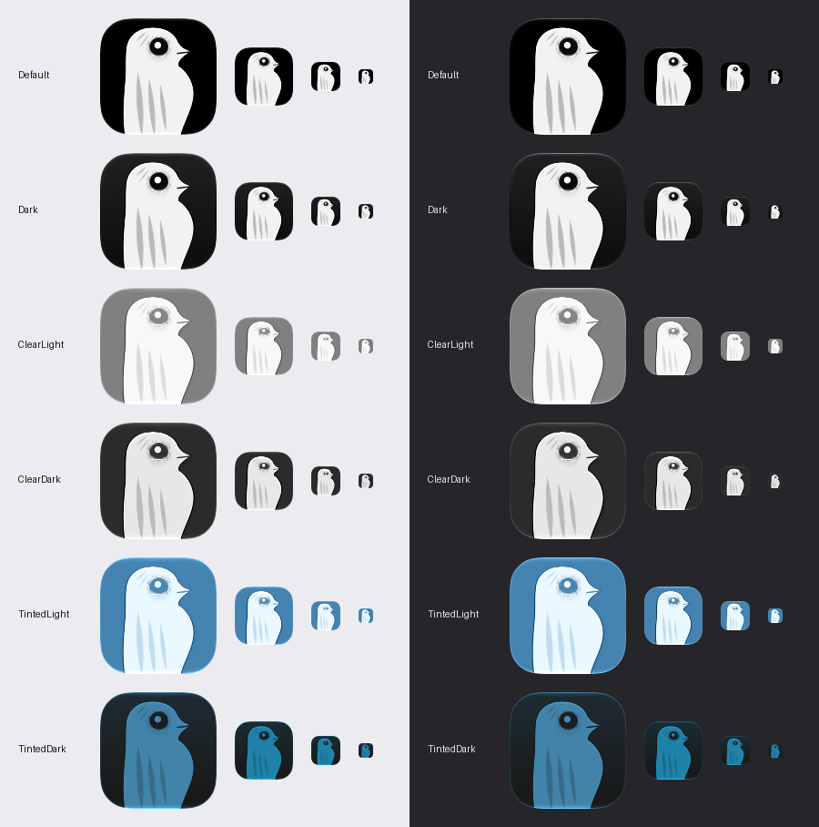

# App icon in every appearance (D-09)

`App/Oxys/AppIcon.icon` is written by `scripts/export-app-icon.py` from the SVG parts in
`scripts/make-icon-moods.py` (`parts()`). Run it with a Python that has pillow and numpy.

## Layers

Four layers, back to front, each in its own group (own shadow and depth):

| Layer | Content | Glass |
| --- | --- | --- |
| body | the bird and the peaking dots | yes |
| marks | the three feather marks and the two head marks | no |
| eye | pupil, highlight, ring | yes (no in Clear) |
| beak | the beak line | no |

The marks and the beak are thin dark or grey shapes. A specular highlight on them adds noise, so they stay matte.

## Appearance variants

Only one variant is needed. In Clear the system maps every layer to a grey ramp, and the near-black pupil
became mid-grey on a mid-grey tile (Clear light). In Clear, the eye and the beak line blend with
*multiply*, and the eye has no glass. Default, Dark and Tinted use the file as it is.
The fill stays black: in Clear the system ignores it (a fill override changed nothing), and in Default
and Dark black is what we want.

## Sheets

`scripts/icon-appearance-sheet.py out.png` renders Default, Dark, Clear light, Clear dark, Tinted light and
Tinted dark with Icon Composer's `ictool` at 128, 64, 32 and 16 px (each size rendered, not scaled),
on a light and a dark backdrop.

## What the sheet shows

- Default, Dark: the eye is the strongest contrast on the icon at 128, 64 and 32 px. At 16 px it is one dark speck.
- Clear dark: the pupil stays dark; clear at 32 px.
- Clear light: the bird shape is clear and the tile is a mid-grey, not a black blob. The pupil is dark grey on
  mid-grey; it reads at 64 and 32 px with its white highlight and is weak at 16 px.
- Tinted light and dark: the bird shape and the eye read at 32 px. The Tinted dark bird is mid-blue on near-black;
  the feather marks are faint, the eye is not.
- Not yet looked at by eye in the Dock, Finder and Spotlight (needs System Settings > Appearance).
